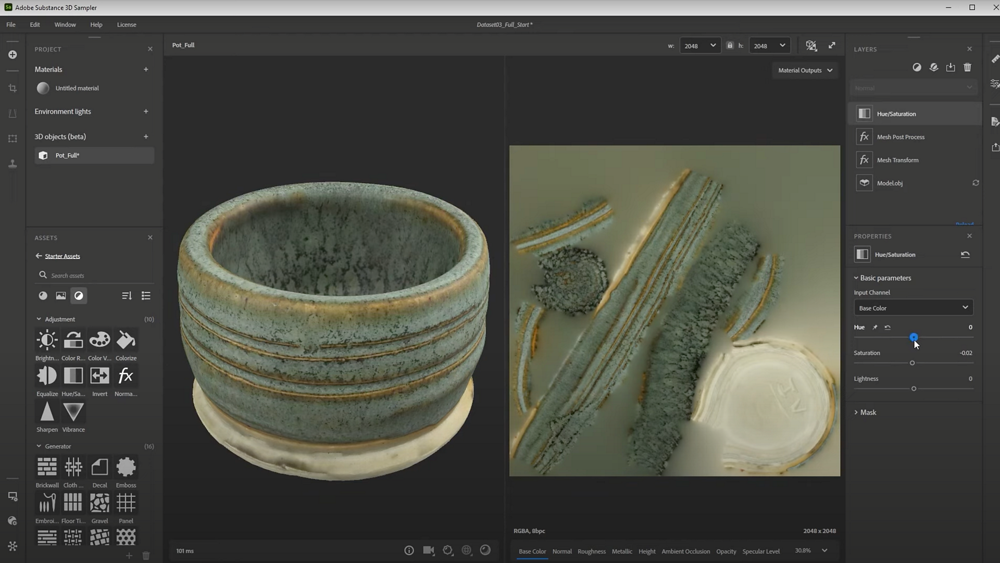

# Modifica di trame 3D acquisite

>[!WARNING]
>
> Il supporto per capture 3D è stato rimosso dalla versione 5.1 di Sampler.

## Modifica di trame 3D acquisite

In questa guida utente esamineremo alcune tecniche per modificare e pubblicare l&#39;elaborazione degli oggetti acquisiti in 3D in Substance 3D Sampler.

Preferisci guardarlo come un tutorial video? Puoi trovarlo [qui.](https://youtu.be/6_EZEAR0Uy8?si=6AaCUHD6nnWZyKUE "Esercitazione video avanzata sulla post-elaborazione della trama")

Al termine del processo e dopo aver aggiunto una trama al progetto Sampler, puoi apportare modifiche. Queste possono essere modifiche alla trama o al materiale. I filtri Trama sono nuovi rispetto a Sampler 4.0. I Filtri materiali utilizzano tutti i filtri già presenti in Sampler.

Quando modificate un oggetto 3D acquisito in Sampler, <b>potete impilare trame e Filtri materiali in modo misto</b>, in modo che vengano applicati automaticamente alla parte corretta dei dati. L’elenco dei filtri rapidi non distingue tra i due tipi.

## Filtri Trama

Diamo prima un’occhiata ai filtri trama. In Sampler ne sono presenti due: <b>Trasforma trama</b> e <b>elaborazione post trama</b>.

<b>La Trasforma della trama</b> è un filtro semplice che consente di <b>tradurre</b>, <b>ruotare</b> e <b>ridimensionare</b> la trama. Di solito puoi capovolgere un oggetto o regolarne la scala. Qualsiasi scansione viene fornita con un Trasforma pre-applicato.

<b>Il processo di post-elaborazione della trama</b> corrisponde al passaggio di post-elaborazione alla fine della finestra di dialogo, ma in un filtro dinamico. Ti consente di <b>rifare</b> , <b>re-uv</b> e <b>rifare</b> le tue texture. Questo filtro ha lo scopo di <b>ottimizzare le trame riducendo il numero di triconto, migliorando gli UV e riducendo la texture di ridimensionamento</b>. Uno dei risultati migliori derivanti dall&#39;uso è il layout UV migliorato. I Capture 3D originali di default hanno UV molto frammentati, di solito i nuovi UV automatici sono un miglioramento.

Non è un filtro veloce, ogni volta che modificate un parametro, la trama viene elaborata. È meglio essere un po&#39; pazienti.

## Filtri materiale

I Filtri materiali sono molto più diversi, tutto ciò che si può utilizzare sui materiali regolari può essere utilizzato sul materiale della trama del capture 3D, ma tenete presente che i risultati potrebbero non sempre funzionare, poiché molti filtri sono destinati a materiali Affiancamenti uniformi.

I filtri più utili tendono a essere regolazioni quali <b>contrasto</b> luminoso, <b>saturazione tonalità</b> e alcuni dei filtri più avanzati per la modifica dei canali. Poiché non è stato possibile catturare la rugosità del nostro oggetto, utilizzeremo alcuni filtri per ripristinarlo.

Puoi utilizzare un <b>filtro Saturazione tonalità</b> per far sì che i colori corrispondano ancora di più a quelli reali del tuo oggetto. Ci sono modi migliori per ottenere la precisione del colore, ma sono molto più coinvolti di questo filtro rapido.

Successivamente potreste voler ripristinare i riflessi che esistevano nel vostro oggetto. È possibile utilizzare il <b>filtro Sostituisci colore</b> qui. Sostituisci colore consente di acquisire un colore dalla texture e di modificare tutte le aree con quel colore.

Per impostazione predefinita, il colore selezionato viene colorato tutto, ma se attivate <b>Segmentazione avanzata</b> e impostate su <b>Maschera da colore di base</b> e <b>Sostituisci</b> in <b>Rugosità</b>, potete rendere molto più brillante la rugosità dell&#39;area di tutti i colori selezionati. Giocare con le variazioni di luminosità e l&#39;intervallo delle maschere può essere utile per perfezionare la maschera.

Infine, potreste voler recuperare un po’ di dettagli dal colore di base nella rugosità. Il <b>filtro per lo switch di canale</b> mi consente di miscelare e fondere i dettagli tra canali diversi. Potete impostare l&#39;<b>input su Basecolo</b>r, l&#39;<b>output su Rugosità</b>, quindi giocare con la modalità Fusione e l&#39;opacità per ottenere qualcosa di interessante e abbastanza vicino alla vita reale.

Infine, se desiderate un maggiore controllo sulla rugosità finale, potete utilizzare il filtro Contrasto luminosità e impostarlo in modo da agire sul canale di rugosità. Quindi modificate i valori per rendere la rugosità un po&#39; più croccante.

Ogni oggetto è diverso e, a seconda del set di dati, potrebbero essere necessarie regolazioni specifiche. Puoi anche utilizzare lo <b>strumento Timbro Clona /Clone</b> per cancellare parti della texture che desideri rimuovere, ad esempio per acquisire i marcatori degli strumenti. Tieni presente che qualsiasi filtro di materiale che utilizza posizioni specifiche sulla tua texture dipenderà dal layout UV, quindi fai l&#39;elaborazione della trama prima di qualsiasi filtro di materiale.

Quando sei soddisfatto del tuo oggetto e della tua texture, puoi <b>esportare </b>il tuo risultato utilizzando la finestra di dialogo <b>Condividi > Esporta come</b>. Le impostazioni generali consentono di scegliere nome e percorso, le impostazioni Trama consentono di scegliere il formato trama 3D e le impostazioni del materiale consentono di configurare il materiale della trama. Potete disattivare la trama o il materiale per esportarne solo uno singolarmente. Una volta esportata, la trama è pronta per essere utilizzata in altre applicazioni 3D.
