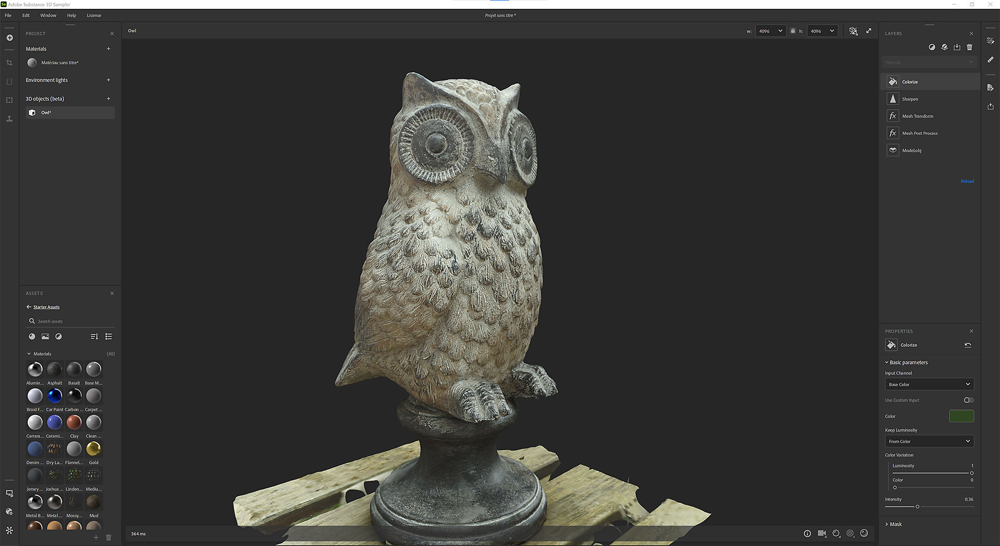
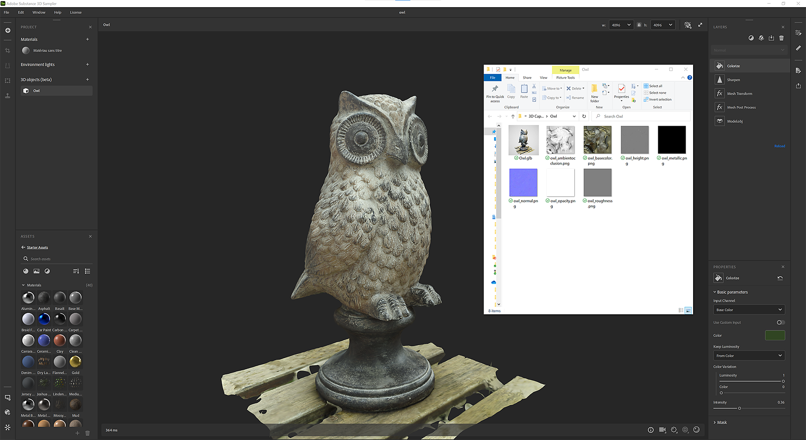

# Capture 3D

## Introduzione

## Cos&#39;è la fotogrammetria?

Sampler utilizza la fotogrammetria per Trasforma le immagini in una trama con texture. La fotogrammetria è la scienza delle misurazioni dalle immagini. Viene utilizzato per estrarre informazioni da fotografie, per creare modelli e texture 3D. Il processo prevede lo scatto di più fotografie di un oggetto da diverse angolazioni, quindi l&#39;elaborazione delle immagini per estrarre informazioni sulla forma e la posizione delle caratteristiche nelle immagini.

L&#39;obiettivo è quello di far corrispondere le caratteristiche corrispondenti tra le immagini per stabilire le posizioni relative della fotocamera per ogni immagine. Dalle feature corrispondenti, viene ricostruito un modello 3D dell&#39;oggetto. Il passaggio finale consiste nel proiettare le texture sul modello 3D.

## Requisiti hardware

Il capture 3D è disponibile su Windows e MacOS Monterey o Ventura.

Windows/Linux

Consigliamo:

* GPU con 8 Gb di VRAM
* 16 Gb di RAM. Idealmente, 32 Gb e 64 Gb.
* Minimo 10 Gb di spazio su disco

[Configurazione Linux](https://helpx.adobe.com/it/substance-3d/unlisted/documentation/sadoc/3d-capture-set-up-on-linux-255426606.html)

Mac

* I dispositivi Apple Silicon sono vivamente consigliati (M1 o M2)
* GPU basata su Intel e AMD con almeno 4 Gb di supporto per VRAM e raytracing

## Avvia una nuova Capture 3D

## Importare il set di dati

## Preparazione del set di dati

Trascina e rilascia le foto o fai clic per sfogliare Esplora sistema operativo.

>[!NOTE]
>
> **Consigli sul set di dati**
> 
> Si consiglia di disporre di un set di dati che contenga almeno <b>20 immagini</b> per un corretto funzionamento del capture 3D.

Per gli utenti di iPhone, il formato .HEIC non è ancora supportato. Puoi usare Lightroom per convertire in .jpeg.

In MacOS, potete utilizzare [Azioni rapide](https://support.apple.com/en-gb/guide/mac-help/mchl97ff9142/mac) per convertire le immagini.

Per i formati Camera RAW, consigliamo di utilizzare Lightroom per convertire le foto in .jpeg.

>[!NOTE]
>
> **Limitazioni del set di dati**
> 
> **Windows**: il set di dati deve essere inferiore a 6 pixel (6 000 000 000) in totale. Rappresenta 500 foto di 12 M pixel

Una volta importate le foto, potete fare clic su una foto per visualizzarla completamente.

Definizione gruppo fotografico:

Il set di dati può essere suddiviso in più gruppi di foto. I gruppi di foto raggruppano le foto in base alle proprietà (dimensione sensore, lunghezza focale, rotazione,...)

## Mascheratura

L&#39;uso delle maschere presenta molti vantaggi. Consente al processo di fotogrammetria di rilevare le caratteristiche e ricostruire solo le aree non mascherate.

Questo consente anche di spostare l’oggetto durante l’acquisizione, poiché le maschere nasconderanno lo sfondo in tutte le foto.

Per utilizzare le maschere, selezionate un gruppo di foto e aprite la scheda **Maschera** a destra.

È possibile importare maschere rispettando una convenzione di denominazione:

* [image\_name].file\_extension
* [image\_name]\_mask.file\_extension

Potete generare automaticamente le maschere in base alle foto utilizzando la nostra tecnologia basata sull&#39;intelligenza artificiale.

## Allineamento

L’allineamento consiste nell’elaborare tutte le immagini da estrarre e abbinare alle caratteristiche corrispondenti per stabilire le posizioni relative della videocamera per ogni immagine.

## Impostazioni

Precisione

Sono disponibili due opzioni, Bassa e Alta.

* Bassa: consigliata per la maggior parte dei set di dati.
* Alto: aumentate il numero di punti e consigliate di abbinare più foto nei casi in cui la texture del soggetto è insufficiente o le foto sono di piccole dimensioni. Questa impostazione rallenta l’elaborazione. Ti consigliamo di provare prima l&#39;opzione bassa.

Disposizione delle foto

Sono disponibili due opzioni: predefinita e sequenza.

Questo può essere calcolato utilizzando diversi algoritmi di abbinamento delle caratteristiche:

* Predefinito: la selezione si basa su diversi criteri, tra cui la somiglianza tra le immagini.
* Sequenza: utilizzate solo le immagini adiacenti entro la distanza specificata, consigliate per l’elaborazione di una singola sequenza di foto se la modalità Predefinita non è riuscita. L’ordine di inserimento delle foto deve corrispondere all’ordine di sequenza.

## Posizione punti cloud e fotocamere

Il risultato del passaggio di allineamento è una nuvola a punto sparso con tutte le funzioni rilevate e la posizione di tutte le fotocamere.

Se il contorno dell’immagine è verde, l’immagine è stata allineata correttamente.

Se il contorno dell’immagine è arancione, l’immagine non è stata allineata correttamente e dall’immagine non è stata estratta alcuna funzione.

Potete fare clic sull’immagine nel pannello a sinistra per creare un fotogramma della nuvola di punti sulla fotocamera associata.

Puoi fare clic su una fotocamera per creare un fotogramma dei punti che contiene una nuvola.

## Ricostruzione

Il passaggio di ricostruzione genera un modello 3D dell&#39;oggetto dalle feature corrispondenti come proiezione delle texture sul modello 3D.

## Impostazione

Dettagli geometria Questa opzione specifica il livello di precisione nelle foto di input, che risulta più o meno dettagliato nel modello 3D calcolato.

## Area di interesse

Prima di generare il modello 3D, potete impostare l’area da ricostruire attorno alla nuvola di punti con il rettangolo di selezione.

Potete traslare, ridimensionare e ruotare la casella lungo l&#39;asse 3.

Premendo Maiusc durante il ridimensionamento, la casella verrà ridimensionata a partire dal centro.

<table>
<tr style="border: 0;">
<td style="border: 0;" valign="top">

</td>
<td style="border: 0;" valign="top">

</td>
</tr>
</table>

## Post-elaborazione

La post-elaborazione ti aiuta ad adattare e ottimizzare la trama e le texture in base alle tue esigenze e a come desideri utilizzarla.

Il risultato della ricostruzione può generare una rete con milioni di poligoni e fino a 16K texture. Spesso questa opzione non è ottimizzata per il rendering, il tempo reale o l’esperienza AR.

Sarà necessario post-elaborare il risultato per ridurre il numero di poligoni senza perdere dettagli.

Il passo di post-elaborazione concatena automaticamente 4 passaggi:

* Decimazione: consente di ridurre il numero di poligoni definendo il numero di facce desiderato
* Srotolamento UV: definisce automaticamente le giunture, lo srotolamento e confezione UV della trama decimata
* Riproiezione: riproietta la texture di colori della trama fotogrammetrica sulla trama decimata
* Esegue i baking: Esegue i baking i dettagli normali, height e AO dalla trama fotogrammetrica alla trama decimata. In questo modo tutti i dettagli di trama persi durante la decimazione verranno trasferiti nelle mappe di texture.

## Versione

Per iterare e testare facilmente diverse opzioni di post-elaborazione, puoi creare diverse versioni e selezionare quella da aggiungere al progetto.

Per aiutarvi, potete visualizzare la trama in diverse modalità.

Modalità solida

Modalità wireframe

Modalità griglia UV

## Flusso di lavoro non invasivo

Una volta aggiunta una versione al progetto, viene creata una Pila livelli con diversi livelli.

Il primo strato è il risultato della ricostruzione.

Il secondo livello (se avete eseguito qualche operazione di post-elaborazione) è il livello di post-elaborazione della trama con i valori definiti nella finestra del capture 3D. Potete comunque modificare i parametri in questa fase se desiderate utilizzare altre impostazioni.

Il terzo livello è un livello di Trasforma trama per ridimensionare, traslare e ruotare l&#39;oggetto 3D.

In questa fase, puoi aggiungere i filtri che utilizzi per applicare ai materiali per modificare le texture sull’oggetto 3D.

## Esporta

Nella finestra Esportazione, potete definire il formato della trama e le impostazioni del materiale (stesse impostazioni quando esportate un materiale).

## Tutorial

[Vai a Tutorials avanzati](https://substance3d.adobe.com/tutorials/courses/Advanced-3D-Capture/youtube-f8iCtZ3Gmzs)

## DOMANDE FREQUENTI

**Quali sono le condizioni di acquisizione migliori per la fotografia?**

Per ottenere risultati accurati con la fotogrammetria, è importante seguire alcune best practice durante l’acquisizione delle immagini.

1. Illuminazione: la fotogrammetria funziona meglio quando le immagini vengono acquisite in buone condizioni di illuminazione. Evitate di scattare immagini in condizioni di scarsa illuminazione o con illuminazione ad alto contrasto, perché possono rendere difficile l’estrazione accurata delle caratteristiche dalle immagini. Le migliori condizioni di illuminazione per la fotografia sono giornate nuvolose o aree ombreggiate.
1. Sovrapposizione: per essere certi che le informazioni presenti nelle immagini siano sufficienti per estrarre con precisione le caratteristiche, è importante acquisire immagini con sovrapposizioni significative. Una regola generale prevede una sovrapposizione di almeno il 60% tra le immagini, sia in orizzontale che in verticale.
1. Fotocamera: utilizzate una fotocamera e un obiettivo ad alta risoluzione per ottenere una buona qualità e nitidezza delle immagini. Evita di usare fotocamere con obiettivo fish-eye o grandangolare poiché può causare distorsioni geometriche che possono influire sui risultati finali.
1. Orientamento: quando scattate le immagini, cercate di mantenere la fotocamera in posizione orizzontale e perpendicolare al terreno. Le immagini acquisite da un angolo possono rendere difficile l&#39;estrazione accurata delle feature e possono portare a risultati distorti.
1. Calibrazione fotocamera: assicurati che la fotocamera sia calibrata prima di scattare immagini. Questo processo consente di correggere la distorsione dell&#39;obiettivo e altri errori che possono influire sulla precisione dei risultati finali.

**Come funziona per gli specular e gli oggetti riflettenti?**

La fotogrammetria può essere difficile quando si lavora con oggetti altamente specular o riflessivi, poiché i riflessi luminosi possono rendere difficile l&#39;estrazione delle caratteristiche dalle immagini. Ecco alcune strategie che possono essere utilizzate per superare queste sfide:

1. Illuminazione: durante l’acquisizione di immagini di oggetti fortemente riflettenti, evitate la luce solare diretta e acquisite invece immagini in condizioni di ombra o cielo. In questo modo è possibile ridurre l’intensità dei riflessi e semplificare l’estrazione di elementi dalle immagini.
1. Finitura opaca: l’applicazione di una finitura opaca alle superfici riflettenti può contribuire a ridurre l’intensità dei riflessi e a semplificare l’estrazione delle feature dalle immagini.
1. Acquisizione di più immagini: l’acquisizione di più immagini dello stesso oggetto da diverse angolazioni può ridurre l’impatto dei riflessi e aumentare le possibilità di estrarre le caratteristiche almeno da alcune immagini.
1. Editing delle immagini: in fase di post-elaborazione, alcuni software di editing delle immagini come Lightroom possono essere utilizzati per ridurre i riflessi e migliorare le funzioni delle immagini, ad esempio l’aumento del contrasto o la correzione del colore.

Tenete presente che gli oggetti riflettenti possono richiedere impostazioni e trattamenti più elaborati e che potrebbe non essere possibile ottenere risultati perfetti in tutti i casi. È una buona idea sperimentare diverse tecniche.

**Qual è il suggerimento tra un telefono cellulare e una fotocamera DSLR per la fotografia?**

Sia i telefoni cellulari che le fotocamere DSLR possono essere utilizzati per la fotografia, ma hanno punti di forza e debolezze diversi. Di seguito sono riportati alcuni aspetti da considerare quando si decide quale tipo di fotocamera utilizzare:

1. Risoluzione: le fotocamere DSLR solitamente hanno una risoluzione molto più alta rispetto ai telefoni cellulari, il che può portare a risultati più dettagliati e accurati. Tuttavia, con i recenti progressi della fotocamera dei telefoni cellulari, alcune fotocamere high-end per telefoni cellulari hanno una risoluzione e una qualità delle immagini paragonabili ad alcune fotocamere DSLR di fascia bassa.
1. Calibrazione della fotocamera: la fotogrammetria si basa su una calibrazione accurata della fotocamera, che in genere è più difficile da ottenere con le fotocamere dei telefoni cellulari rispetto alle fotocamere DSLR. Alcune fotocamere per telefoni cellulari dispongono di parametri di calibrazione incorporati che è possibile utilizzare, ma potrebbero non essere precisi quanto la calibrazione corretta di una fotocamera DSLR.
1. Durata della batteria e archiviazione: le fotocamere dei telefoni cellulari hanno una durata della batteria più limitata rispetto a quelle DSLR. Pertanto, dovrai pianificare la ricarica del telefono o il trasporto di batterie aggiuntive durante il lavoro. Inoltre, devi assicurarti che il telefono abbia una capacità di archiviazione sufficiente per gestire file di immagini di grandi dimensioni.
1. Costo: le fotocamere DSLR sono generalmente più costose dei telefoni cellulari e richiedono anche accessori aggiuntivi, come treppiedi e unità flash esterne.
1. Portabilità: un telefono cellulare è più portatile di una fotocamera DSLR ed è più probabile che abbiate con voi il telefono quando incontrate un oggetto o una scena interessante che desiderate acquisire per la fotografia.

In sintesi, dipende dalle vostre esigenze specifiche e dalle caratteristiche del progetto. Per i progetti a bassa risoluzione, può essere sufficiente un telefono cellulare. Tuttavia, se sono necessarie alta precisione e alta risoluzione, una fotocamera DSLR potrebbe essere la scelta migliore. Inoltre, se prevedete di scattare foto su base regolare o per un progetto a lungo termine, investire in una fotocamera DSLR potrebbe essere una soluzione più conveniente nel lungo periodo.

**Come calibrare la fotocamera per limitare la sfocatura sull&#39;oggetto?**

La calibrazione della fotocamera è un passaggio importante nel processo di fotogrammetria che aiuta a correggere la distorsione dell&#39;obiettivo e altri errori che possono influire sulla precisione dei risultati finali. Di seguito sono riportati alcuni passaggi da eseguire per calibrare la fotocamera e limitare la sfocatura sull’oggetto:

1. Usare un treppiede: per mantenere la fotocamera stabile e ridurre la sfocatura, è importante utilizzare un treppiede quando si acquisiscono le immagini per la fotografia. In questo modo, la telecamera si troverà nella stessa posizione per ogni ripresa e si riduce al minimo il movimento della telecamera.
1. Utilizza rilascio dell&#39;otturatore a distanza: per ridurre ulteriormente il movimento della fotocamera, puoi utilizzare un rilascio dell&#39;otturatore a distanza o una funzione di autoscatto sulla fotocamera per scattare le immagini. In questo modo si riduce al minimo qualsiasi tremolio della fotocamera causato dal pulsante dell&#39;otturatore.
1. Regola la velocità dell&#39;otturatore: per ridurre la sfocatura causata dal movimento della fotocamera, è necessario utilizzare una velocità dell&#39;otturatore elevata. Una regola generale consiste nell&#39;utilizzare una velocità dell&#39;otturatore che sia almeno altrettanto veloce quanto il reciproco della lunghezza focale dell&#39;obiettivo. Ad esempio, se usate un obiettivo da 50 mm, dovreste usare un tempo di scatto di almeno 1/50 di secondo.
1. Utilizza un valore ISO elevato: in condizioni di scarsa illuminazione, potrebbe essere necessario utilizzare un valore ISO più elevato per mantenere una velocità dell&#39;otturatore elevata e ridurre la sfocatura. Tuttavia, tenete presente che un valore ISO elevato può anche aumentare il disturbo nell’immagine, influendo sulla precisione dei risultati finali.
1. Utilizzare un flash: in alcune situazioni, l’uso di un flash può contribuire a ridurre la sfocatura causata dalla scarsa illuminazione. Tenete presente che il flash può anche causare riflessi e altri problemi in alcuni casi, quindi assicuratevi di sperimentare con scatti flash e non flash per vedere quale funziona meglio per la vostra applicazione specifica.

Tenere presente che la calibrazione è un processo iterativo e può richiedere più tentativi per ottenere buoni risultati.

**È possibile spostare l&#39;oggetto durante l&#39;acquisizione per la fotografia?**

Nella maggior parte dei casi, non è consigliabile spostare l’oggetto durante l’acquisizione a scopo di fotogrammetria. Il processo di fotogrammetria si basa sul fatto che l’oggetto si trova in una posizione fissa per ciascuna immagine, poiché il software utilizza le posizioni relative delle caratteristiche nelle immagini per ricostruire un modello 3D dell’oggetto.

Se l’oggetto viene spostato durante l’acquisizione, apparirà in una posizione diversa in ogni immagine, rendendo difficile per il software far corrispondere le caratteristiche corrispondenti tra le immagini. Ciò può portare a imprecisioni nel modello 3D finale e può anche rendere difficile o impossibile la corrispondenza dell’immagine.

Tuttavia, in alcuni casi può essere utile spostare un oggetto. Ad esempio, nel caso di oggetti di piccole dimensioni, in cui è difficile scattare immagini con sovrapposizioni significative, è possibile utilizzare un giradischi e ruotare l&#39;oggetto per assicurarsi che tutte le caratteristiche siano acquisite da più angolazioni.
