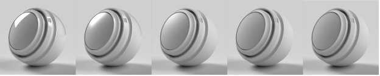
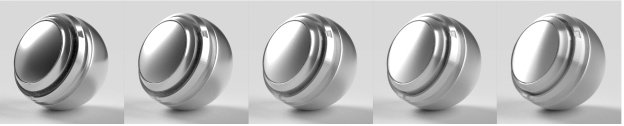
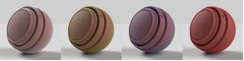

# Materiale standard Adobe

>[!NOTE]
>
> Per impostazione predefinita, ora Substance 3D Sampler utilizza il modello di materiale [OpenPBR](openpbr.md) anziché il materiale Adobe Standard.

## Proprietà dei materiali standard

## Proprietà della superficie di base

**Colore di base**

Colore della superficie.

**Rugosità**

Quanto è liscia o opaca la superficie.

**Metallico**

Il grado di lucentezza metallica della superficie.

**Opacità**

La visibilità della superficie.

**occlusione ambiente**

Ombre provenienti da cavità e pieghe che impediscono alla luce di colpire la superficie.

**Specular level**

Intensità dei riflessi di luce sulla superficie.

**Specular edge color**

Il colore dei riflessi di luce. Influisce sugli angoli di sfocatura dei materiali metallici.

**Normale**

Simula i dettagli della superficie come protuberanze e crepe.

**Scala normale**

L’intensità dell’effetto normale.

**Combina normale e height**

Applica la texture normale alla texture del height.

**Height**

Crea i dettagli della superficie utilizzando lo spostamento di rilievo o di geometria.

**Scala Height**

Scala del height in unità di scena. Applicabile sia allo spostamento che alla protuberanza.

**Livello Height**

Il valore della texture del height che rappresenta lo spostamento zero.

**Livello di Anisotropia**

Quantità di estensione delle riflessioni in una direzione lungo la superficie.

**Angolo di Anisotropia**

Rotazione antioraria dell’effetto anisotropo.

**Intensità delle emissioni**

Intensità della luce emessa dalla superficie.

**Colore di emissione**

Colore della luce emessa.

**Opacità brillantezza**

Simula l’effetto di fibre microscopiche o di fuzz sulla superficie.

**Colore di lucentezza**

Colore dell&#39;effetto brillantezza.

**Rugosità brillantezza**

Morbidezza dell&#39;effetto brillantezza.

## Proprietà interne

**Traslucidità**

Quantità di luce in grado di trasmettere attraverso la superficie.

**Colore di assorbimento**

La luce del colore convergerà verso quando verrà assorbita.

**Distanza Assorbimento**

Distanza approssimativa nelle unità di scena che la luce viaggerà prima di raggiungere il colore di assorbimento. Se impostato su zero, thickness non avrà effetto sul colore di assorbimento.

**Indice di rifrazione**

La quantità di luce che si curva mentre attraversa l’oggetto.

**Dispersione**

Quantità di rifrazione dello spettro cromatico.

**Dispersione sottosuperficie**

Dispersione la luce al di sotto della superficie, invece di passare direttamente attraverso di essa.

**Colore di dispersione**

Il colore sotto la superficie che diventerà la luce diffusa.

**Distanza di dispersione**

La luce a distanza approssimativa deve viaggiare prima di raggiungere la dispersione completa.

**Scala distanza di dispersione**

Moltiplicatore della distanza della dispersione. Può essere diverso per ogni canale di colore.

**Scostamento rosso**

Imposta la luce rossa in modo che si sposti più a destra rispetto ad altri colori chiari. Utile per la pelle.

**Dispersione di Rayleigh**

Imposta la luce arancione per spostarsi più sotto la superficie e la luce blu per spostarsi meno.

**thickness di volumi**

Thickness della superficie relativa al rettangolo di selezione dell&#39;oggetto. Utilizzato per effetti interni quando il thickness reale non è noto.

**Scala thickness volume**

Moltiplicatore del thickness di volumi.

## Proprietà rivestimento

**Opacità pelo**

Simula un livello sopra il materiale. Utilizzato per creare cappotti, lacche e vernici trasparenti.

**Colore pelo**

Il colore del cappotto.

**Rugosità pelo**

Quanto è liscia o opaca la superficie del pelo.

**Indice di rifrazione del rivestimento**

La quantità di luce si piega mentre passa attraverso il pelo.

**specular level**

L&#39;intensità dei riflessi di luce sul pelo ad angoli di visuale.

**Pelo normale**

Simula i dettagli della superficie come protuberanze e crepe sulla superficie del pelo.

**Scala normale rivestimento**

La forza dell&#39;effetto normale del pelo.
