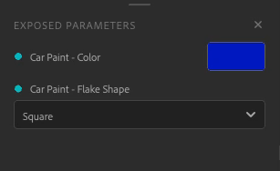
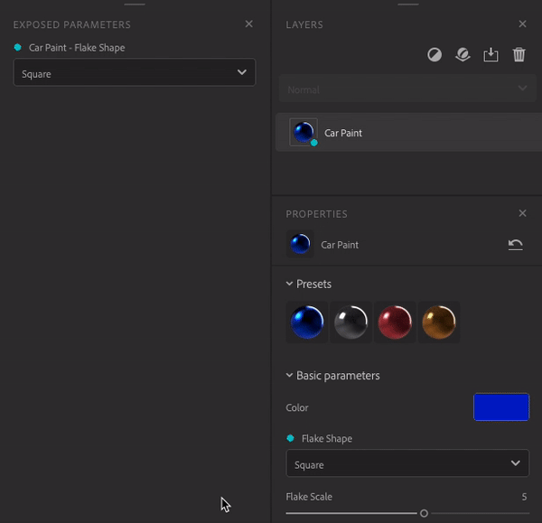

# Esporta risorse parametriche

I parametri esposti possono essere modificati in altre applicazioni senza dover tornare a Sampler. In questo modo è possibile ridurre i tempi di iterazione e concentrarsi sulla ricerca dell&#39;aspetto migliore senza dover passare da un&#39;applicazione all&#39;altra.

## Esporre e annullare l&#39;esposizione dei parametri

Per esporre i parametri, apri il **pannello Proprietà**. Passa il mouse o fai clic con il pulsante destro del mouse sul parametro desiderato, quindi fai clic sull&#39;icona del segnaposto o su &quot;esponi questo parametro&quot;.

È possibile annullare l&#39;esposizione di un parametro in due modi:

* Nel **Pannello dei parametri esposti**, fai clic con il pulsante destro del mouse sul parametro e scegli &quot;unexpose&quot;.

  
* Nel **pannello Proprietà**, fai clic sull&#39;icona del segnaposto incrociato oppure fai clic con il pulsante destro del mouse sul parametro e scegli &quot;annulla l&#39;esposizione di questo parametro&quot;.

  

I parametri dei seguenti filtri non possono essere esposti:

* Immagine su materiale (basato su intelligenza artificiale)
* Riempimento in base al contenuto
* Normale al Height
* Miglioramento

Se aggiungete uno dei filtri sopra i livelli che contengono parametri esposti, questi non verranno esposti al momento dell’esportazione.\
Per evitare ciò, rimuovete il filtro o posizionatelo dove non influirà sui livelli con parametri esposti.

Se hai esposto dei parametri da una fusione, questi andranno persi se sposti de layer nella parte inferiore della pila.

## Modificare i parametri

Modifica l&#39;etichetta del parametro facendo clic con il pulsante destro del mouse sul **Pannello dei parametri esposti**, immetti il nuovo nome e fai clic su &quot;Applica&quot;.

Puoi utilizzare il parametro nel **Pannello dei parametri esposti** come nel **pannello Proprietà**.

## Esportare il materiale

Per esportare il materiale con i parametri esposti

1. Apri il pannello <b>Esporta.</b>
1. Fai clic su Esporta.
1. Seleziona SBSAR o SBS.
1. Fare clic su &quot;Export&quot;.

Ora puoi utilizzare il tuo materiale con i parametri esposti in qualsiasi software che supporti il formato di file SBSAR.
