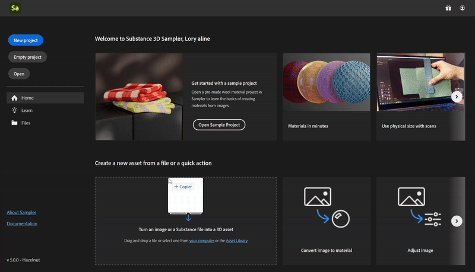

# Azioni rapide

Azioni rapide è un sistema che consente di creare una risorsa o di aggiungere più livelli nella pila in pochi clic. Usa Azioni rapide per creare una risorsa, creare un progetto o aggiungere i livelli necessari alla pila esistente.

In Sampler puoi trovare Azioni rapide in diverse posizioni:

* [Schermata Home](../interface/the-home-screen.md)
* [Crea nuova finestra](../getting-started/project-management.md)
* [Pannello Azioni rapide](../interface/panels/quick-actions-panel.md)

| Nome azione rapida | Descrizione | Livelli |
| --- | --- | --- |
| Converti immagine in materiale | Crea un materiale con tutti i canali necessari da una singola immagine. | Da immagine di input a materiale IA Equalize |
| Converti immagini multi-angolo in materiale | Creare un materiale unendo le foto di una superficie scattate da diversi angoli di luce | Multiangolo su materiale di input Equalizza |
| Importa texture | Crea un materiale da mappe di texture. | Input |
| Importa immagini | Crea un materiale vuoto e aggiungi un&#39;immagine singola come livello. | Input |
| Converti immagine in ricamo | Applica un filtro procedurale per dare all&#39;immagine un aspetto simile a una toppa ricamata. | Ricamo di input |
| Crea un materiale di tessuto | Crea un tessuto con un filtro procedurale. | ClothWeave |
| Regola immagine | Scegli i filtri per ottimizzare e preparare un&#39;immagine da utilizzare in un materiale. | Colore di contrasto/luminosità/saturazione del ritaglio dell&#39;input sostituisci |
| Crea materiale vuoto | Crea un materiale senza canali. | Nessuno |

## Come utilizzare l’azione rapida

<b>Dalla schermata iniziale</b>

Fai clic su un’azione rapida

oppure trascina e rilascia un&#39;immagine su un&#39;azione rapida.

oppure trascina e rilascia un&#39;immagine su un&#39;azione rapida.

<b>Da Crea nuovo</b>

Scegli un&#39;azione rapida o importa file e visualizza le azioni rapide che puoi utilizzare con il tuo input

<b>Dal Pannello Azioni Rapide</b>

Fai clic su un’azione rapida per aggiungerla alla pila o creare una nuova risorsa a seconda del tipo di azione rapida:

* <b>Applica :</b> Applica l&#39;azione rapida sullo stack attivo.
* <b>Installazione:</b> apre la finestra di installazione per predisporre l&#39;azione rapida prima di aggiungerla allo stack.
* <b>Crea nuova risorsa:</b> crea una nuova risorsa dall&#39;azione rapida selezionata.
* <b>Crea nuovo progetto: </b>Crea un nuovo progetto dall&#39;azione rapida selezionata.
