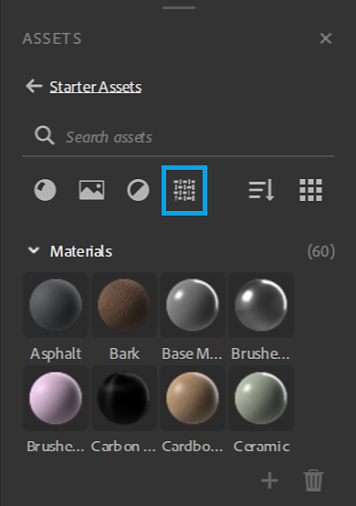

# Generatori di texture

I generatori di texture offrono un controllo migliore sulla creazione del materiale utilizzando le opzioni <b>rumori parametrici, pattern </b>e<b> grunge</b>. Le immagini generate possono essere utilizzate nelle maschere o nelle mappe dei canali.

<table>
<tr style="border: 0;">
<td style="border: 0;" valign="top">

</td>
<td style="border: 0;" valign="top">

I generatori di texture sono un tipo di risorse disponibili in Substance 3D Sampler. Possono essere filtrati nel pannello Risorse con l&#39;icona Generatori texture.

</td>
</tr>
</table>

## Come usare i generatori di texture

### Mappe dei canali

Trascinate un generatore di texture nella vista 3D o 2D o nella pila di livelli e selezionate un canale per utilizzarlo.

Verrà creato un filtro di riempimento nella pila con il Generatore texture nell’input corretto. Potete accedere alle proprietà Generatore texture nel pannello Proprietà.

#### Filtri

Alcuni filtri come <b>parquet</b> utilizzano per impostazione predefinita i generatori di texture per le maschere di pattern. Altri invece usano un’immagine o un generatore di texture, come il filtro <b>Pattern</b>.\
Nei filtri potete usare i generatori di texture in qualsiasi proprietà dell’immagine, ad esempio <b>maschere personalizzate</b>.

I filtri possono suggerire ai generatori di lavorare con questi elementi, che vengono visualizzati nel nuovo selettore di risorse quando si fa clic su una proprietà dell’immagine.

#### Esercitazione

Tutti i tutorial di Substance 3D Sampler sono disponibili nella [pagina di apprendimento](https://creativecloud.adobe.com/cc/learn/app/substance-3d-sampler).

[Progettazione di tessuti con i generatori di texture di Sampler](https://creativecloud.adobe.com/cc/learn/substance-3d-sampler/web/fabric-texture-generator?locale=en)

[Materiale in fibra di carbonio in pochi minuti con Substance 3D Sampler](https://creativecloud.adobe.com/cc/learn/substance-3d-sampler/web/create-carbon-fiber-material?locale=en)

[Riproduzione del materiale in pochi minuti con Substance 3D Sampler](https://creativecloud.adobe.com/cc/learn/substance-3d-sampler/web/create-plaid-fabric-material?locale=en)

## Come creare generatori di texture personalizzati

Puoi importare i generatori di texture realizzati con Adobe Substance 3D Designer tramite il pulsante *Importa* nelle azioni serie di livelli. Per funzionare correttamente durante l’importazione in Designer, devono essere costruiti in un modo specifico.

### Tipo

Scegli &quot;Generatore texture&quot; come grafico<b> tipo</b>.

#### Output

Per il nodo di output dei filtri deve essere definito <b>l&#39;identificatore</b> o <b>l&#39;utilizzo </b>:

* L’output principale di Texture Generator non deve essere utilizzato. Quindi, può essere riconosciuto come output principale da 3D Sampler.

<table>
<tr style="border: 0;">
<td style="border: 0;" valign="top">

</td>
<td style="border: 0;" valign="top">

</td>
</tr>
</table>

* Per utilizzare <b>l&#39;output secondario</b> del Generatore texture è necessario <b>l&#39;utilizzo</b>.\
  Il nome del gruppo corrisponde all&#39;output principale <b>Identificatore</b>.

>[!NOTE]
>
> Se crei i tuoi filtri e generatori di texture per lavorare insieme, ti consigliamo di utilizzare <b>usi personalizzati</b> in base agli <b>identificatori di output</b>.

<table>
<tr style="border: 0;">
<td style="border: 0;" valign="top">

</td>
<td style="border: 0;" valign="top">

</td>
</tr>
</table>

>[!IMPORTANT]
>
> Se desiderate che il Generatore texture personalizzato sia incluso in un elenco di risorse suggerite con filtro, dovete aggiungere i seguenti dati utente nel grafico delle Substance:
> 
> alchemist::suggestedfilters=[NomeFiltro,NomeFiltro2];

>[!NOTE]
>
> I dati utente possono essere utilizzati con [filtri personalizzati](../filters/custom-filters.md).

#### Formato

Esportare il filtro come file di archivio Substance (.sbsar)

>[!NOTE]
>
> Potete esporre i parametri del filtro per controllarlo direttamente in Sampler. Scopri come [fare](https://experienceleague.adobe.com/en/docs/substance-3d-designer/using/substance-graphs/manage-parameters/exposing-a-parameter)
