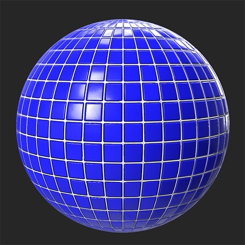

# Luminosità/Contrasto

<table>
<tr style="border: 0;">
<td width="41.60%" style="border: 0;" valign="top">

**In:** Regolazioni

</td>
<td width="58.30%" style="border: 0;" valign="top">

## Descrizione

Come suggerisce il nome stesso, il filtro Luminosità/contrasto consente di regolare la luminosità e il contrasto del materiale. È importante notare che il filtro Luminosità/Contrasto può essere utilizzato per specifici canali. Ad esempio, potete aumentare il contrasto del canale di rugosità o la luminosità del canale emissivo.

Nelle immagini seguenti, il **filtro Luminosità/Contrasto** è stato utilizzato per aumentare la luminosità e il contrasto di un materiale su piastrelle.

<table>
<tr style="border: 0;">
<td style="border: 0;" valign="top">

</td>
<td style="border: 0;" valign="top">

</td>
</tr>
</table>

</td>
</tr>
</table>

## Parametri

**Parametri di base**

* **Selezione canale**:\
  Selezionate il canale interessato dal filtro. Nota: non è possibile utilizzare il filtro Luminosità/Contrasto per modificare il canale Normale in quanto si comporta in modo diverso dalla maggior parte dei canali.
* **Luminosità**: da -1 a 1\
  Modifica la luminosità del canale selezionato
* **Contrasto**: da -1 a 1\
  Modifica il contrasto del canale selezionato

**Maschera**

* **Usa maschera personalizzata**: attiva/disattiva\
  Attivare o disattivare l’uso di una maschera personalizzata. Se questa opzione è attivata, vengono visualizzati i seguenti parametri:
  * **Maschera**: immagine/pennello\
    Seleziona un’immagine da usare come maschera o usa il pennello per pittura una maschera personalizzata direttamente nella Vista 2D
  * **Maschera personalizzata - Sfocatura**: 0-1\
    Sfocare la maschera
  * **Maschera personalizzata - Inverti**: attiva/disattiva\
    Invertire la maschera
