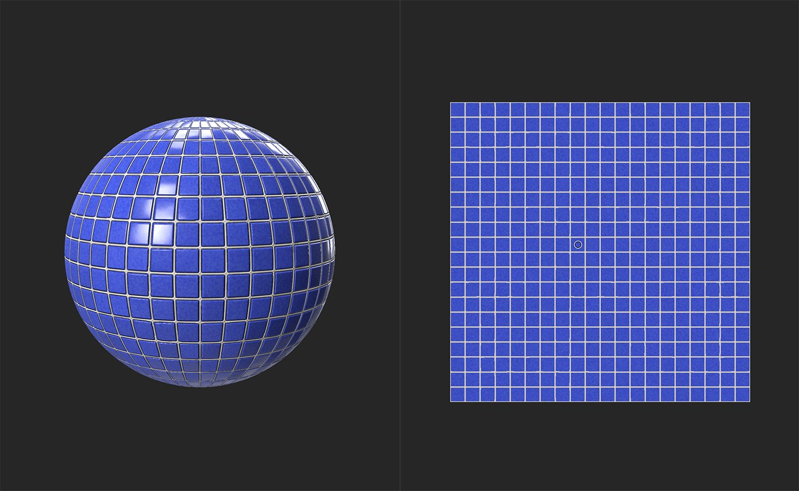

# Sostituisci colore

<table>
<tr style="border: 0;">
<td width="41.60%" style="border: 0;" valign="top">

**In:** Regolazioni

</td>
<td width="58.30%" style="border: 0;" valign="top">

## Descrizione

Sostituisci un colore o un valore selezionato in un canale.

Le immagini seguenti mostrano **Color Replace** in azione. Osservate come le aree tra le porzioni rimangono dello stesso colore: vengono modificate solo le porzioni stesse.

</td>
</tr>
</table>

## Parametri

**Parametri di base**

* **Segmentazione avanzata**: attiva/disattiva\
  Quando questa opzione è attivata, il filtro può utilizzare un canale separato per generare le informazioni della maschera dal canale interessato dalla funzione Sostituisci colore.
  * **Maschera** **Da**:\
    Selezionate un canale da usare come sorgente per la generazione della maschera. Ad esempio, la maschera del valore metallico sostituisce il colore di base di aree metalliche del materiale
* **Sostituisci in**:\
  Selezionate il canale interessato dalla sostituzione del colore.
* **Colore di destinazione**: selezione colore\
  Seleziona il colore che sostituirà i colori del canale corrente.
* **Variazione luminosità**: 0-1\
  Regolate in che misura i valori di luminosità originali sono influenzati dalla luminosità del nuovo colore.
* **Intervallo maschera**\
  La maschera viene creata in base alla combinazione dei seguenti valori
  * **&#x200B;**&#x200B;**&#x200B; Da Luminosità&#x200B;**: 0-1\
    Intervallo di luminosità utilizzato per creare la maschera **&#x200B;**
  * **Da colore**: 0-1\
    Intervallo di colori utilizzato per creare la maschera
* **Smoothness maschera**: 0-1\
  Regolare la granularità della maschera
* **Sfocatura maschera**: 0-1\
  Sfocare la maschera

**Maschera**

Questa maschera è separata dalla maschera creata con **Parametri di base**: potete utilizzare una maschera personalizzata per creare una pittura oppure un&#39;immagine per specificare le aree su cui agire con il filtro **Sostituzione colore** nel suo insieme.

* **Usa maschera personalizzata**: attiva/disattiva\
  Attivare o disattivare l’uso di una maschera personalizzata. Se questa opzione è attivata, vengono visualizzati i seguenti parametri:
  * **Maschera**: immagine/pennello\
    Seleziona un’immagine da usare come maschera o usa il pennello per pittura una maschera personalizzata direttamente nella Vista 2D
  * **Maschera personalizzata - Sfocatura**: 0-1\
    Sfocare la maschera
  * **Maschera personalizzata - Inverti**: attiva/disattiva\
    Invertire la maschera

## Guida all’uso

Il **filtro Sostituisci colore** è un metodo efficace per modificare l’aspetto dei materiali, ad esempio per trasformare la ruggine di ferro in rame ossidato

Il filtro funziona creando prima una maschera basata sui valori di luminosità e colore di un punto scelto e quindi sostituendo il colore dell’area definita da quella maschera. Quindi, per usare il filtro:

1. Aggiungi il **filtro Sostituisci colore** alla Pila livelli
1. Determinate quale canale volete usare per creare la maschera e quale canale volete sostituire il colore di
   1. Se desideri basare la maschera su un canale ma sostituire il colore di un altro, abilita **Segmentazione avanzata** e seleziona i rispettivi canali.
   1. Se desideri basare la maschera su un canale e sostituire il colore dello stesso canale, mantieni disabilitata la **segmentazione avanzata**.
1. Spostare il controllo in **Vista 2D** sul colore che si desidera sostituire.
1. Potete regolare le aree della maschera utilizzando i controlli **Intervallo maschera**, **Smoothness maschera** e **Sfocatura maschera**.
1. Selezionate un **colore di destinazione** e regolate la **variazione di luminosità** fino a ottenere l&#39;effetto desiderato.
1. Facoltativamente, puoi aggiungere una maschera personalizzata per applicare gli effetti del filtro solo nelle aree scelte. La maschera personalizzata non influisce sulla maschera creata al punto 1, ma è una maschera aggiuntiva che puoi utilizzare per regolare ulteriormente il punto in cui viene applicato l’effetto.

A volte può essere utile usare più **filtri di sostituzione del colore** uno sopra l&#39;altro per creare effetti più avanzati.
