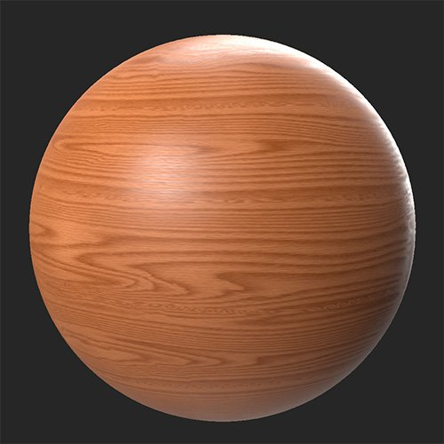

# Colorazione

<table>
<tr style="border: 0;">
<td width="41.60%" style="border: 0;" valign="top">

**In:** Regolazioni

</td>
<td width="58.30%" style="border: 0;" valign="top">

## Descrizione

Colora consente di aggiungere colore a una selezione di canali senza perdere dettagli.

>[!NOTE]
>
> Anche se il filtro Colorazione consente di modificare il canale normale, non è una buona idea farlo a meno che non si abbia una buona comprensione di come funziona il canale normale e quale sarà l’impatto sul materiale. Si tratta di una funzione avanzata che in genere dovrebbe essere necessaria solo in circostanze specifiche.

In queste immagini è stato utilizzato il **filtro Colorazione** per regolare il colore di base e produrre un materiale in legno molto più ricco.

<table>
<tr style="border: 0;">
<td style="border: 0;" valign="top">

{width="200px"}

</td>
<td style="border: 0;" valign="top">

{width="200px"}

</td>
</tr>
</table>

</td>
</tr>
</table>

## Parametri

**Parametri di base**

I parametri disponibili in questa sezione cambiano in base a **Selezione canali**.

* **Selezione canale**:\
  Seleziona il canale su cui agirà il filtro. È consigliabile visualizzare il canale selezionato nella vista 2D per visualizzare direttamente i risultati del filtro.
  * ***Opzioni colore di base/di emissione***
    * ***Nome canale*** **- Colore**: selezione colore\
      Seleziona il colore usato per colorare il canale
    * ***Nome canale*** **- Mantieni luminosità**: attiva/disattiva\
      Se questa opzione è attivata, vengono mantenuti i valori di Luminosità o Luminosità dei colori originali.
    * ***Nome canale*** **- Intensità**: 0-1\
      Regolate l’intensità dell’effetto Colorazione.
  * ***Opzioni canale normale***
    * **Normale - Angolo Pendenza**: 0-90\
      Modificare la sfumatura della normale
    * **Normale - Direzione**: 0-360\
      Regolare la direzione delle facce normali
    * **Normale - Mantieni luminosità**: attiva/disattiva\
      Se attivata, la luminosità rispetto alle normali originali verrà mantenuta
    * **Normale - Intensità**: 0-1\
      Regolate l’intensità dell’effetto Colorazione.
* **Maschera personalizzata**: attiva/disattiva\
  Attivare o disattivare l’uso di una maschera personalizzata. Se questa opzione è attivata, vengono visualizzati i seguenti parametri:
  * **Maschera**: immagine/pennello\
    Selezionate un’immagine da usare come maschera o usate il pennello per colorare una maschera personalizzata direttamente nella vista 2D
  * **Maschera personalizzata - Sfocatura**: 0-1\
    Sfocare la maschera
  * **Maschera personalizzata - Inverti**: attiva/disattiva\
    Invertire la maschera
