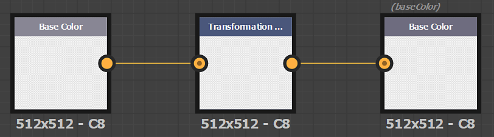

# Filtri personalizzati

## Substance filtri personalizzati

Puoi importare i filtri creati con Adobe Substance 3D Designer tramite il pulsante *Importa* nelle azioni Pila livelli.

### Creazione di un filtro Substance

I filtri devono essere creati in modo specifico in Designer per funzionare correttamente una volta importati in Sampler.

Per i nodi di input e di output del filtro deve essere definito un identificatore o un utilizzo.

>[!NOTE]
>
> È possibile utilizzare **l&#39;utilizzo** o **l&#39;identificatore** (l&#39;utilizzo ha la priorità).

#### Formato

Esportare il filtro come file di archivio Substance (.SBSAR)

>[!NOTE]
>
> Potete esporre i parametri del filtro per controllarlo direttamente in Sampler. Scopri come [fare](https://experienceleague.adobe.com/it/docs/substance-3d-designer/using/substance-graphs/manage-parameters/exposing-a-parameter)

#### Creare un filtro per modificare le immagini

| Nome immagini | Utilizzo |
| --- | --- |
| *Scansione1* | **scansione1** |
| *Scansione2* | **scansione2** |
| *...* | **...** |

#### Creare un filtro per modificare i canali

| Nome canale | Utilizzo |
| --- | --- |
| *Colore di base* | **colore base** |
| *Diffusa* | **diffusione** |
| *Specular* | **specular** |
| *Specular level* | **specularlevel** |
| *Metallico* | **metallico** |
| *Rugosità* | **rugosità** |
| *Lucentezza* | **lucentezza** |
| *Normale* | **normale** |
| *Height* | **height** |
| *Occlusione ambientale* | **occlusioneAmbientale** |
| *Opacità* | **opacità** |

>[!IMPORTANT]
>
> Quando crei un filtro personalizzato per Sampler, devi aggiungere i seguenti dati utente nel grafico a Substance:
>
> alchemist::type=filter;

>[!IMPORTANT]
>
> Se, nel pacchetto, avete un grafico per elaborare le immagini (da scan1 a scanX) e un grafico per elaborare i materiali (canali PBR), Sampler è in grado di scegliere il grafico corretto a seconda di dove viene inserito il filtro nella Pila livelli.
>
> Nel grafico &quot;immagine&quot;, aggiungi i seguenti dati utente:
>
> * alchemist::type=filter;alchemist::variation::type=multi
>
> Nel grafico &quot;materiale&quot;, aggiungi i seguenti dati utente:
>
> * alchemist::type=filter;alchemist::variation::type=material

### Parametri specifici

Parametri specifici sono gestiti a livello globale dall&#39;applicazione. È un modo per utilizzare i parametri globali dell&#39;applicazione, del progetto e della Pila livelli nei filtri personalizzati.

#### Formato normale

Controllo del formato normale sull&#39;applicazione. Imposta su DirectX in Sampler

**identificatore di parametri**: normalformat, normal_format, $normalformat, $normal_format

#### Conteggio input

Per modificare le immagini (da scan1 a scanX), è possibile utilizzare il numero di immagini nella Pila livelli utilizzando il parametro **Numero immagini**.

* **identificatore parametro**: input_count
* **Tipo di parametro**: integer1

#### Ingresso materiale

Se si desidera visualizzare uno slot di materiale nella Pila livelli, come l&#39;atlas scatter o lo splatter:

* Aggiungi un nuovo set di nodi di input (Colori di base, Normale, ... )
* Tutti i nodi di input dello sfondo (materiale inferiore nella Pila livelli) devono trovarsi nel gruppo **Materiale1**
* Tutti i nodi di input del primo materiale che si desidera aggiungere in alto devono trovarsi nel gruppo **Materiale2** ed eccetera se si desidera utilizzare diversi slot di materiale.
* Aggiungete un parametro di input del materiale:
  * **identificatore parametro**: material_input
  * **Tipo di parametro**: integer1

#### Tipo di flusso di lavoro

Per visualizzare o nascondere alcuni parametri in base al flusso di lavoro del progetto (Metalic/Roughness PBR o Specular/Lucentezza PBR), è possibile utilizzare il parametro Tipo di flusso di lavoro

**identificatore di parametro**: workflow_type

**Tipo di parametro**: integer1, elenco a discesa

opzioni:

* 0: PBR Metallico/Rugosità
* 1: Specular/Lucentezza PBR

{width="300px"}
