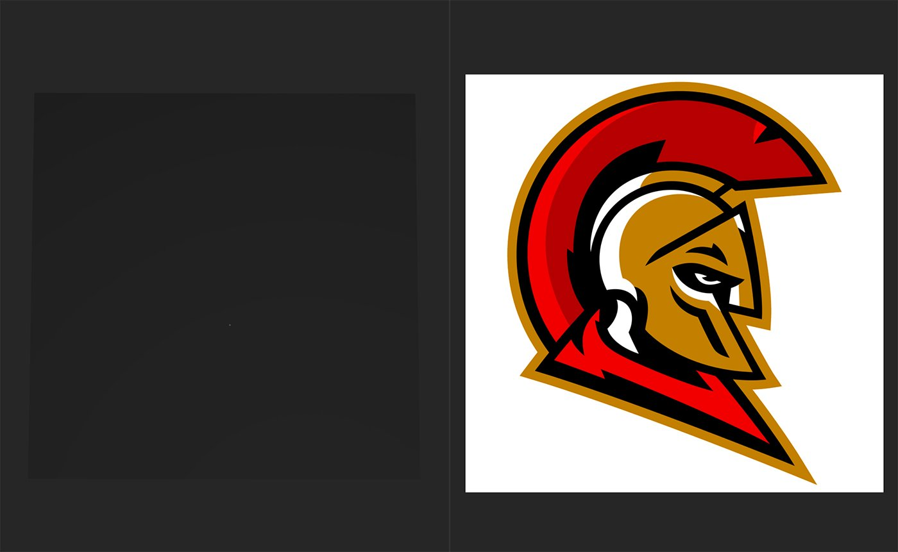

# Ricamo

<table>
<tr style="border: 0;">
<td width="41.60%" style="border: 0;" valign="top">

**In:** Generatori

</td>
<td width="58.30%" style="border: 0;" valign="top">

## Descrizione

Il filtro Ricamo consente di convertire rapidamente le immagini in macchie ricamate. Puoi personalizzare l’aspetto delle patch e utilizzare gli strumenti di gestione del colore per creare una maschera per più materiali.

Le immagini seguenti mostrano il **filtro Ricamo** in azione.

Nell’immagine sopra, l’immagine sorgente è stata importata. L’immagine è opaca e ha uno sfondo bianco.

Nell&#39;immagine precedente, il **filtro Ricamo** è stato aggiunto alla pila di livelli e ha convertito l&#39;immagine sorgente in una patch ricamata. L&#39;immagine di origine è opaca, ma l&#39;output del **filtro Ricamo** è trasparente.

</td>
</tr>
</table>

## Plug-in per ricamo Tajima

Ti interessa provare il plug-in di ricamo Tajima? \
Ulteriori informazioni [qui](../../pipeline-and-integrations/tajima-exporter-plugin.md).

## Parametri

<b>Parametri di base</b>

* <b>Numero casuale</b>:\
  Valore di inizializzazione casuale su cui sono basati tutti gli altri parametri casuali in questo filtro.
* <b>Immagine</b>: immagine/maschera\
  Seleziona un&#39;immagine dal tuo sistema o dipingi una maschera personalizzata.
* <b>Conteggio colori</b>: 1-8\
  Il filtro per ricami proverà a suddividere le immagini importate in colori separati: modifica questo valore per cambiare il numero di colori utilizzati.
* <b>Densità</b>: 80-300\
  Selezionare la densità delle fibre.
* <b>Progettazione</b>: Riempimento, Contorno, Riempimento + Contorno, Topstitch\
  Selezionate la modalità di ricamo: *Riempi* riempie tutta la zona di colore; *Contorno* crea un contorno della zona di colore; *Riempi + Contorno* crea entrambi su ciascuna zona di colore; *Trama* crea un contorno di primo piano della zona di colore.
* <b>Riempimento/Contorno: </b>0-1\
  Modificate il modo in cui le fibre vengono distribuite nella zona di colore.
* <b>Thread</b>:\
  Regolate il Thickness e la lunghezza dei filetti.
* <b>Aree smussate: </b>0-1\
  Uniformate le zone di colore e influite sul comportamento di concatenamento.
* <b>Imperfezioni</b>: 0-1\
  Aggiungete imperfezioni al filetto per facilitare la divisione del pattern

<b>Colore 1</b>

Usate i controlli per regolare ogni zona di colore singolarmente.

* <b>Riempi</b>: attiva/disattiva\
  Rendete la zona colorata visibile o non visibile.
* <b>Height</b>: \
  Scostare l&#39;orientamento dei filetti

<b>Fine cucitura</b>

* <b>Colore personalizzato:</b>\
  Personalizzare il colore dell&#39;intero ricamo
* <b>Rugosità: </b>0-1\
  Modificate il valore di rugosità per rendere il ricamo ruvido o lucido.
* <b>Metallico: </b>0-1\
  Modificate il valore Metallico per aggiungere un tocco metallico ai filetti.
* <b>Livello Anisotropia: </b>0-1\
  Modificate il livello di Anisotropia per accentuare la metallizzazione.

<b>Avanzate</b>

* <b>Intensità normale</b>: 0-1\
  Regolate la forza delle normali.
* <b>Intervallo Height:</b> 0-1\
  Regola la posizione del Height del ricamo sul materiale di base.
* <b>Posizione Height:</b> 0-1\
  Regola la posizione del Height del ricamo sul materiale di base.

## Guida all’uso

Inizialmente il filtro Ricamo può essere un po&#39; confuso, ma con pochi parametri importanti per iniziare, aggiungerai patch ai tuoi materiali in pochissimo tempo.

>[!NOTE]
>
> Se hai già utilizzato il filtro [Tessuto](weave.md), il filtro Ricamo funziona in modo simile.

Per usare il filtro Ricamo:

1. Aggiungi il filtro Ricamo al gruppo di livelli.
1. Utilizzate <b>Parametri di base > Immagine</b> per aggiungere un&#39;immagine al filtro oppure aggiungete un&#39;immagine alla pila di livelli sotto il filtro Ricamo (non in uno degli slot di input). Se un&#39;immagine non viene aggiunta a <b>Parametri di base > Immagine</b>, il filtro preleva automaticamente le immagini dai canali di digitalizzazione, se disponibili.
1. Regolate <b>Parametri di base > Conteggio colori </b> fino a ottenere il bilanciamento del colore corretto per l’immagine. Con un limite di 8 colori, attivate o disattivate i colori per isolare i colori necessari.\
   Il filtro Ricamo funziona meglio con i colori piatti e le immagini illustrate.
1. Regolate altri parametri per perfezionare l’aspetto del cerotto.

È possibile utilizzare immagini trasparenti nel filtro Ricamo, ma per impostazione predefinita queste influiranno anche sulla mappa di opacità del materiale: le parti trasparenti dell&#39;immagine renderanno anche il materiale trasparente. Per creare un cerotto con il filtro Ricamo e posizionarlo sopra i livelli sottostanti, usa il filtro Decalcomania.

1. Crea un filtro Decalcomania.
1. Aggiungi il filtro Ricamo allo slot di input del filtro Decalcomania.
1. Seguite i passaggi normali per regolare il pattern Ricamo.

Il livello Decal converte l’input Ricamo in decalcomania: la trasparenza del livello Ricamo spiega al livello decalcomania come mascherare il pattern Ricamato. Con il livello Decal puoi anche spostare il pattern sul materiale o abilitare la funzionalità come affiancamento.
