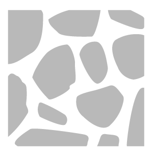

# Ghiaia

<table>
<tr style="border: 0;">
<td width="41.60%" style="border: 0;" valign="top">

**In:** Generatori

</td>
<td width="58.30%" style="border: 0;" valign="top">

## Descrizione

Gli strati di filtro di ghiaia ghiaia sulla parte superiore del materiale in modo naturale, riempiendo crepacci.

Queste immagini mostrano il **filtro Ghiaia** utilizzato per riempire i crepacci di un materiale fangoso con la ghiaia.

<table>
<tr style="border: 0;">
<td style="border: 0;" valign="top">

</td>
<td style="border: 0;" valign="top">

</td>
</tr>
</table>

</td>
</tr>
</table>

## Parametri

**Parametri di base**

* **Numero casuale**:\
  Il valore di inizializzazione casuale determina i valori casuali di altri parametri che utilizzano la casualità in questo filtro.
* **Quantità**: 0-1\
  Modificate la quantità di ghiaia distribuita sul materiale.
* **Colore primario**: selezione colore\
  Selezionare il colore di base delle pietre di ghiaia
* **Colore secondario**: selezione colore\
  Seleziona il colore secondario delle pietre di ghiaia
* **Corrispondenza colore materiale inferiore**: 0-1\
  Regolate l’impatto del colore di ghiaia sul colore del materiale sottostante
* **Abilita maschera cavità**: attiva/disattiva\
  Quando è attivata, la ghiaia riempirà le cavità e non verrà sparsa sulle parti superiori del materiale. Questo può portare ad una dispersione più realistica della ghiaia.
* **Soglia volume diffusione**: 0-50\
  Regola il volume della dispersione in base ai valori height
* **Mascheratura casuale**: 0-1\
  Imposta la percentuale di ghiaia da mascherare casualmente
* **Dimensione pietra**: 1-10\
  Controllare le dimensioni delle pietre
* **Variazione dimensione pietra**: 0-1\
  Controllare la casualità della dimensione della pietra
* **Rotondità pietra**: 0-1\
  Rendete le pietre più rotonde o più angular
* **Rugosità pietra**: 0-1\
  Modificare il valore di rugosità delle pietre
* **Height pietra**: 0-1\
  Modificate il height delle pietre. Questo influisce sul modo in cui le pietre si fondono con il materiale sottostante.
* **Elevazione pietra**: 0-1Modificare la quota altimetrica di base delle pietre. Elevation imposta il pavimento di dove si trovano le pietre, mentre height imposta il height delle pietre dal pavimento.
* **Casuale elevazione pietra**: 0-1\
  Aggiungete un valore casuale alla quota altimetrica di ciascuna pietra.
* **Smoothness superficie**: 0-1\
  Smussare le cime dei sassi
* **Usa maschera personalizzata**: attiva/disattiva\
  Attivate o disattivate l’uso di una maschera personalizzata per pittura le posizioni della pietra. I seguenti parametri saranno visibili solo se è abilitato **Usa maschera personalizzata**.
  * **Sfocatura maschera**: 0-1\
    Sfoca i bordi della maschera dipinta
  * **Maschera personalizzata**: immagine/pennello\
    Fate clic sul pennello per pittura una maschera personalizzata in cui verranno visualizzate le pietre. Fai clic sul quadrato per importare un’immagine da usare come maschera.

**Parametri avanzati**

* **Dimensioni superficie (cm)**: 0-1000\
  Modificate le dimensioni della superficie rappresentata dal materiale. Aumentando le dimensioni della dimensioni fisiche, la ghiaia è più grande e verrà modificata di conseguenza.
* **Profondità Height** **(cm)**: 0-100\
  Modificate la profondità fisica rappresentata dalla mappa di altezza del materiale. Una maggiore profondità del height significa che la dimensioni fisiche delle pietre è più alta di quanto sarebbe altrimenti, quindi l&#39;intensità normale delle pietre è aumentata.
