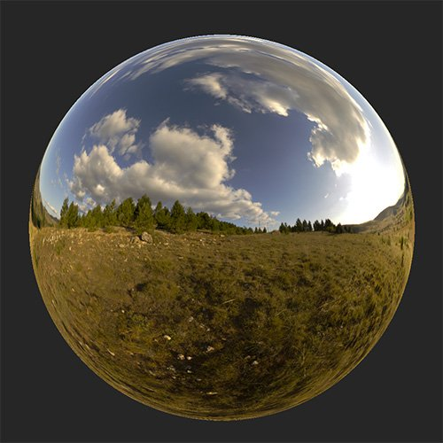

# Color temperature adjustment

<table>
<tr style="border: 0;">
<td width="41.60%" style="border: 0;" valign="top">

**In:** Strumenti HDRI

</td>
<td width="58.30%" style="border: 0;" valign="top">

## Descrizione

Regolate la temperatura della luce ambiente.

Le immagini seguenti mostrano come utilizzare il **filtro Color temperature adjustment** per rendere la luce di una luce ambiente più calda o più fredda.

<table>
<tr style="border: 0;">
<td style="border: 0;" valign="top">

{width="200px"}

</td>
<td style="border: 0;" valign="top">

{width="200px"}

</td>
</tr>
</table>

</td>
</tr>
</table>

## Parametri

**Parametri di base**

* **Temperatura**: da -1 a 1\
  Modificate la temperatura in modo che sia più fredda o più calda.
* **Magenta-Verde**: da -1 a 1\
  Modificare il colore sulla scala magenta-verde

**Maschera**

* **Maschera personalizzata**: attiva/disattiva\
  Attivare o disattivare l’uso di una maschera personalizzata. Se questa opzione è attivata, vengono visualizzati i seguenti parametri:
  * **Maschera**: immagine/pennello\
    Selezionate un’immagine da usare come maschera o usate il pennello per colorare una maschera personalizzata direttamente nella vista 2D
  * **Maschera personalizzata - Sfocatura**: 0-1\
    Sfocare la maschera
  * **Maschera personalizzata - Inverti**: attiva/disattiva\
    Invertire la maschera
