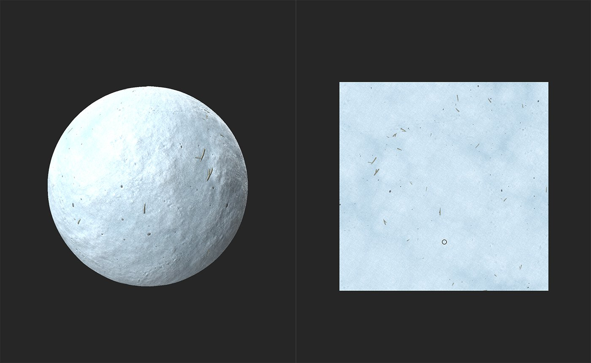
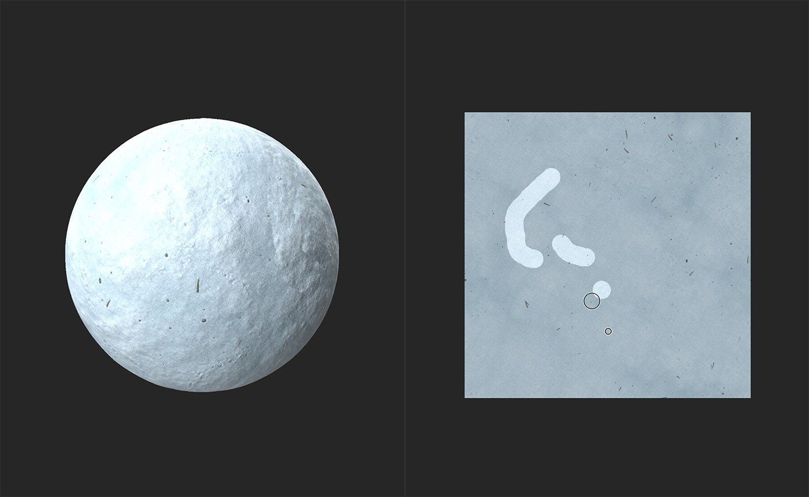
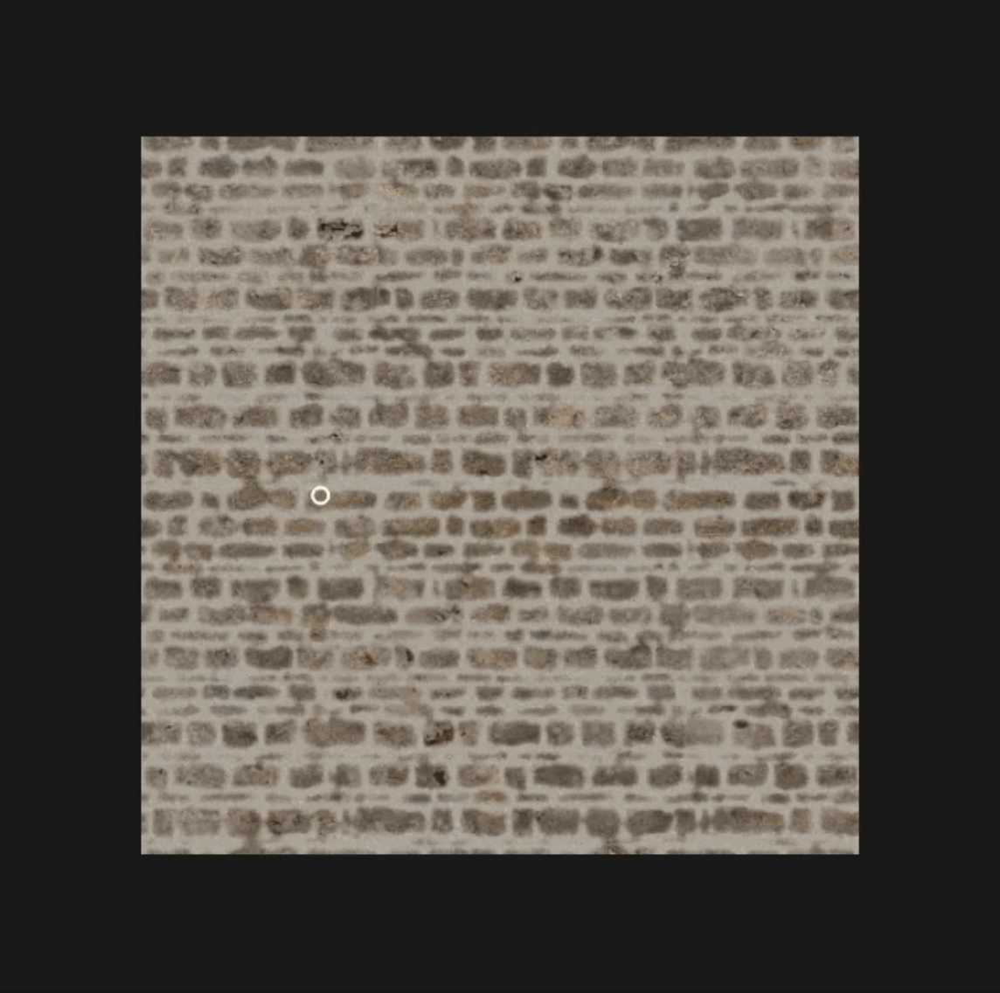

# Timbro clone

<table>
<tr style="border: 0;">
<td width="41.60%" style="border: 0;" valign="top">

**In:** Strumenti

</td>
<td width="58.30%" style="border: 0;" valign="top">

## Descrizione

Lo strumento **Timbro clone** consente di duplicare o applicare manualmente patch a parti del materiale. Ciò è utile per correggere le giunture o rimuovere gli errori dal materiale. Il **filtro Timbro clone** è uno degli strumenti disponibili nella barra laterale sinistra.

Le immagini seguenti mostrano il **Timbro clone** utilizzato per rimuovere i detriti da un materiale innevato.

Nell&#39;immagine sopra, il materiale della neve include una serie di ramoscelli e altri detriti sparsi intorno.

Lo strumento **Timbro clone** viene utilizzato per rimuovere alcuni ramoscelli e sostituirli con neve pulita.

</td>
</tr>
</table>

## Esercitazione timbro clone

## Parametri

<b>Parametri di base</b>

* <b>Espandi maschera</b>: 0-1\
  Regolate la distanza attorno all’area dipinta che il filtro tenterà di abbinare al materiale sottostante.
* <b>Fusione dissolvenza</b>: 0-1\
  Ammorbidite il bordo dell&#39;area clonata per facilitare la fusione con il materiale sottostante.
* <b>Maschera sfocatura</b>: 0-1\
  Regola la quantità di dettagli del bordo del timbro clone. Aumentando questo valore, i bordi dell’area clonata diventano più simili a blob.
* <b>Mantieni rapporto</b>: attiva/disattiva\
  Se disattivata, consente di regolare le proporzioni dell’area stampata.
  * <b>Orizzontale</b>: 0-2
  * <b>Verticale</b>: 0-2
* <b>Rotazione</b>: da -180 a 180\
  Ruota l’area stampata.
* <b>Rifletti in orizzontale</b>: attiva/disattiva\
  Specchiate l’area stampata lungo un asse orizzontale.
* <b>Rifletti in verticale</b>: attiva/disattiva\
  Specchiate l’area stampata lungo un asse verticale.

<b>Fusione dissolvenza</b>

Utilizza i controlli di fusione della dissolvenza per regolare singolarmente la fusione della dissolvenza per ogni canale nel materiale.

<b>Avanzate</b>

* <b>Intensità normale</b>: 0-2\
  Regolate l’intensità delle normali nell’area stampata.
* <b>Posizione di origine</b>: \
  0-1: Regola la posizione orizzontale della sorgente.\
  0-1: Regola la posizione verticale della sorgente.
* <b>Posizione di destinazione</b>:\
  0-1: Regola la posizione orizzontale di destinazione.\
  0-1: Regola la posizione verticale di destinazione.
* <b>Modalità di suddivisione in porzioni</b>: menu a discesa\
  Attivare o disattivare la suddivisione in porzioni.

## Guida all’uso

Fai clic sullo **strumento Timbro clone** per creare un nuovo livello filtro Timbro clone nella parte superiore della pila di livelli. Puoi anche aggiungere un filtro Timbro clone utilizzando il **pulsante Aggiungi un livello** nel **pannello Livelli**.

La creazione di un livello filtro Timbro clone apre automaticamente la **vista 2D** nella **finestra della vista**. Quando è selezionato il livello Timbro clone, nella parte superiore della **vista 2D** viene visualizzata una **barra degli strumenti**.

{width="300px"}

Per iniziare a utilizzare lo strumento Timbro clone, fate clic e trascinate sull&#39;area problematica nella **vista 2D**. Il materiale inizierà ad essere aggiornato automaticamente in base alla sorgente. Le aree in cui si utilizza lo **strumento Timbro clone** sono evidenziate.

## Barra degli strumenti

<table>
<tr style="border: 0;">
<td width="16.67%" style="border: 0;" valign="top">

</td>
<td width="83.33%" style="border: 0;" valign="top">

Mentre è selezionato il livello Timbro clone, nella vista 2D viene visualizzata una barra degli strumenti con controlli aggiuntivi.

* Seleziona lo <b>strumento Pennello </b> da aggiungere alla maschera o lo <b>strumento Cancella </b> da rimuovere dalla maschera.
* Impostate le dimensioni dello strumento attualmente selezionato.
* Accedere a controlli aggiuntivi:
  * <b>Affiancatura pennello</b>: \
    Attiva/disattiva la suddivisione in porzioni del pennello X e Y.
  * <b>Sovrapposizione:</b>\
    Attivate o disattivate la visualizzazione della sovrapposizione mentre passate il mouse sulla vista 2D.
* Visualizzare i controlli della vista 2D.

</td>
</tr>
</table>

>[!NOTE]
>
> Analogamente alle altre barre degli strumenti del riquadro di visualizzazione, è possibile trascinare il quadratino nella parte superiore della barra degli strumenti per riposizionare la barra degli strumenti all&#39;interno del riquadro di visualizzazione, fare doppio clic sul quadratino per passare dalla modalità verticale a quella orizzontale o utilizzare la doppia virgoletta per nascondere o espandere la barra degli strumenti.

## Selezione sorgente

Tenete premuto Ctrl e fate clic nella vista 2D per aggiungere una nuova sorgente. L’aggiunta di una nuova sorgente creerà un timbro aggiuntivo sotto il livello Timbro clone nel <b>pannello Livelli</b>. Puoi controllare ogni timbro singolarmente.

>[!NOTE]
>
> In genere è consigliabile evitare di posizionare il punto di origine vicino all&#39;area su cui si sta clonando. Se il punto sorgente è vicino all&#39;area problematica, è possibile clonare l&#39;area problematica.

## Scelte rapide

| Azione | Windows + Linux | MacOs |
| --- | --- | --- |
| Aumenta dimensione pennello | ] o Ctrl + rotellina del mouse | ] o Comando + rotellina del mouse |
| Riduci dimensione pennello | [ o Ctrl + rotellina del mouse | [ o Comando + rotellina del mouse |
| Impostare la sorgente | Ctrl + clic sinistro | Cmd+clic sinistro |
