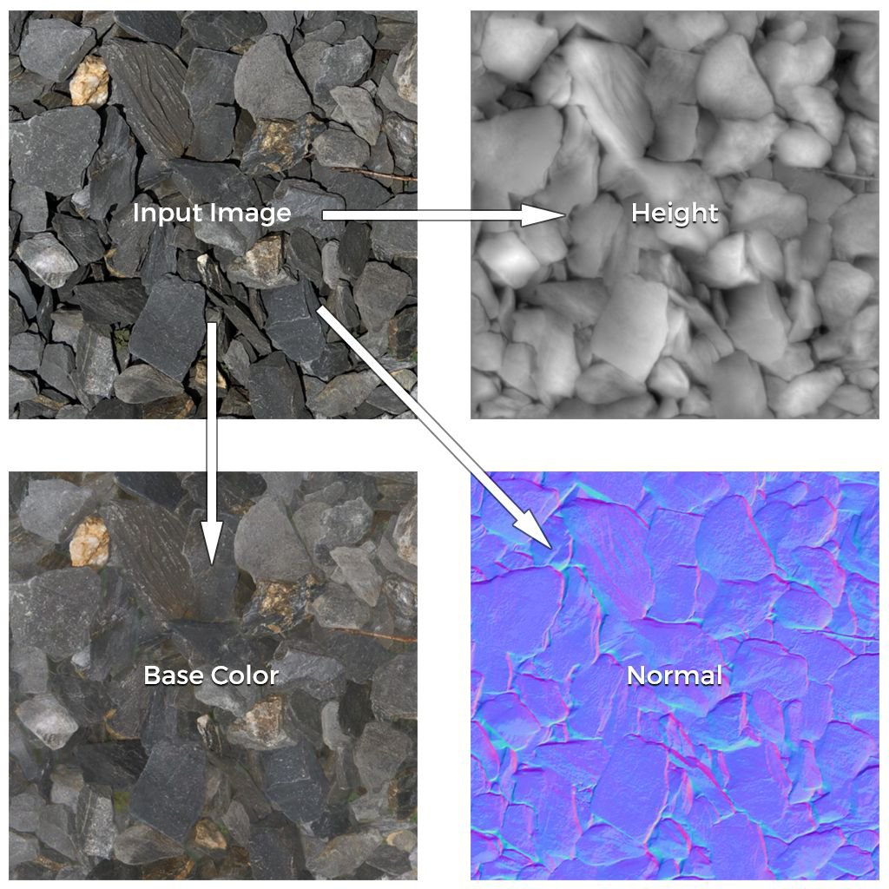

# Da Immagine A Materiale

Il modello **Da immagine a materiale** consente di generare un materiale PBR di alta qualità da una singola immagine di input.

Questo modello dispone di due algoritmi principali:

* **Basato sull&#39;intelligenza artificiale**
* **B2M**

Per una spiegazione dettagliata di ciascun algoritmo, vedere di seguito.

## Esempio

Di seguito è riportato un esempio di canali di materiale generati da una singola immagine di input:

{width="500px"}

## Algoritmi

Per modificare l&#39;algoritmo del modello **Immagine in Materiale**, fare clic sul menu a discesa sotto il nome del modello:

### Basato su IA

L&#39;algoritmo <b>AI Powered</b> utilizza l&#39;apprendimento automatico per riconoscere forme e oggetti e generare accuratamente mappe, Normali, di Height e di rugosità, nonché per eliminare l&#39;albedo da qualsiasi ombra o luce.

La rete neurale è stata addestrata su un&#39;ampia gamma di materiali come tessuti, sostanze organiche, interni e superfici esterne.

>[!NOTE]
>
> Il calcolo da immagine a materiale (basato su IA) richiederà più tempo per le immagini ad alta risoluzione. Per ottimizzare il flusso di lavoro durante il lavoro, si consiglia di utilizzare il sistema [Layer Resolution](../../interface/preferences/layer-resolution.md).

### B2M

L&#39;algoritmo **B2M** utilizza il metodo Bitmap to Material basato su Substance per generare più canali quali colore di base, normale, metallico, rugosità e occlusione ambientale utilizzando tecniche procedurali.

Questo algoritmo può produrre risultati meno precisi ma funziona su una gamma più ampia di immagini di input.

## Adobe Capture

Questa funzionalità è disponibile anche sull’app mobile Adobe Capture (Android e iOS). Puoi scattare una foto in mobilità e ottenere un&#39;anteprima del risultato direttamente sul telefono.

Invia facilmente i risultati a Substance 3D Sampler per ulteriori edizioni.

>[!NOTE]
>
> Questa funzionalità è disponibile solo con un abbonamento ad Substance 3D Collection.
