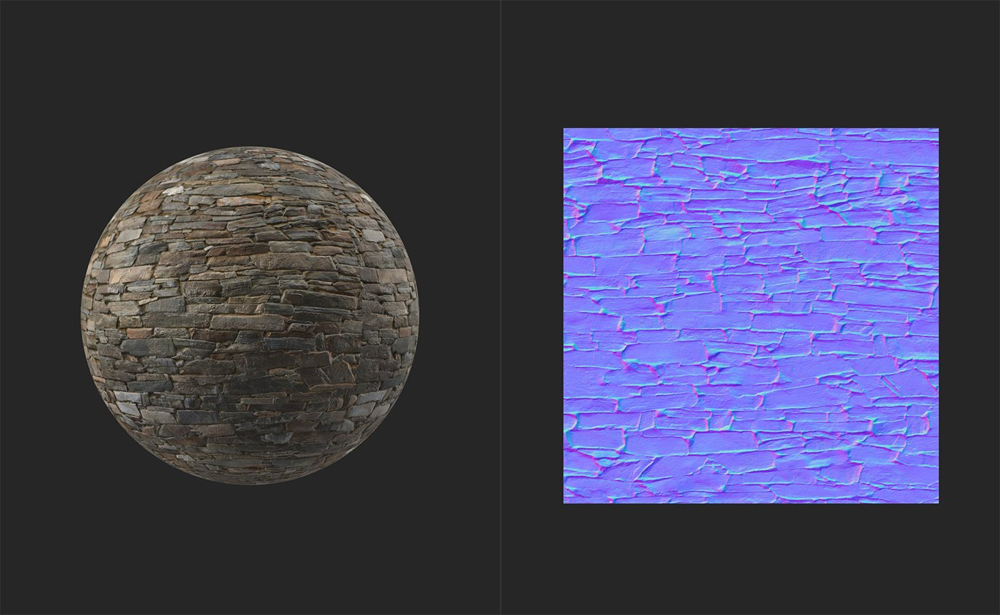

# Normale al Height

<table>
<tr style="border: 0;">
<td width="41.60%" style="border: 0;" valign="top">

**In:** Strumenti

</td>
<td width="58.30%" style="border: 0;" valign="top">

## Descrizione

Genera le informazioni di height in base al canale normale.

Le immagini seguenti mostrano il **filtro Normale al Height** in azione. Nella prima immagine, la mappa del height non contiene informazioni sul height. Nella seconda immagine, dopo l&#39;applicazione del **Normale al Height** **filtro**, viene generata una mappa di height realistica.

</td>
</tr>
</table>

## Parametri

Questo filtro non ha parametri. Per utilizzarlo, è sufficiente aggiungerlo alla parte superiore della pila di livelli.
