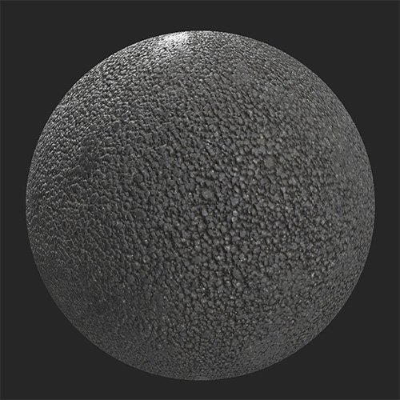

# Gomme Eliminate

<table>
<tr style="border: 0;">
<td width="41.60%" style="border: 0;" valign="top">

**Entrata:** usura e fine

</td>
<td width="58.30%" style="border: 0;" valign="top">

## Descrizione

Aggiungere la gomma da masticare eliminata nel materiale. Questo filtro è ideale per la creazione di marciapiedi o altri materiali per le aree comuni.Prima e dopo aver utilizzato il filtro **Gomme scartate** su un materiale asfaltato.

<table>
<tr style="border: 0;">
<td style="border: 0;" valign="top">

{width="200px"}

</td>
<td style="border: 0;" valign="top">

{width="200px"}

</td>
</tr>
</table>

</td>
</tr>
</table>

## Parametri

**Parametri di base**

* **Numero casuale**:\
  Il valore di inizializzazione casuale determina i valori casuali di altri parametri che utilizzano la casualità in questo filtro.
* **Densità Gomma**: 0-1\
  Regolate il numero di macchie visualizzate.
* **Dimensioni gomma**: 0-1\
  Regolate la scala delle macchie.
* **Colore gomma 1**: selezione colore.\
  Modificate il colore delle macchie.
* **Colore gomma 2**: selezione colore\
  Modificate il colore delle macchie.
* **Bilanciamento distribuzione colore gomma**: 0-1\
  Regolate la frequenza relativa dell&#39;aspetto di ciascun colore.
* **Invecchiamento gomma**: 0-1\
  Modificate l’aspetto delle macchie in modo che appaiano più vecchie o più giovani. Quando questo valore è impostato su 0, il cursore **Variazione durata gomma** scomparirà.
* **Variazione durata gomma**: 0-1\
  Varia casualmente l’età delle macchie
* **Invecchiamento della gengiva durante lo scurimento**: 0-1\
  Regola di quanto i punti si scuriscono a causa dell’età.
* **Dirt gomma**: 0-1\
  Controllate la sporcizia delle macchie.
* **Colore Dirt gomma**: selezione colore\
  Seleziona il colore del dirt sovrapposto alle macchie.
* **Variazione Dirt Gum**:\
  Regola il grado di variazione del dirt nelle varie macchie.
* **Maschera personalizzata**: attiva/disattiva\
  Attivare o disattivare l’uso di una maschera personalizzata. Se è abilitata l&#39;opzione **Maschera personalizzata**, verrà visualizzato il controllo seguente:
  * **Maschera**: immagine/pennello\
    Selezionate un’immagine da usare come maschera oppure usate il pennello per pittura una maschera personalizzata direttamente nella Vista 2D.

**Parametri avanzati**

* **Intervallo Height gomma**: 0-1\
  Controllate l’estensione delle macchie sulla superficie sottostante.
* **Intensità normale gomma**: 0-1\
  Regolate la forza del normale impatto dovuto alle macchie.
