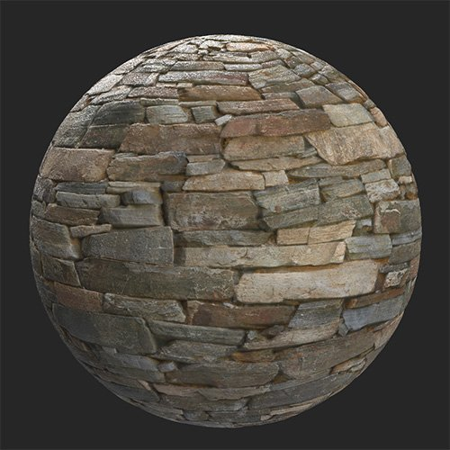

# Erode

<table>
<tr style="border: 0;">
<td width="41.60%" style="border: 0;" valign="top">

**Entrata:** usura e fine

</td>
<td width="58.30%" style="border: 0;" valign="top">

## Descrizione

Usa **Filtro Erosione** per indossare macchie alte sul tuo materiale.

Le immagini seguenti mostrano come è possibile utilizzare il **Filtro Erosione** per aggiungere erosione a un muro di pietra.

<table>
<tr style="border: 0;">
<td style="border: 0;" valign="top">

{width="200px"}

</td>
<td style="border: 0;" valign="top">

{width="200px"}

</td>
</tr>
</table>

</td>
</tr>
</table>

## Parametri

**Parametri di base**

* **Numero casuale**:\
  Il valore di inizializzazione casuale determina i valori casuali di altri parametri che utilizzano la casualità in questo filtro.
* **Colore di erosione**: selezione colore\
  Impostate il colore delle aree erose.
* **Colore Dust scanalature**: selezione colore\
  Imposta il colore del dust.
* **Colore quarzo**: selezione colore\
  Imposta il colore del quarzo rivelato dall&#39;erosione.
* **Dimensioni area di erosione**: 0-1\
  Modificate la diffusione dell’effetto di erosione.
* **Rugosità erosione**: 0-0.63\
  Modificate la ruvidezza del materiale a causa dell&#39;erosione.
* **Intensità erosione**: 0-1\
  Regolate l’intensità dell’effetto erosione.
* **Intensità effetto pioggia**: 0-1
* **Scanalature**: 0-1
* **Intensità Dust scanalature**: 0-1
* **Intensità Scratches scanalature**: 0-1\
  Regola l&#39;impatto delle scanalature sulle mappe normali e altezza.
* **Densità micro grana**: 0-1\
  Regolate la densità dei graffi della scanalatura.
* **Intensità quarzo**: 0-1\
  Regolate la visibilità delle aree di quarzo.
* **Rugosità quarzo**: 0-1\
  Regolate la ruvidità del quarzo.
* **Variazione normale al quarzo**: 0-1\
  Modificate le normali delle aree di quarzo.
* **Usa maschera personalizzata**: attiva/disattiva\
  Attivare o disattivare l’uso di una maschera personalizzata. Se questa opzione è attivata, vengono visualizzati i seguenti parametri:
  * **Maschera**: immagine/pennello\
    Selezionate un’immagine da usare come maschera oppure usate il pennello per pittura una maschera personalizzata direttamente nella Vista 2D.
  * **Maschera personalizzata - Sfocatura**: 0-1\
    Sfocate la maschera.
  * **Maschera personalizzata - Inverti**: attiva/disattiva\
    Invertite la maschera.
  * **Maschera personalizzata - Opacità**: 0-1\
    Regola l’intensità della maschera personalizzata.
