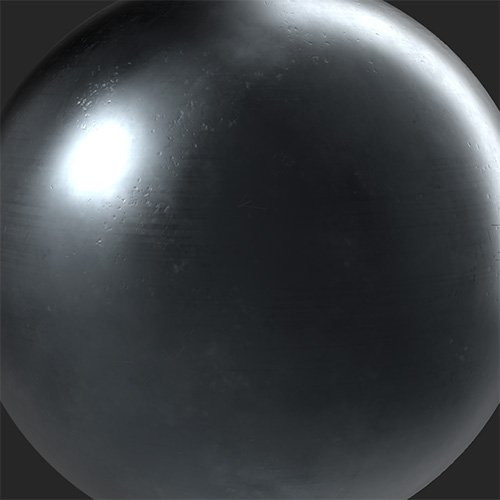

# Finitura metallo

<table>
<tr style="border: 0;">
<td width="41.60%" style="border: 0;" valign="top">

**Entrata:** usura e fine

</td>
<td width="58.30%" style="border: 0;" valign="top">

## Descrizione

Converti il tuo materiale in un metallo con una serie di finiture e stili.

*Un materiale metallico grezzo viene convertito in una superficie metallica spazzolata con il **filtro di finitura metallica.***

<table>
<tr style="border: 0;">
<td style="border: 0;" valign="top">

{width="200px"}

</td>
<td style="border: 0;" valign="top">

{width="200px"}

</td>
</tr>
</table>

</td>
</tr>
</table>

## Parametri

**Parametri di base**

* **Numero casuale**:\
  Il valore di inizializzazione casuale determina i valori casuali di altri parametri che utilizzano la casualità in questo filtro.
* **Modifica solo metallizzato**: attiva/disattiva\
  Quando attivato, questo filtro limiterà le modifiche al canale metallico.
* **Metodo colore metallo**:\
  Selezionate un colore basato su un metallo esistente o scegliete il vostro colore. Con **Colore personalizzato** selezionato, verrà visualizzato il controllo seguente:
  * **Colore metallo**: selezione colore\
    Selezionate un colore personale per la finitura in metallo.
* **Tipo di fine**:\
  Selezionate uno stile da applicare al metallo. Ogni stile ha parametri diversi che consentono di regolarne l&#39;aspetto. Possono essere visualizzati i seguenti parametri:
  * **Intensità**: 0-1\
    Regolate l’intensità della finitura scelta.
  * **Scala**: 0-1\
    Modificate la scala della serie che guida la finitura scelta.
  * **Rugosità**: 0-1\
    Controllate il valore di rugosità del metallo.
  * **Scala perline**: 0-1\
    Disponibile per **Sandblast**. Imposta le dimensioni delle perline utilizzate per creare l’effetto sabbiatura.
  * **Lucido**: 0-1\
    Disponibile per **Cast**. Regolate la quantità di lucidatura per rimuovere le parti più alte del materiale.
  * **Pattern**:\
    Disponibile per **Grinded**. Impostate il pattern utilizzato dalla smerigliatrice.
  * **Dettagli Rilievo**: 0-1\
    Disponibile per **Raw**. Regolate la forza normale.
  * **Orientamento**: 0-1\
    Disponibile per **Pennellate**. Modificate la direzione dell’effetto pennello.
  * **Lunghezza pennello**: 0-1\
    Disponibile per **Pennellate**. Modificate la lunghezza dei tratti utilizzati per creare l’effetto pennello.
  * **Pennellata**: 0-1\
    Disponibile per **Galvanizzato**. Sovrapponete un aspetto a pennello sulla finitura zincata.

**Maschera**

* **Usa maschera personalizzata**: attiva/disattiva\
  Attivare o disattivare l’uso di una maschera personalizzata. Se questa opzione è attivata, vengono visualizzati i seguenti parametri:
  * **Maschera**: immagine/pennello\
    Selezionate un’immagine da usare come maschera oppure usate il pennello per pittura una maschera personalizzata direttamente nella Vista 2D.
  * **Maschera personalizzata - Sfocatura**: 0-1\
    Sfocate la maschera.
  * **Maschera personalizzata - Inverti**: attiva/disattiva\
    Invertite la maschera.

**Parametri avanzati**

* **Colore di base**: attiva/disattiva\
  Consente di impostare se il filtro agisce sul canale del colore di base.
* **Metallico**: attiva/disattiva\
  Imposta se il filtro agisce sul canale metallico.
* **Rugosità**: attiva/disattiva\
  Impostate se il canale di rugosità è interessato dal filtro.
* **Specular level**: attiva/disattiva\
  Controlla se il filtro agisce sul canale di specular level. Se questa opzione è attivata, viene visualizzato un controllo aggiuntivo:
  * **Specular level** **- Valore**: 0-1\
    Regolate il valore del canale di specular.

>[!NOTE]
>
> Attualmente è presente un bug noto in cui il controllo **Specular level** può scomparire se viene disattivato senza alcun controllo per riattivarlo. Se perdi il controllo **Specular level** ma ne hai bisogno, puoi utilizzare Annulla (ctrl + z o cmd + z in macOS) per annullare la disattivazione dell&#39;interruttore.

* **Normale**: attiva/disattiva\
  Consente di impostare se il filtro agisce sul canale normale. Se questa opzione è attivata, viene visualizzato un controllo aggiuntivo:
  * **Intensità normale**: 0-1\
    Regolare l’intensità della normale modifica mediante il filtro.
* **Height**: attiva/disattiva\
  Consente di impostare se il filtro agisce sul canale del height.
* **Emissivo**: attiva/disattiva\
  Impostate se il filtro agisce sul canale emissivo. Se questa opzione è attivata, viene visualizzato un controllo aggiuntivo:
  * **Emissivo - Colore**: selezione colore\
    Imposta il colore del canale emissivo.
* **Occlusione ambientale**: attiva/disattiva\
  Consente di impostare se il canale di occlusione ambientale è interessato dal filtro. Se questa opzione è attivata, compaiono i seguenti controlli aggiuntivi:
  * **Occlusione ambientale - Intensità**: 0-1\
    Regolate l’intensità dell’AO generato.
  * **Occlusione ambientale** **- Raggio**: 0-1\
    Regolate il raggio dell’effetto AO.
* **Opacità**: attiva/disattiva\
  Impostate se il filtro agisce sul canale di opacità. Se questa opzione è attivata, viene visualizzato un controllo aggiuntivo:
  * **Opacità - Valore**: 0-1\
    Modificate l&#39;opacità del materiale.
