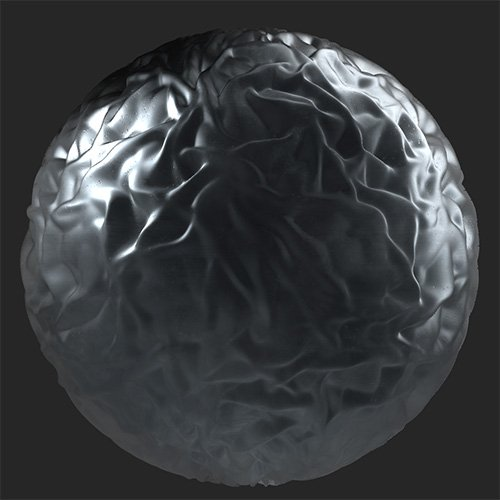

# Ossidato

<table>
<tr style="border: 0;">
<td width="41.60%" style="border: 0;" valign="top">

**Entrata:** usura e fine

</td>
<td width="58.30%" style="border: 0;" valign="top">

## Descrizione

Aggiungete uno strato di ossidazione sopra il materiale.*Su una superficie rugosa è applicato il **filtro ossidato**.*

<table>
<tr style="border: 0;">
<td style="border: 0;" valign="top">

{width="200px"}

</td>
<td style="border: 0;" valign="top">

{width="200px"}

</td>
</tr>
</table>

</td>
</tr>
</table>

## Parametri

**Parametri di base**

* **Numero casuale**:\
  Il valore di inizializzazione casuale determina i valori casuali di altri parametri che utilizzano la casualità in questo filtro.
* **Aree di destinazione**: attiva/disattiva\
  Abilita per modificare il modo in cui l&#39;effetto di ossidazione viene applicato nel materiale. Quando questa opzione è attivata, viene visualizzato il controllo seguente:
  * **Intensità aree di destinazione**: 0-1\
    Regolate la diffusione dell’effetto sulle aree di destinazione.
  * **Diffusione**: 0-1\
    Regolare la distanza di diffusione dell&#39;ossidante.
* **Colore**: selezione colore\
  Selezionate il colore di base del filtro. I colori di base modificano la tonalità di tutti i colori che compongono l&#39;effetto ossidante.
* **Variazioni colore**: 0-1\
  Regola la scala dell’effetto di variazione del colore.
* **Densità**: 0-1\
  Modificate la densità di copertura dell’effetto.
* **Pagina al vivo bordo**: 0-1\
  Modificate il modo in cui i bordi dell’effetto di ossidazione fuoriescono nelle aree non ossidate.
* **Patch**: 0-1\
  Si tratta di un controllo separato per modificare la maschera tra aree ossidate e non ossidate. Combinatela con la densità e altri controlli per perfezionare i bordi delle aree ossidate.
* **Chipping**: 0-1\
  Eliminare l&#39;area ossidata per rivelare il materiale sottostante.
* **Macchie**: 0-1\
  Regolate la quantità di colorazione sovrapposta sul materiale.
* **Rugosità corrosione**: 0-1\
  Regolate la rugosità delle aree ossidate.
* **Metallico corrosione**: 0-1\
  Regolate i valori metallici delle aree ossidate.
* **Intensità disturbo**: 0-1

**Maschera**

* **Usa maschera personalizzata**: attiva/disattiva\
  Attivare o disattivare l’uso di una maschera personalizzata. Se questa opzione è attivata, vengono visualizzati i seguenti parametri:
  * **Maschera**: immagine/pennello\
    Selezionate un’immagine da usare come maschera oppure usate il pennello per pittura una maschera personalizzata direttamente nella Vista 2D.
  * **Maschera personalizzata - Sfocatura**: 0-1\
    Sfocate la maschera.
  * **Maschera personalizzata - Inverti**: attiva/disattiva\
    Invertite la maschera.
  * **Opacità maschera personalizzata**: 0-1\
    Regolate l’opacità della maschera.

**Parametri tecnici**

I seguenti parametri consentono di regolare il valore denominato per l’intero materiale senza aggiungere un livello di regolazione, ad esempio **Luminosità/Contrasto** o **Tonalità/Saturazione**

* **Luminosità**: 0-1
* **Contrasto**: da -1 a 1
* **Scostamento tonalità**: 0-1
* **Saturazione**: 0-1
* **Intensità normale**: 0-1
* **Intervallo Height**: 0-1
* **Posizione Height**: 0-1
* **Intensità Occlusione ambientale**: 0-1
