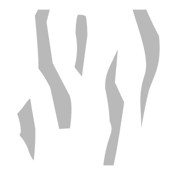

# Graffio

<table>
<tr style="border: 0;">
<td width="41.60%" style="border: 0;" valign="top">

**Entrata:** usura e fine

</td>
<td width="58.30%" style="border: 0;" valign="top">

## Descrizione

Aggiungi graffi e usura al tuo materiale.

*Prima e dopo l&#39;applicazione del **filtro memoria virtuale**.*

<table>
<tr style="border: 0;">
<td style="border: 0;" valign="top">

{width="200px"}

</td>
<td style="border: 0;" valign="top">

{width="200px"}

</td>
</tr>
</table>

</td>
</tr>
</table>

## Parametri

**Parametri di base**

* **Numero casuale**:\
  Il valore di inizializzazione casuale determina i valori casuali di altri parametri che utilizzano la casualità in questo filtro.
* **Memoria virtuale**: attiva/disattiva\
  Attivare o disattivare i graffi. Se abilitata, viene visualizzata la sezione **Scratch**.
* **Chip**: attiva/disattiva\
  Aggiungete un effetto ridotto alla superficie. Se abilitata, viene visualizzata la sezione **Chip**.
* **Micro-scratch**: attiva/disattiva\
  Aggiungete micrograffi alla superficie. Se abilitata, viene visualizzata la sezione **Micromemoria**.

**Memoria virtuale**

Per visualizzare questa sezione, è necessario abilitare **Parametri di base > Scratch**.

* **Importo**: 0-1\
  Controllate il numero di graffi che vengono visualizzati.
* **Intensità**: 0-1\
  Regolate la profondità e l’intensità dei graffi.
* **Scala**: 1-4\
  Modificate le dimensioni dei graffi. Aumentate questo valore per ridurre le dimensioni del graffio.

**Chip**

Per visualizzare questa sezione, è necessario abilitare **Parametri di base > Scratch**.

* **Importo**: 0-1\
  Controllare il numero di chip visualizzati.
* **Intensità**: 0-1\
  Regolate la profondità e la robustezza dei chip.
* **Scala**: 1-4\
  Modificate le dimensioni dei chip. Aumentate questo valore per ridurre le dimensioni del chip.

**Micromemoria**

* **Importo**: 0-1\
  Controllate il numero di micrograffi che vengono visualizzati.
* **Intensità**: 0-1\
  Regolate la profondità e l’intensità dei micrograffi.
* **Rotazione**: 0-1\
  Ruotate i micro-graffi.
* **Rotazione casuale**: 0-1\
  Varia casualmente la rotazione dei micrograffi.
* **Scala**: 0-2\
  Regolate le dimensioni dei micrograffi. Aumentate questo cursore per aumentare le dimensioni del micro-graffio.
* **Scala casuale**: 0-1\
  Modificate casualmente la scala dei micrograffi.
* **Larghezza**: 0-1\
  Controllare la larghezza dei graffi
* **Larghezza casuale**: 0-1\
  Varia casualmente la larghezza dei micrograffi.
* **Distorsione**: 0-1\
  Aggiungete distorsione ai graffi per rompere l&#39;uniformità.
* **Distorsione casuale**: 0-1\
  Controllate la casualità dell’effetto distorsione.
* **Frequenza Distorsione**: 0-1\
  Consente di controllare la scala di frequenza dell’effetto distorsione.

**Maschera**

* **Maschera personalizzata**: attiva/disattiva\
  Attivare o disattivare l’uso di una maschera personalizzata. Se questa opzione è attivata, vengono visualizzati i seguenti parametri:
  * **Maschera**: immagine/pennello\
    Selezionate un’immagine da usare come maschera o usate il pennello per colorare una maschera personalizzata direttamente nella vista 2D.
  * **Maschera personalizzata - Sfocatura**: 0-1\
    Sfocate la maschera.
  * **Maschera personalizzata - Inverti**: attiva/disattiva\
    Invertite la maschera.

**Parametri avanzati**

* **Opacità complessiva**: 0-1\
  Regola l’opacità dell’effetto **Filtro memoria virtuale**.
* **Colore di base**: attiva/disattiva\
  Consente di impostare se il canale del colore di base è interessato dal filtro. Se questa opzione è attivata, viene visualizzato un controllo aggiuntivo:
  * **Colore di base - Colore**: selezione colore\
    Selezionate il colore di base dei graffi e dei patatini.
* **Metallico**: attiva/disattiva\
  Imposta se il filtro agisce sul canale metallico. Se questa opzione è attivata, viene visualizzato un controllo aggiuntivo:
  * **Valore metallico**: 0-1\
    Regolate il valore metallico delle aree graffiate.
* **Rugosità**: attiva/disattiva\
  Impostate se il canale di rugosità è interessato dal filtro. Se questa opzione è attivata, viene visualizzato un controllo aggiuntivo:
  * **Rugosità - Valore**: 0-1\
    Regolate il valore di rugosità delle aree graffiate.
* **Normale**: attiva/disattiva\
  Consente di impostare se il filtro agisce sul canale normale. Se questa opzione è attivata, vengono visualizzati controlli aggiuntivi:
  * **Normale - Intensità**: da -1 a 1\
    Regolate l’intensità delle normali.
  * **Normale -** **Appiattisci**:\
    Diminuite questo valore per appiattire le normali.
* **Height**: attiva/disattiva\
  Consente di impostare se il filtro agisce sul canale del height. Se questa opzione è attivata, viene visualizzato un controllo aggiuntivo:
  * **Height - Intensità**: 0-1\
    Regola il contrasto della mappa del height.
* **Emissivo**: attiva/disattiva\
  Impostare se il canale di emissione è influenzato dal filtro. Se questa opzione è attivata, viene visualizzato un controllo aggiuntivo:
  * **Emissivo - Colore**: selezione colore\
    Imposta il colore del canale di emissione.
* **Specular level**: attiva/disattiva\
  Controlla se il filtro agisce sul canale di specular level. Se questa opzione è attivata, viene visualizzato un controllo aggiuntivo:
  * **Specular level** **- Valore**: 0-1\
    Regolate il valore del canale di specular.
* **Occlusione ambiente**: attiva/disattiva\
  Consente di specificare se il filtro agisce sul canale di occlusione dell’ambiente. Se questa opzione è attivata, compaiono i seguenti controlli aggiuntivi:
  * **Occlusione ambiente - Intensità**: 0-1\
    Regolate l’intensità dell’AO generato.
  * **Occlusione ambiente** **- Raggio**: 0-1\
    Regolate il raggio dell’effetto AO.
* **Opacità**: attiva/disattiva\
  Impostate se il filtro agisce sul canale di opacità. Se questa opzione è attivata, viene visualizzato un controllo aggiuntivo:
  * **Opacità - Valore**: 0-1\
    Modificate l&#39;opacità del materiale.
