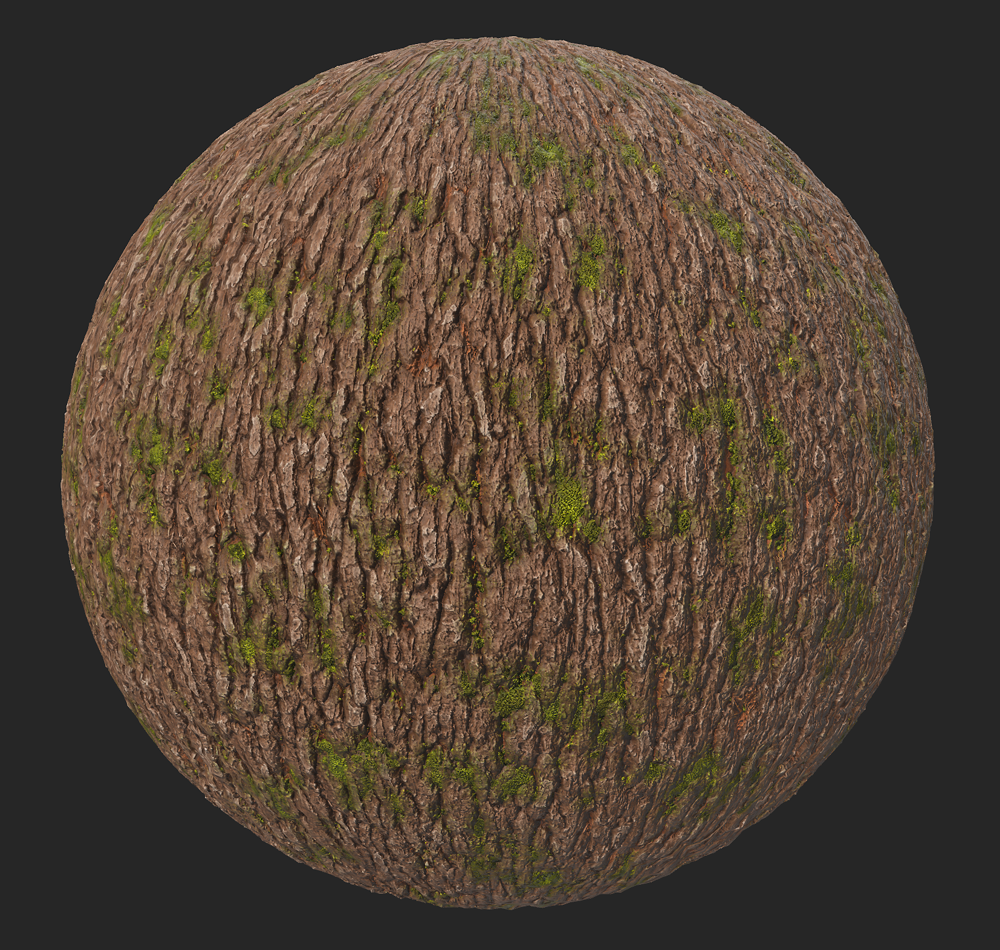

# Stilizzazione

<table>
<tr style="border: 0;">
<td width="41.60%" style="border: 0;" valign="top">

<b>Entrata:</b> Fine usura

</td>
<td width="58.30%" style="border: 0;" valign="top">

## Descrizione

Utilizza il <b>filtro Stilizzazione</b> per modificare l&#39;aspetto del materiale al fine di semplificare i dettagli con diversi effetti.

Le immagini seguenti mostrano il materiale della corteccia prima e dopo aver applicato il filtro Stilizzazione.

</td>
</tr>
</table>

## Predefiniti

<b>Stilizzazione</b>

    Il predefinito predefinito applica un effetto di stilizzazione morbido sfocando piccoli dettagli e aumentando il contrasto

<b>Stilizzazione in contrasto</b>

    Questo predefinito applica al materiale un effetto simile a pennellate

<b>Pittorico</b>

    Questo predefinito applica al materiale un effetto pennellate sfocate e morbide

<b>Dipinto a mano</b>

    Questo predefinito applica un contrasto maggiore rispetto ai precedenti, imita i tratti di pennello manuali di guazzo o pittura ad olio

## Parametri di base

* <b>Numero casuale </b>\
  Numero casuale su cui sono basati tutti gli altri parametri casuali in questo filtro.

* <b>Intensità filtro globale</b>: 0-1 \
  Regolate quanto gli effetti di questo filtro verranno applicati al materiale originale. Impostate su 1 per applicare l’effetto completo.

* <b>Contrasto</b>: 0-1 \
  Modificare il livello di contrasto applicato al materiale

* <b>Intensità stile colore</b>: 0-1 \
  Regola l’effetto di stilizzazione del filtro sul colore del materiale

* <b>Intensità Stilizzazione Rugosità</b>: 0-1 \
  Regola di quanto l&#39;effetto di stilizzazione del filtro influirà sulla rugosità del materiale

* <b>Intensità Stilizzazione Metallica</b>: 0-1 \
  Regola in che misura l&#39;effetto di stilizzazione del filtro influirà sulla metallizzazione del materiale

* <b>Intensità Stilizzazione Height</b>: 0-1 \
  Regola l’effetto di stilizzazione del filtro sul height del materiale

* <b>Intensità Stilizzazione Normale</b>: 0-1 \
  Regolate l’effetto di stilizzazione del filtro in base alla normale proprietà del materiale.

## Colore di base

* <b>Intensità colorazione</b>: 0-1 \
  Colori più vividi

* <b>Colora Colore</b>: Colore \
  Consente di scegliere il colore a cui tendono i parametri &quot;Intensità colorazione&quot;.

* <b>Intensità variazione colore</b>: 0-1 \
  Regola di quanto l&#39;intensità del colore è influenzata dal colore definito in &quot;Variazione colore&quot;

* <b>Variazione colore</b>: colore \
  Scegli il colore su cui applicare il cursore &quot;Intensità variazione colore&quot;

* <b>Contrasto variazione colore</b>: 0-1 \
  Regolare il contrasto nel colore definito in &quot;Variazione colore&quot;

* <b>Intensità colore cavità</b>: 0-1 \
  Regola l’intensità del colore che appare nelle aree scure del materiale, colore definito in &quot;Colore cavità&quot;

* <b>Colore cavità</b>: colore \
  Definisce il colore che verrà applicato nelle aree incassate del materiale

* <b>Intervallo cavità</b>: 0-1 \
  Definisce la larghezza delle aree incassate nel materiale.

* <b>Sfocatura cavità</b>: 0-1\
  Regolare il livello di sfocatura nelle aree sul bordo delle cavità del materiale

* <b>Intensità curvatura</b>: 0-1 \
  Modifica la visibilità del punto più alto dei materiali, colorandoli con il colore definito nel parametro &quot;Curvature Color&quot;

* <b>Intensità colorazione curvatura</b>: 0-1 \
  Regola l&#39;opacità del colore definito nel parametro &quot;Curvature Color&quot;

* <b>Colore curvatura</b>: colore \
  Definite il colore da applicare ai punti più alti del materiale

* <b>Sfocatura curvatura</b>: 0-1 \
  Regola il livello di sfocatura attorno alle aree colorate dal parametro &quot;Colore curvatura&quot;

## Grunge

* <b>Intensità Grunge</b>: 0-1 \
  Aggiunge una mappa di grunge sopra il materiale. La mappa della grunge può essere scelta di seguito.

* <b>Colore Grunge</b>: colore \
  Scegli il colore da usare per applicare la mappa di grunge scelta

* <b>Rugosità Grunge</b>: 0-1 \
  Regola il livello o la rugosità che verrà applicato alla mappa della grunge aggiunta

* <b>Metallico Grunge</b>: 0-1 \
  Regola il livello di metallizzazione da applicare alla mappa di grunge aggiunta

* <b>Variazione rugosità Grunge</b>: 0-1 \
  Scegli il livello di variazione della rugosità applicata alla mappa delle grungi aggiunta

* <b>Intensità variazione rugosità Grunge</b>: 0-1 \
  Scegliere il livello di variazione dell’intensità della variazione applicata alla mappa delle grungi aggiunta

* <b>Grunge</b>: immagine \
  Scegli un&#39;immagine o un generatore di Texture disponibile nella libreria di risorse di Sampler da utilizzare come mappa di grunge

## Parametri tecnici

* <b>Intensità nitidezza</b>: 0-1 \
  Regola l’intensità dell’effetto nitidezza globale

* <b>Raggio nitidezza</b>: 0-1 \
  Regola il raggio dell’effetto di nitidezza globale

* <b>Ricalcola normale</b>: Attiva/Disattiva \
  Consenti a Sampler di ricalcolare la normale in base alle modifiche applicate al materiale

* <b>Intensità normale</b>: 0-1 \
  Regolare l’intensità della Mappa normale

* <b>Ammorbidimento normale</b>: 0-1\
  Ammorbidite la normale per un aspetto più uniforme del materiale

* <b>Intensità Occlusione ambientale</b>: 0-1\
  Regola il livello del contrasto sulla mappa AO
