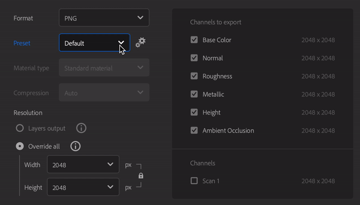

# Finestra Esporta

Puoi esportare la tua risorsa dal pannello <b>Esporta</b> nella <b>barra destra</b>.

Le opzioni di esportazione dipendono dal tipo di risorsa esportata.

La finestra Esporta per un&#39;esportazione di materiale.

>[!NOTE]
>
> Il pannello Esporta ha anche le opzioni per Inviare la tua risorsa a Substance 3D Designer, Painter o Stager. La risorsa verrà esportata automaticamente con le impostazioni corrette per altre applicazioni Substance 3D.

## Impostazioni generali

Le seguenti impostazioni sono disponibili per tutti i tipi di risorse.

* <b>Nome: </b>Questo campo definisce il nome della risorsa che stai esportando. Verrà utilizzato come prefisso nel nome dei file esportati.
* <b>Salva in: </b>Seleziona la destinazione di esportazione per la tua risorsa. Facoltativamente, puoi anche creare una sottocartella nella posizione scelta. Se questa opzione è attivata, alla sottocartella verrà assegnato il nome della risorsa.

## Impostazioni materiale

Quando esportate Materiali, il pannello Impostazioni materiale della finestra Esporta presenta le seguenti opzioni:

* <b>Formato</b>: selezionate un formato di file per la risorsa esportata.
  * <b>SBSAR</b>: esporta il tuo materiale per utilizzarlo in qualsiasi applicazione che supporti i materiali di Substance.
  * <b>SBS</b>: esportate il materiale in modo che possa essere aperto in Substance 3D Designer.
  * <b>EXR, JPEG, PNG, TARGA, TIFF</b>: esporta il materiale come raccolta di file di immagine.

>[!NOTE]
>
> La profondità di bit viene forzata a 16 bit per i canali Normale e Height. Gli altri canali vengono esportati in 8/16 bit a seconda dei materiali e dei filtri utilizzati. A seconda del formato di file, la profondità di bit può essere modificata poiché alcuni formati di file non supportano la profondità di bit alta.

{width="400px"}

* <b>Predefinito </b>(EXR, JPEG, PNG, TARGA, TIFF): selezionate un predefinito per impostare automaticamente l&#39;esportazione dei file per una determinata applicazione o pipeline.
  * L&#39;opzione <b>Predefinito (flusso di lavoro del progetto)</b> mostra un elenco di tutti i canali disponibili dei materiali senza alcun predefinito applicato.
  * Usa il pulsante <b>Gestisci predefiniti </b> a destra del parametro Predefiniti per modificare i predefiniti o aggiungerne di nuovi.<b> </b>
  * [Ulteriori informazioni sui Predefiniti sono disponibili qui.](../managing-presets.md)

>[!NOTE]
>
> La selezione del predefinito non è disponibile quando il formato di esportazione è SBS o SBSAR. Per questi formati, il file di output è già configurato per essere utilizzabile in tutti i prodotti Substance e le integrazioni Substance.

* <b>Tipo di materiale </b>(SBSAR, SBS): selezionare se il materiale esportato si comporta come un materiale standard, una decalcomania o un atlas. Questa impostazione può modificare il modo in cui viene trattata dalle altre applicazioni che supportano i file SBSAR e SBS.

* <b>Compressione </b>(SBSAR, SBS): selezionare la modalità di compressione del file esportato
  * <b>Automatico</b>: consente a Sampler di determinare le impostazioni di compressione.
  * <b>Migliore</b>: questa opzione genera file più piccoli, ma può anche comportare tempi di caricamento e salvataggio più lunghi durante la codifica o la decodifica del file.
  * <b>Nessuno</b>: se non si utilizza la compressione, i file saranno più grandi, ma verranno caricati e salvati più rapidamente.
* <b>Risoluzione (</b>SBSAR, SBS<b>)</b>: selezionate una risoluzione di output per il materiale.
  * Per impostazione predefinita, la risoluzione si basa sui parametri globali di Sampler. Se selezionate una risoluzione diversa, Sampler ricalcolerà tutti i materiali con la nuova risoluzione. Potrebbe influire sull’aspetto finale del/i materiale/i.

* <b>Risoluzione </b> (formati immagine): selezionare se la risoluzione di ogni livello deve essere esportata in modo indipendente oppure se deve essere ignorata in modo che tutti i livelli vengano esportati con dimensioni uniformi. Se l’opzione Sostituisci tutto è selezionata, vengono visualizzate le opzioni per modificare la risoluzione dell’output.
  * Per impostazione predefinita, la risoluzione è basata sulla risoluzione di output di ciascun livello. Se selezionate una risoluzione diversa, Sampler ricalcolerà tutti i materiali con la nuova risoluzione. Potrebbe influire sull’aspetto finale del/i materiale/i.

* **Modello di materiale** (tutti i formati sono in predefinito): selezionate uno standard di shader per la texture esportata.
  * La modifica del Modello di materiale influirà sui nomi dei file esportati. Ad OpenPBR, viene utilizzato &quot;Metalness&quot; invece di ASM, che utilizza &quot;Metallic&quot;.

### Informazioni aggiuntive

Lo spazio disponibile su disco nell&#39;unità di destinazione selezionata è visibile nella parte inferiore della <b>finestra Esportazione</b>.

>[!NOTE]
>
> <b>La Dimensioni fisiche</b> è impostata durante la creazione del materiale e non può essere modificata durante l&#39;esportazione.

### Canali

Sul lato destro del <b>pannello Impostazioni materiali</b>, è visibile un elenco di canali che possono essere esportati e le relative risoluzioni (canali predefiniti e personalizzati).

Ogni predefinito ha un diverso set di canali da esportare e il nome dei file esportati si basa sui nomi visibili nell&#39;area <b>Canali da esportare</b>. Puoi utilizzare la casella di controllo accanto a qualsiasi canale per abilitare o disabilitare l’esportazione per quel canale.

