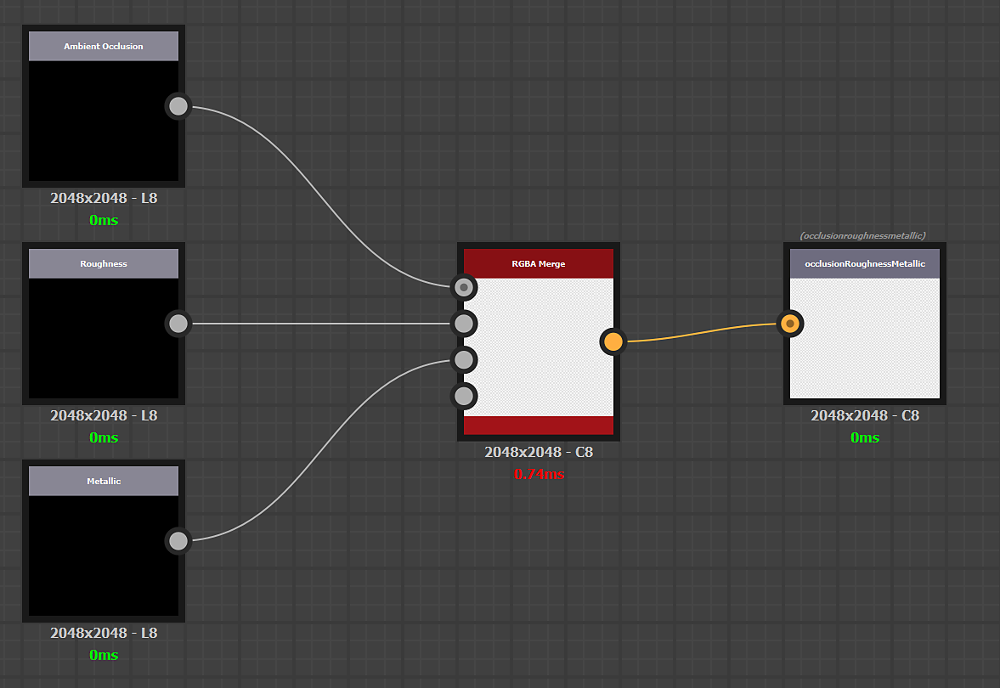

# Creare e modificare predefiniti personalizzati

I predefiniti personalizzati possono essere creati con Substance 3D Designer.

La creazione di predefiniti personalizzati rispetta le stesse regole della creazione di un filtro personalizzato per Sampler. La documentazione è disponibile [qui](../../filters/custom-filters.md).

## Creazione

## Creare il grafico

Aprite il Substance Designer e create un nuovo grafico Substance.

Aprite le proprietà del grafico e compilate le seguenti informazioni obbligatorie:

* Etichetta: immetti il nome del predefinito personalizzato che verrà utilizzato nell’interfaccia di Sampler
* Dati utente: <b>alchemist::type=filter</b>

## Definizione di ingressi e uscite

### Input

Gli input rappresentano i canali di materiale da trasformare prima dell’esportazione.

Create un nodo Colore di input (o scala di grigi) per canale di materiale e aggiungete un <b>utilizzo</b> negli attributi a ciascun nodo di input per garantire che la connessione venga effettuata tra il materiale (o i materiali) e il predefinito personalizzato.

Esempio: definizione dell&#39;input di Colore di base

{width="600px"}

### Output

Gli output rappresentano il risultato dell’esportazione texture.

Creare un nodo di output per texture e aggiungere <b>utilizzo</b> e una <b>etichetta</b> negli attributi di ogni nodo di output. L&#39;<b>etichetta</b> verrà visualizzata nell&#39;elenco Canali nella finestra di Esportazione e nel nome del file di texture.

Esempio: definizione della texture personalizzata Opacità colore

{width="600px"}

#### Esempio di impacchettamento del canale e conversione del canale

Impacchettamento di 3 canali in scala di grigio in una texture RGB:

{width="600px"}

Conversione canale da metallizzato/rugosità PBR a Specular/Lucentezza PBR:

{width="600px"}

## Importa

Per importare il nuovo predefinito:

1. Fai clic sul pulsante <b>Gestisci predefiniti </b> a destra del menu a discesa <b>Predefiniti</b>.
1. Utilizzate il pulsante <b>Importa predefiniti</b> nella parte inferiore dell&#39;<b>elenco dei predefiniti</b>.

{width="400px"}
