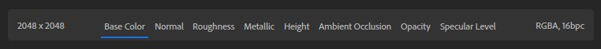

# Riquadro di visualizzazione 2D e 3D

Nel **viewport** viene visualizzata la risorsa corrente. Nella parte superiore della **V****iewport** puoi visualizzare il nome della risorsa e le opzioni per modificare l&#39;aspetto della **finestra di visualizzazione**. Utilizzare queste opzioni per:

* Modifica la larghezza e il height della risorsa in pixel.
* Visualizza <b>Vista 2D</b>, <b>visualizzazione 3D</b> oppure <b>visualizzazione 2D </b>e <b>visualizzazione 3D </b>insieme.
* Passare dalla <b>vista divisa</b> alla visualizzazione orizzontale.
* Scambia <b>viste 3D e 2D</b>.
* Passare dalla finestra della vista standard a quella a schermo intero.

## Vista 3D

Il <b>riquadro di visualizzazione 3D</b> dispone di due barre degli strumenti che consentono di modificare l&#39;aspetto della risorsa nel <b>riquadro di visualizzazione</b>. Per impostazione predefinita, queste barre degli strumenti vengono visualizzate nell&#39;angolo superiore destro e nel centro inferiore del <b>riquadro di visualizzazione 3D</b>.

>[!NOTE]
>
> È possibile riposizionare le barre degli strumenti del <b>riquadro di visualizzazione 3D</b>:
> 
> * È possibile spostare le barre degli strumenti trascinando la maniglia nella parte superiore o sinistra della barra degli strumenti.
> * Fai doppio clic sulla maniglia nella parte superiore o sinistra della barra degli strumenti per passare da un layout orizzontale a uno verticale e viceversa.
> * Fate clic sulle virgolette acute doppie nella parte inferiore o destra della barra degli strumenti per ridurla a icona.

La barra degli strumenti in alto a destra del <b>riquadro di visualizzazione 3D </b> include controlli incentrati sull&#39;aspetto del riquadro di visualizzazione:

* <b>Visualizza</b>: modifica le impostazioni della fotocamera, ad esempio il campo visivo o la modalità di proiezione. Modificate inoltre i colori della griglia e dello sfondo.
* <b>Trama</b>: selezionate una trama diversa per visualizzare le risorse materiali o le sfumature delle risorse Luci ambientali.
* <b>Materiale</b>: modificate la posizione e la suddivisione in porzioni della texture sulla trama.
* <b>Spostamento</b>: regolate la qualità e l&#39;intensità dello spostamento.
* <b>Luce</b>: selezionate e regolate una luce ambiente, comprese impostazioni quali l&#39;attivazione delle ombre e del piano terreno.
* <b>Attiva/disattiva tracciamento tracciato</b>: la tracciatura tracciato è una tecnica di rendering che fornisce risultati fotorealistici, migliorando l&#39;aspetto delle risorse. Tuttavia, il tracciamento dei tracciati può essere computazionalmente costoso, in questo caso è possibile attivarlo o disattivarlo in base alle proprie esigenze.

>[!NOTE]
>
> Attiva le ombre per migliorare gli elementi visivi della finestra. Disattivate le ombre per migliorare le prestazioni dei campionatori.

La barra degli strumenti nella parte centrale inferiore del <b>riquadro di visualizzazione 3D</b> include le informazioni e i controlli seguenti:

* <b>Tempo Fotogramma/FPS</b>: questi valori mostrano le prestazioni del materiale.
* <b>Oggetto Fotogramma</b>: centrate la fotocamera sulla trama.
* <b>Cambia asse in alto</b>: cambiare l&#39;asse considerato in alto. In questo modo è possibile correggere eventuali problemi con le trame importate.
* <b>Posizionamento</b>: modificate la posizione della trama rispetto al piano terreno.
* <b>Copia istantanea</b>: copia negli Appunti un&#39;immagine del <b>riquadro di visualizzazione 3D</b> corrente.
* <b>Salva istantanea</b>: salva un&#39;istantanea del <b>riquadro di visualizzazione 3D</b> in un file di immagine.
* <b>Controlli vista 3D</b>: visualizzate un riferimento rapido per i controlli videocamera nella finestra della vista 3D.

## Spostare la fotocamera

Nella finestra della vista viene utilizzata una videocamera per eseguire il rendering della vista 3D. Puoi spostare la videocamera per modificare la vista e visualizzare le creazioni da diverse angolazioni.

| Scelta rapida | Movimento | Descrizione |
| --- | --- | --- |
| Fai clic e trascina | Orbita | Ruotate la fotocamera. Non è possibile ruotare la fotocamera. |
| Fai clic con il pulsante destro e trascina | Dolly | Spostate la fotocamera in avanti e indietro. |
| Clic centrale e trascinamento | Panning | Spostate la fotocamera a sinistra, a destra, in alto e in basso. |

<b>Vista 2D</b> è bidimensionale, pertanto non è disponibile alcuna opzione di orbita. Fai clic con il pulsante destro e seleziona Alt + trascinamento per ingrandire o ridurre la visualizzazione, mentre premi Alt + trascinamento per eseguire il panning.

Sia nella <b>vista 3D </b> che nella <b>Vista 2D</b> utilizzate <b>F</b> per concentrarvi sulla risorsa. Questo è utile se si perde di vista la risorsa 3D o lo spazio 2D.

## Vista 2D

Per impostazione predefinita, è visibile solo la <b>vista 3D</b>, tuttavia <b>Vista 2D</b> può contenere molte informazioni e controlli utili per alcuni filtri.

Per aprire il <b>Vista 2D</b>, utilizzare il <b>pulsante di selezione della vista </b>nell&#39;angolo superiore destro della finestra della vista. Puoi anche utilizzare la scelta rapida da tastiera <b>2</b> per passare rapidamente alla <b>Vista 2D</b>.

Con <b>Vista 2D </b>aperto, vengono visualizzate alcune nuove opzioni:

* Nell&#39;angolo superiore destro del **Vista 2D**, utilizza il menu a discesa per modificare l&#39;origine dei canali disponibili per la visualizzazione.

  * Gli Input di livello mostrano i canali immessi nel livello selezionato
  * Gli Output di livello mostrano i canali in output dal livello selezionato
  * Output materiale mostra i canali in fase di output dal livello superiore e non è influenzato dalla selezione del livello.
* Nella parte inferiore del **Vista 2D** è possibile:

  * Consultate la risoluzione del canale selezionato.
  * Selezionate un canale per visualizzarlo nella vista 2D.
  * Consultate Canali di colore e profondità di bit per il canale di materiale selezionato.

  
