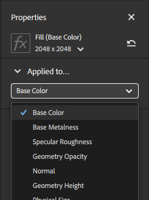

# Pannello Proprietà

Il **pannello Proprietà** mostra i parametri e le proprietà dei livelli selezionati nel **pannello Livelli**. Il modo migliore per scoprire quali parametri fanno è giocare con loro e vedere quale impatto hanno sulla vostra risorsa.

I parametri visualizzati nel **pannello Proprietà** dipendono da quanto selezionato nel **pannello Livelli**. A volte un livello può avere più di un insieme di proprietà personalizzabili, ad esempio un livello di materiale che non si trova nella parte inferiore della pila avrà proprietà di fusione. Ogni icona della Pila livelli è un insieme diverso di proprietà e parametri. Per un livello di materiale con proprietà di materiale e proprietà di fusione, saranno presenti due icone su quel livello.

<table>
<tr style="border: 0;">
<td style="border: 0; width: 30%" valign="top">

</td>
<td style="border: 0;" valign="top">

In questa immagine del **pannello Livelli**, ogni icona nella Pila livelli ha un diverso set di parametri per controllare l&#39;aspetto del materiale. Ad esempio, il livello Argilla ha sia l&#39;icona del materiale che l&#39;icona della fusione, ognuna delle quali ha un insieme separato di parametri. Il Livello di pittura Rotazione ha anche icone di materiale e di fusione, ma poiché è posizionato al passaggio del mouse, ha anche un interruttore di visibilità.

</td>
</tr>
</table>

## Applicato a...

La sezione **Applicata a** del **pannello Proprietà** consente di controllare i canali interessati dal livello corrente. Come con altre proprietà, le impostazioni dei canali sono diverse a seconda che sia selezionato il livello o la fusione.

Per impostazione predefinita, tutti i canali sono attivati per la maggior parte dei materiali e dei filtri. Alcuni filtri, come Luminosità o Vividezza, influiscono solo su un singolo canale. Quando i filtri agiscono solo su un singolo canale, potete vedere il canale interessato accanto al nome del livello.

