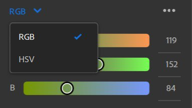
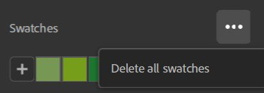

# Selettore colore

Il Selettore colore viene visualizzato ogni volta che è necessario selezionare un colore.

## Panoramica interfaccia utente

{width="300px"}

1. **Quadrato colori**: modifica la saturazione e la luminosità del colore in base alla tonalità selezionata.
1. **Cursore TONALITÀ**: regolate la tonalità del colore.
1. **Corrente/Precedente**: il colore sinistro è il colore corrente del selettore colore. Il colore corretto è quello che avevi quando aprivi il selettore colore. Fate clic sul colore destro per ripristinare il valore originale del colore corrente.
1. **Input esadecimale**: è possibile immettere direttamente il codice colore esadecimale del colore desiderato.
1. **Contagocce**: avviate il contagocce per selezionare un colore dallo schermo. Accanto al cursore appare una bolla per visualizzare in anteprima il colore scelto.
1. **Cursori**: regolate il colore utilizzando diversi spazi colore (RGB o HSV).
1. **Campioni**: salvate i colori per accedervi rapidamente e utilizzarli in futuro.

### Cursori

#### Spazio cromatico

RGB (Rosso, Verde, Blu) e HSV (Tonalità, Saturazione, Valore) sono i due spazi colore disponibili.

{width="200px"}

#### Opzioni cursore

{width="200px"}

**Mostra cursori**

Questa opzione consente di nascondere i cursori per risparmiare spazio. Anche se i cursori sono nascosti, potete comunque modificare i valori immessi.

**Valori a virgola mobile**

{width="200px"}

Attivate/disattivate se utilizzare valori a virgola mobile o interi per i cursori. I valori a virgola mobile sono compresi tra 0 e 1, mentre i valori interi sono compresi tra 0 e 255.

**Cursori dinamici**

Attiva o disattiva l’aggiornamento dinamico dello sfondo del cursore quando vengono modificati i valori. L’immagine seguente mostra l’aspetto del cursore quando i cursori dinamici sono disattivati.

{width="200px"}

### Campioni

I campioni sono utili per salvare colori specifici da usare in un’applicazione o in più progetti.

I campioni sono globali per Sampler e non specifici per progetto.

Facendo clic sul pulsante &quot;+&quot; viene aggiunto come primo campione un campione con il colore corrente nell&#39;elenco.

{width="200px"}

Nota: non potete aggiungere due volte un campione con lo stesso colore. Il campione già salvato verrà evidenziato quando provate ad aggiungerlo di nuovo.

Quando si passa il cursore del mouse su un campione, viene visualizzata una descrizione con il valore del colore nel codice esadecimale.

#### Opzioni Campioni

Elimina tutto.

{width="200px"}

Fate clic con il pulsante destro del mouse su un campione per eliminarlo o sostituirlo con il colore corrente.

{width="200px"}

Potete anche eliminare un campione trascinandolo all’esterno del selettore colore.
