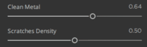

# Cursori

È disponibile un’opzione per animare da uno a diversi cursori. Premete **Ctrl** quando passate il cursore del mouse su un oggetto, per avviare l’animazione appare l’icona **Riproduci**.

Puoi mettere in pausa l&#39;animazione premendo **Ctrl** quando posizioni il puntatore del mouse su un cursore animato, verrà visualizzata un&#39;icona di **pausa** per interrompere l&#39;animazione di questo cursore.

Per mettere in pausa tutti i cursori, premi **P**. Per riavviare, premi nuovamente **P**.

