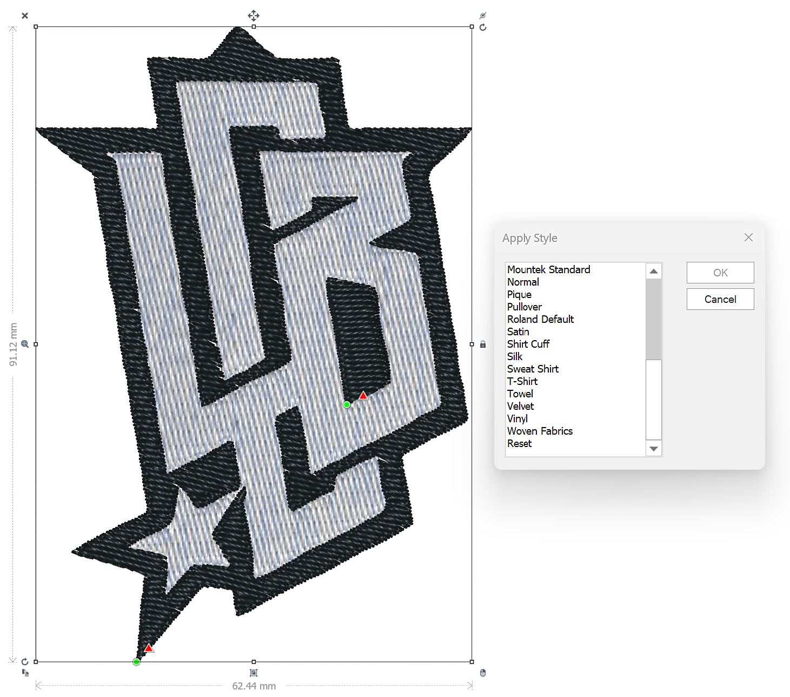

# Plug-in di Tajima Exporter dei file di ricamo

Con questa prima prova di concetto, è ora possibile trasferire i progetti ricamati digitalmente da Substance 3D direttamente nel software di ricamo <b>Tajima DG17</b>, eliminando la necessità di una lunga digitalizzazione manuale.

Vediamo come usarlo passo dopo passo.

## Scarica

Scarica il plug-in Sampler Tajima qui:

[Scarica qui il plug-in](https://www.adobe.com/go/sampler-tajima-plugin)

## Installazione

*Dall&#39;interfaccia utente di Sampler:*

Accedete a Preferenze > Plug-in e script > Aggiungi un plug-in

Seleziona la cartella di decompressione del download

*Da Esplora file:*

Seleziona Documenti > Adobe > Adobe Substance 3D Sampler > Plug-in.

Copia/incolla qui la cartella di decompressione del download

## Installazione

Aprite il progetto Sampler (5.0.3 o successivo) con un materiale per ricamo.

Apri il plug-in Tajima ed esporta nella posizione desiderata

<b>Software Tajima </b>

<b>1</b>- Avvia la procedura guidata di Substance 3D

<b>2</b>- Selezionare la <b>cartella dei dati</b> appropriata (cartella di esportazione di Sampler)

<b>3</b> - Scegliere il grafico del thread di ricamo

<b>4</b>- Applicare un predefinito di stile per impostazioni di infrastruttura ottimali

<b>5</b>- Modificare le forme in base alle esigenze per ottenere risultati ottimali

<b>6</b>- Visualizza in anteprima il foglio di lavoro di progettazione, con un codice a barre che può essere scansionato da un computer

