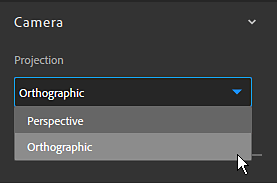

# Versione 2019.1

**Substance Alchemist 2019.1 &quot;Sesame&quot;** consente di condividere le risorse con la nuova gestione del progetto. Lo stack di livelli è stato completamente ricostruito per migliorare il flusso di lavoro. Ulteriori controlli e informazioni sono stati aggiunti alla finestra della vista. Una nuova versione di Delighter migliora la qualità e la precisione dei materiali.

Data di pubblicazione: *4 novembre 2019*

>[!NOTE]
>
> **Nota:** il contenuto prodotto con la versione beta 0.8.1 o versioni precedenti non è compatibile con la versione 2019.1. Tuttavia, non si perde nulla e questi dati sono ancora accessibili avviando la versione 0.8.1.

## Caratteristiche principali

### Nuova schermata introduttiva

Substance Alchemist ora ha una schermata di benvenuto che ti consente di passare rapidamente al tuo ultimo progetto ma anche di crearne di nuovi. Nella schermata introduttiva sono inoltre disponibili alcuni collegamenti alle piattaforme esistenti, ad esempio [Accademia Substance](https://academy.substance3d.com/).

### Gestione dei progetti

La versione 2019.1 introduce il concetto di progetti, che possono raccogliere raccolte di materiale. I progetti possono anche essere esportati per essere condivisi su altri computer.

Per ulteriori informazioni sui progetti, vedere: [Gestione dei progetti](../../getting-started/project-management.md).

### New Delighter

Abbiamo migliorato la funzione delighter, che viene utilizzata per rimuovere le ombre dalle foto. Ora conserva i dettagli e i colori originali delle varie superfici, che dovrebbero migliorare la precisione dei materiali generati.

### Nuova pila di livelli

La pila di livelli è stata ricostruita da zero per ampliarne le possibilità e le azioni. Modifiche degne di nota:

* **È ora possibile accedere a materiali e maschere direttamente tramite l&#39;icona dedicata**\
  Quando si aggiunge un materiale nella pila di livelli, ora viene visualizzata una nuova icona maschera. Facendo clic su questa seconda icona verranno visualizzati i parametri di fusione del materiale.

  
* **Il metodo di fusione può essere modificato direttamente dalla barra degli strumenti**\
  D&#39;ora in poi, quando è selezionato un livello di materiale, il suo metodo di fusione può essere modificato direttamente dalla barra degli strumenti Pila di livelli, senza dover fare clic sulla maschera.

  
* **Assegnare la bitmap a specifici input di digitalizzazione**\
  Quando si importa una bitmap per creare i materiali dalla scansione, è possibile assegnare l’utilizzo corretto per bitmap.

  

### Miglioramenti del riquadro di visualizzazione

Nella finestra della vista sono state aggiunte alcune nuove funzioni che ne migliorano l&#39;utilizzo. È possibile accedere a queste nuove impostazioni nel [pannello Impostazioni visualizzatore](https://helpx.adobe.com/it/substance-3d/unlisted/documentation/sadoc/viewer-settings-188973164.html).

* **Modalità fotocamera**\
  La modalità di proiezione della fotocamera consente di scegliere tra Prospettiva e Ortografica.

  
* **Campo visivo della fotocamera**\
  È ora possibile modificare il campo di visualizzazione (FOV) della finestra della vista. Regolare questo valore può aiutare a visualizzare in modo realistico i materiali. Il campo di visualizzazione può essere controllato solo in modalità di proiezione prospettica.

  
* **Risoluzione e profondità di bit per canale**\
  La vista 2D mostra ora la risoluzione della texture e la profondità di bit di ciascun canale.

  

## Note sulla versione

### 2019.1.4 Sesamo

*(Rilasciato il 30 gennaio 2020)*

**Aggiunto:**

* [Risorse] Richiesta di conferma durante la cancellazione di una cartella di risorse

**Corretto:**

* [Livelli] Sposta i livelli in due o più livelli sottostanti o superiori
* [Crea] Allocazione di un budget VRAM sufficiente per ottenere buone prestazioni

**Problemi noti:**

* L&#39;importazione di molte risorse può davvero rallentare la Substance Alchemist
* I filtri Riempimento in base al contenuto sono lenti in alta risoluzione
* L&#39;uso di più delighters in un unico materiale non è raccomandato
* Delighter si arresta in modo anomalo con i driver NVIDIA più vecchi (meno di 400.x)
* Il coma o il punto possono essere ignorati quando si digita un valore specifico in un cursore
* Il filtro Normale al Height può bloccarsi su MacOS

### 2019.1.3 Sesamo

*(Rilasciato il 28 gennaio 2020)*

**Aggiunto:**

* [Workflow] Supporto di più flussi di lavoro
* [Flusso di lavoro] Supporto del flusso di lavoro PBR Specular lucidità
* [Flusso di lavoro] Nuovo pannello Impostazioni canale
* [Flusso di lavoro] Selezione del flusso di lavoro durante la creazione del progetto
* [Impostazioni canale] Attiva/disattiva il calcolo di un canale specifico
* [Impostazioni canale] Visualizza l’elenco dei canali personalizzati disponibili nel materiale corrente
* [Impostazioni canale] Calcolo automatico dei canali personalizzati quando necessario
* [Impostazioni canale] Forza/Blocca calcolo canali personalizzati
* [Layers] Nuova interfaccia utente del segnaposto di input materiale nei filtri Atlas scatter e Spruzzo
* [Layers] Il parametro di input immagine di un filtro può essere alimentato da livelli sottostanti
* [Livelli] Visualizza una notifica quando alcuni livelli non sono aggiornati
* [Livelli] Possibilità di aggiornare alla versione più recente di livelli obsoleti tramite la notifica
* [Progetto] Nuovi campi metadati durante la creazione del progetto
* [Inspire] Le variazioni generate sono specifiche di un progetto
* [Vista 2D] Alterna gli ingressi e le uscite dei livelli e le uscite del materiale
* [Schermata introduttiva] Opzione Aggiungi progetto di importazione (.alch)
* [Preferenze] Nuova finestra Preferenze per impostare la posizione della cache e le impostazioni della privacy di analisi
* [UI] Nuovi pulsanti per l’interfaccia utente
* [Prestazioni] Miglioramento generale del sistema di parallelizzazione
* [Prestazioni] Ottimizzazione del numero di calcoli del materiale
* Aggiornamento Substance Engine [Engine]
* [Framework] Aggiornamento a Qt 5.13
* [MacOS] Miglioramenti globali del supporto di macOS Catalina
* [Contenuto] Filtro di regolazione: intensità normale e parametri inverti

**Corretto:**

* [Layers] Annulla l’impostazione del parametro Image Input quando si elimina il livello
* [Livelli] Correggere un arresto anomalo durante l’aggiunta di un livello di patch clone
* [Livelli] Correggi alcuni arresti anomali durante la fusione dei livelli, per sovrapporre materiali in altri materiali della pila di livelli
* [Esporta] La selezione dei canali per l’esportazione è ora rispettata
* [Risorse] Non arrestarsi in modo anomalo durante la navigazione nel pannello Risorse
* [Risorse] Correggere l&#39;arresto anomalo durante l&#39;importazione di file di Substance danneggiati
* [Risorse] Riduzione del numero di arresti anomali durante il caricamento di cartelle di grandi dimensioni
* [Miniatura] Il calcolo delle miniature non blocca l’interfaccia
* [Importazione immagini] Uniformizzazione del tipo di immagine supportata nell&#39;applicazione
* [Predefinito] Salva la descrizione durante la creazione di un predefinito da un SBSAR
* [Ispirazione] Correggere il trascinamento dell’immagine
* [Applicazione] Correggi arresti anomali all’uscita
* [Applicazione] Correzione degli arresti anomali all’uscita durante l’esportazione di materiali
* [UI] Correzioni e miglioramenti
* [UI] Rinomina la risorsa temporanea in &quot;materiale non salvato&quot;
* [Content] Aggiornamento globale e pulizia di tutti i filtri

**Problemi noti:**

* L&#39;importazione di molte risorse può davvero rallentare la Substance Alchemist
* I filtri Riempimento in base al contenuto sono lenti in alta risoluzione
* L&#39;uso di più delighters in un unico materiale non è raccomandato
* Delighter si arresta in modo anomalo con i driver NVIDIA più vecchi (meno di 400.x)
* Il coma o il punto possono essere ignorati quando si digita un valore specifico in un cursore
* Il filtro Normale al Height può bloccarsi su MacOS

### 2019.1.2 Sesamo

*(Rilasciato l&#39;11 dicembre 2019)*

**Aggiunto:**

* [Workflow] Supporto di più flussi di lavoro
* [Flusso di lavoro] Supporto del flusso di lavoro PBR Specular lucidità
* [Flusso di lavoro] Nuovo pannello Impostazioni canale
* [Flusso di lavoro] Selezione del flusso di lavoro durante la creazione del progetto
* [Impostazioni canale] Attiva/disattiva il calcolo di un canale specifico
* [Impostazioni canale] Visualizza l’elenco dei canali personalizzati disponibili nel materiale corrente
* [Impostazioni canale] Calcolo automatico dei canali personalizzati quando necessario
* [Impostazioni canale] Forza/Blocca calcolo canali personalizzati
* [Layers] Nuova interfaccia utente del segnaposto di input materiale nei filtri Atlas scatter e Spruzzo
* [Layers] Il parametro di input immagine di un filtro può essere alimentato da livelli sottostanti
* [Livelli] Visualizza una notifica quando alcuni livelli non sono aggiornati
* [Livelli] Possibilità di aggiornare alla versione più recente di livelli obsoleti tramite la notifica
* [Progetto] Nuovi campi metadati durante la creazione del progetto
* [Inspire] Le variazioni generate sono specifiche di un progetto
* [Vista 2D] Alterna gli ingressi e le uscite dei livelli e le uscite del materiale
* [Schermata introduttiva] Opzione Aggiungi progetto di importazione (.alch)
* [Preferenze] Nuova finestra Preferenze per impostare la posizione della cache e le impostazioni della privacy di analisi
* [UI] Nuovi pulsanti per l’interfaccia utente
* [Prestazioni] Miglioramento generale del sistema di parallelizzazione
* [Prestazioni] Ottimizzazione del numero di calcoli del materiale
* Aggiornamento Substance Engine [Engine]
* [Framework] Aggiornamento a Qt 5.13
* [MacOS] Miglioramenti globali del supporto di macOS Catalina
* [Contenuto] Filtro di regolazione: intensità normale e parametri inverti

**Corretto:**

* [Layers] Annulla l’impostazione del parametro Image Input quando si elimina il livello
* [Livelli] Correggere un arresto anomalo durante l’aggiunta di un livello di patch clone
* [Livelli] Correggi alcuni arresti anomali durante la fusione dei livelli, per sovrapporre materiali in altri materiali della pila di livelli
* [Esporta] La selezione dei canali per l’esportazione è ora rispettata
* [Risorse] Non arrestarsi in modo anomalo durante la navigazione nel pannello Risorse
* [Risorse] Correggere l&#39;arresto anomalo durante l&#39;importazione di file di Substance danneggiati
* [Risorse] Riduzione del numero di arresti anomali durante il caricamento di cartelle di grandi dimensioni
* [Miniatura] Il calcolo delle miniature non blocca l’interfaccia
* [Importazione immagini] Uniformizzazione del tipo di immagine supportata nell&#39;applicazione
* [Predefinito] Salva la descrizione durante la creazione di un predefinito da un SBSAR
* [Ispirazione] Correggere il trascinamento dell’immagine
* [Applicazione] Correggi arresti anomali all’uscita
* [Applicazione] Correzione degli arresti anomali all’uscita durante l’esportazione di materiali
* [UI] Correzioni e miglioramenti
* [UI] Rinomina la risorsa temporanea in &quot;materiale non salvato&quot;
* [Content] Aggiornamento globale e pulizia di tutti i filtri

**Problemi noti:**

* L&#39;importazione di molte risorse può davvero rallentare la Substance Alchemist
* I filtri Riempimento in base al contenuto sono lenti in alta risoluzione
* L&#39;uso di più delighters in un unico materiale non è raccomandato
* Delighter si arresta in modo anomalo con i driver NVIDIA più vecchi (meno di 400.x)
* Il coma o il punto possono essere ignorati quando si digita un valore specifico in un cursore
* Il filtro Normale al Height può bloccarsi su MacOS

### 2019.1.1 Sesamo

*(Rilasciato il 26 novembre 2019)*

**Aggiunto:**

* [Fusione] Nuovo metodo di fusione opacità
* [Engine] Nuova versione di Substance Engine

**Corretto:**

* [Livelli] Correggere l’arresto anomalo durante l’eliminazione di un livello che sta ancora elaborando
* [Livelli] Correggere l’arresto anomalo durante la rimozione del livello inferiore
* [Layers] Risolvi l&#39;arresto anomalo mentre il nome del materiale contiene caratteri speciali
* [Livelli] Interrompi elaborazione di tutti i filtri che utilizzano un widget
* [Livelli] Evitare l’arresto anomalo durante l’utilizzo dei filtri Patch clone e Riempimento in base al contenuto
* [Layers] Correggere l&#39;arresto anomalo durante il trascinamento di un filtro negli slot di input di uno splatter
* [Risorse] Correggere l&#39;arresto anomalo durante il collegamento di cartelle locali o l&#39;importazione di risorse in Substance Alchemist
* [Raccolta] Correggi l&#39;arresto anomalo durante il passaggio rapido tra i materiali
* [UI] Correggere l&#39;arresto anomalo quando il valore è null o non valido in cursori di spostamento in porzioni sulla finestra della vista
* [Ispirazione] Correggere l&#39;arresto anomalo durante l&#39;accesso alla scheda Ispirazione
* [Ispirazione] Risolvere l&#39;arresto anomalo mentre ricerchi ispirazione su un materiale della pila di livelli appena salvati
* [Prestazioni] I materiali e i filtri per Substance pesanti (in porzioni) vengono elaborati più rapidamente
* [Guida] Correggere il file di registro di esportazione
* [Content] Il filtro Randomizer funziona su tutti i canali
* [Content] Il flusso di lavoro con più angoli prende in considerazione tutte le scansioni
* [Contenuto] Fusione OA corretta
* [Contenuto] Fusione curvatura: fusione corretta
* [Content] Fusione ID colore corretta fusione
* [Contenuto] Fusione maschera personalizzata: fusione corretta
* [Content] Correggi filtro di regolazione per modifica rugosità
* [Content] Correggi filtro Materiale di base per caricamento canali normali personalizzato
* [Contenuto] Correggere il pattern di importazione personalizzato del filtro Rilievo

**Problemi noti:**

* L&#39;uso di più delighters in un unico materiale non è raccomandato
* Delighter si arresta in modo anomalo con i driver NVIDIA più vecchi (meno di 400.x)
* Il coma o il punto possono essere ignorati quando si digita un valore specifico in un cursore
* Il filtro Normale al Height può bloccarsi su MacOS

### Sesamo del 2019.1

*(Rilasciato il 4 novembre 2019)*

**Aggiunto:**

* [Progetto] Creazione di un progetto
* [Progetto] Introduzione al formato di file .alch che contiene i dati del progetto
* [Progetto] Esporta un progetto .alch contenente le raccolte e i relativi materiali
* [Progetto] Importare un progetto .alch
* [Progetto] Apri progetti recenti
* [Schermata introduttiva] All&#39;avvio viene visualizzata una schermata di benvenuto
* [Schermata introduttiva] Creare un progetto dalla schermata introduttiva
* [Schermata introduttiva] Accedete all’elenco di tutti i progetti nella schermata introduttiva
* [Schermata introduttiva] Collegamenti rapidi per accedere alla documentazione, alla finestra a comparsa informazioni e alla gestione delle licenze
* [Menu File] Integrazione di un menu di file
* [Menu File] Accedi ai comandi del progetto dalla scheda File e salva il gruppo di livelli
* [Menu File] Accedere ai comandi Annulla e Ripeti della scheda Modifica
* [Menu File] Il menu della Guida precedente è stato spostato nel menu File sotto la scheda Guida
* [Layers] Nuova architettura dello stack di livelli
* [Layers] Nuova interfaccia utente dello stack di livelli
* [Livelli] Seleziona il metodo di fusione direttamente sulla barra degli strumenti
* [Livelli] Accedete separatamente ai parametri di fusione e ai parametri del materiale
* [Layers] Aggiungete materiali direttamente negli input dedicati del filtro Spruzzo nella pila di livelli
* [Livelli] Cambia l’ordine di scansione direttamente nel livello di importazione dell’immagine
* [Riquadro di visualizzazione] Controllo del campo visivo della telecamera
* [Riquadro di visualizzazione] Possibilità di passare da una fotocamera ortogonale a una prospettica
* [Finestra di visualizzazione] Visualizza le informazioni sulla risoluzione e sulla profondità di bit per ciascun canale
* [Resources] I Materiali di base vengono aperti per impostazione predefinita
* [Cache] Individua la cartella della cache delle miniature
* [Cache] Individua la cartella della cache di rendering
* [Pannelli] Il pannello Impostazioni materiale è temporaneamente nascosto
* [Flusso di lavoro] Specular/lucidità temporaneamente disattivato
* [MacOS] Autenticazione della versione del sistema operativo Catalina
* [Content] Nuova versione del filtro Delighter
* [Contenuto] Nuovo filtro Riempimento in base al contenuto dell’immagine
* [Contenuto] Filtro Riempimento in base al contenuto per nuovo materiale
* [Content] Il filtro Trasformazione dispone di un&#39;opzione di trasformazione sicura

**Corretto:**

* Tutti i bug precedenti relativi a Crea non sono più validi con la nuova versione per interfaccia e architettura
* Le icone nella barra superiore (3D, 2D, 2D/3D) non vengono nascoste nelle descrizioni comandi
* [Content] Il filtro splatter accetta Atlas con mappa di height completa
* [Contenuto] Il filtro Trasformazione funziona su immagini (scan1, scan2,...)

**Problemi noti:**

* L&#39;uso di più delighters in un unico materiale non è raccomandato
* Delighter si arresta in modo anomalo con i driver NVIDIA più vecchi (meno di 400.x)
* Il coma o il punto possono essere ignorati quando si digita un valore specifico in un cursore
* Il filtro Normale al Height può bloccarsi su MacOS

**Aggiunto:**

* [Fusione] Nuovo metodo di fusione opacità
* [Engine] Nuova versione di Substance Engine

**Aggiunto:**

* [Fusione] Nuovo metodo di fusione opacità
* [Engine] Nuova versione di Substance Engine

**Aggiunto:**

* [Workflow] Supporto di più flussi di lavoro
