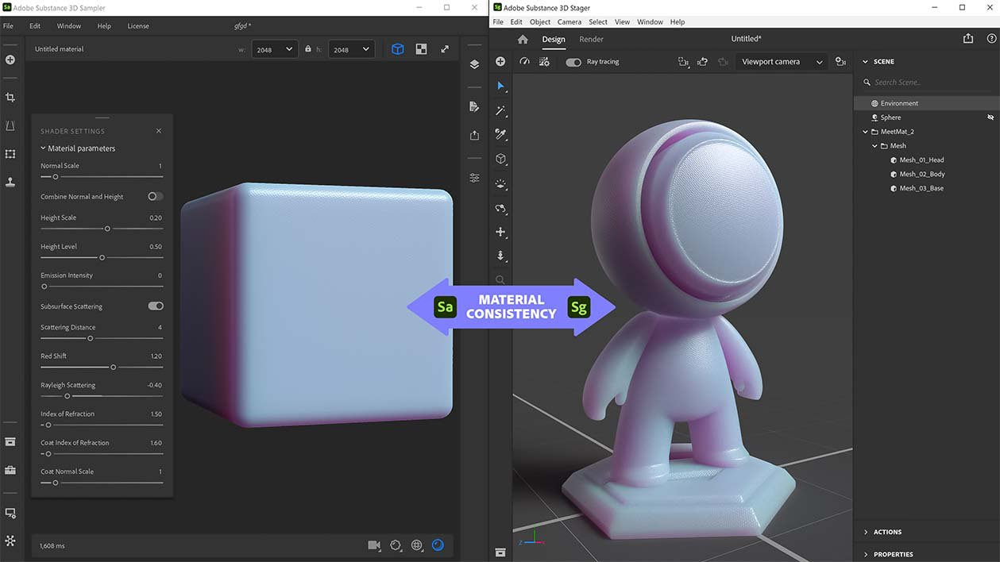

# Versione 3.1

Adobe Substance 3D Sampler 3.1 introduce un nuovo selettore colore, il supporto per i file SVG e una migliore interoperabilità con Stager, Photoshop e Illustrator.

Data di pubblicazione: *28 settembre 2021*

## Caratteristiche principali

### Selettore colore

Questa versione aggiunge un nuovo [Selettore colore](../../interface/tools-and-widgets/color-picker.md) che include un contagocce e il supporto per i campioni.

Il Selettore colore viene visualizzato quando è necessario selezionare un colore. Può essere spostato ovunque sullo schermo.

{width="250px"}

### Supporto SVG

Sampler ora supporta i file SVG. Puoi importarli nelle tue risorse, direttamente nella Pila livelli o in un input di immagine del livello.

{width="500px"}

### Modifica in Illustrator

La nuova funzione &quot;Modifica in&quot; rende estremamente flessibile l&#39;aggiornamento delle immagini importate. Se vuoi modificare il file SVG, puoi semplicemente modificarlo direttamente in Illustrator. Sampler aggiornerà istantaneamente le tue immagini con il nuovo SVG.

### Nuova interfaccia utente/UX ritaglio

Sampler ora dispone di un widget Ritaglio adeguato e rinnovato per definire facilmente l’area ritagliata. I risultati non allungamento si otterranno anche durante il ritaglio di immagini non quadrate in texture quadrate.

{width="500px"}

### Fromato normale

Modificate le preferenze per impostare il [formato normale](../../interface/preferences/normal-format.md) necessario per il flusso di lavoro. Le normali verranno importate, visualizzate ed esportate nel formato selezionato nelle preferenze.

{width="250px"}

### Esportazione delle proprietà dei materiali in SBSAR

Tutti i parametri dei materiali delle impostazioni degli Shader (scala normale, scala height, livello height,...) verrà esportato nel file SBSAR per essere letto in Substance 3D Stager per una corrispondenza perfetta dei materiali.

{width="500px"}

## Note sulla versione

### 3.1.0 Xocoalto

*(Rilasciato Il 28 Settembre 2021)*

**Aggiunto:**

* [Selettore colore] Nuova interfaccia utente del selettore colore
* [Selettore colore] Visualizza in anteprima i colori corrente e precedente uno accanto all&#39;altro
* [Selettore colore] Immetti il colore in Esadecimale
* [Selettore colore] Nuovo contagocce con anteprima colore
* [Selettore colore] Il contagocce può selezionare un colore all&#39;esterno di Sampler
* [Selettore colore] Modifica il colore negli spazi colore RGB o HSV
* [Selettore colore] Salvare e gestire i campioni
* [Interoperabilità] Modificare le immagini in Illustrator dal livello Importazione immagine o dai parametri Immagine
* [Interoperabilità] Modifica le immagini in Photoshop dal livello Importazione immagine o dai parametri Immagine
* [Widget] Nuovo Widget Ritaglio
* [Widget] Premi Invio per convalidare il ritaglio
* [Widget] Il widget Ritaglio legge le dimensioni dell’immagine per adattarle al widget e mantiene le proporzioni durante il ridimensionamento
* [UI] Nuova interfaccia utente del cursore Scala di grigi
* [Applicazione] Aggiungere la selezione del formato normale nelle preferenze
* [Applicazione] Il formato normale nei livelli Importazione immagine segue il formato normale predefinito impostato nelle preferenze
* [Applicazione] Nel Vista 2D, viene visualizzata la normale in base al formato normale impostato nelle preferenze
* [Applicazione] La normale viene esportata nel formato normale impostato nelle preferenze
* [Export] Aggiungi il parametro del formato normale alle esportazioni di file SBS e SBSAR
* [Esportazione] Aggiungere impostazioni di shader alle esportazioni di file SBS e SBSAR
* [Esporta] Imposta la risoluzione predefinita dei grafici SBS esportati
* [Filtri composti] Crea pacchetti di filtri SSA con 7z
* [Filtri composti] Aggiungere metadati di categoria nei filtri composti
* [Filtri composti] I filtri composti possono avere una miniatura incorporata
* [Filtri composti] Estensione Filtri composti (.ssafilter) aggiunta alla finestra di dialogo Ottieni file del contenuto
* [Filtri composti] Importa filtri composti (.ssafilter) nel pannello Risorse
* [Motore] Aggiornare il motore substance alla versione 8.2.0

**Corretto:**

* [Applicazione] Le cartelle locali connesse potrebbero bloccarsi
* [Applicazione] Arresto anomalo all’uscita
* [Applicazione] Arresto anomalo all&#39;avvio di due istanze di Sampler
* [Contenuto] Il filtro di ritaglio ha una regolazione di inizializzazione casuale
* [Contenuto] Alcuni materiali Substance a volte non vengono aggiornati
* arresto anomalo di &quot;Esportazione&quot; quando si esegue l’esportazione con un predefinito personalizzato appena aggiunto
* [Esporta] Dimensioni stimate del pacchetto mancanti nel popup di esportazione
* [Esportazione] Correggere la perdita di memoria durante l’esportazione di file SBS e SBSAR
* [Filtri composti] I filtri composti possono avere ingressi duplicati
* [Filtri composti] Arresto anomalo di un filtro con riferimenti non soddisfatti
* [Filtri composti] Arresto anomalo durante il riordinamento di una Pila livelli contenente un filtro composto
* [Filtri composti] Il rendering a volte si blocca
* [Importazione immagine] L’importazione di un’immagine attiva più rendering
* [Layers] Arresto anomalo all’annullamento/ripetizione
* arresto anomalo [Layers] (Livelli) quando si aggiunge un Materiale di base
* [Livelli] Arresto anomalo quando si utilizza un’immagine non valida come luce ambientale
* [Livelli] Correggere l’importazione duplicata quando si inserisce un filtro con diversi grafici
* [Livelli] Il riordinamento dei livelli non sempre funziona
* [Progetto] Arresto anomalo di caricamento di un file di progetto incompleto
* [Progetto] Arresto anomalo durante l’apertura di un progetto danneggiato
* [Progetto] Alcune risorse possono scomparire da un progetto
* [Proprietà] Correggere i predefiniti del filtro mancanti
* [UI] Impossibile impostare i parametri dell&#39;angolo
* [UI] Filtri e visualizzazione dei metadati nel pannello Risorse
* [UI] Il raggruppamento per categoria nasconde i filtri
* [UI] Problema di scorrimento nel pannello Risorse
* [UI] Il pannello di esportazione ha ora una barra di scorrimento
* [UI] La miniatura non viene visualizzata per alcuni formati immagine nel selettore di immagini

**Problemi noti:**

* [Realtime Engine 2021] Il calcolo intenso può arresto anomalo l&#39;applicazione
* [Realtime Engine 2021] Il motore in tempo reale 2021 verrà arresto anomalo su un computer Windows con CPU AMD e GPU Nvidia installate
* [Selettore colore] La selezione di un colore su un secondo monitor con una risoluzione diversa potrebbe non funzionare
