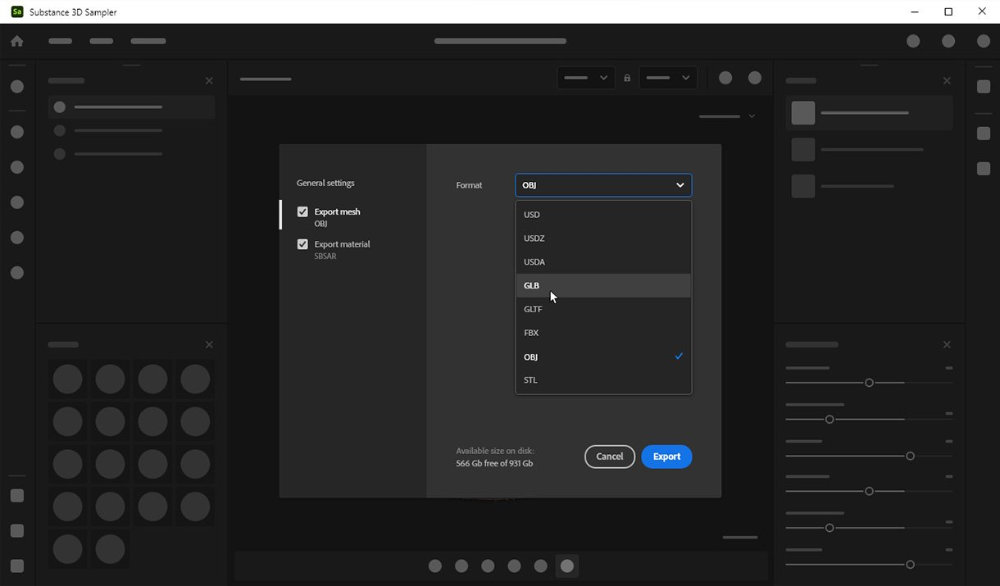

# Versione 4.0

Con **Substance 3D Sampler 4.0**, potete utilizzare immagini reali per creare oggetti 3D con mascheratura automatica del soggetto, mappatura delle texture e decimazione della geometria. Questa versione introduce alcuni miglioramenti UX come nuove possibilità nell&#39;API Python.

*Data di pubblicazione: 31 gennaio 2023*

## Capture 3D

Con Substance 3D Sampler 4.0, ora potete creare oggetti 3D dalle immagini.

Abbiamo capacità fotogrammetriche integrate. La fotogrammetria è il processo tecnico di misurazione delle immagini. Sampler crea trame 3D da una serie di fotografie.

È sufficiente iniziare con una serie di foto che catturino le superfici visibili di un oggetto: uno smartphone o una fotocamera DLSR funzionano alla grande.

Scopri il flusso di lavoro dettagliato [qui](../features-and-workflows/3d-capture.md).

## Luci

### Mascheratura automatica

Rimuovi lo sfondo dell&#39;oggetto da Capture 3D. Create una maschera generata automaticamente dall&#39;oggetto dopo l&#39;importazione delle immagini tramite la scheda Maschera.

L&#39;uso delle maschere presenta molti vantaggi. Consente di rilevare le funzioni e di ricostruire solo le aree non mascherate.

{width="500px"}

### Definisci l&#39;area di ricostruzione

Attiva/disattiva Area di interesse per attivare un rettangolo di selezione dopo aver allineato le immagini. Impostate e allineate l’area precisa da ricostruire.

{width="500px"}

### Post-elaborazione connessa

Una volta ricostruito l’oggetto 3D, ottimizzate il risultato con decimazione automatica, srotolamento UV e cottura al forno.

La post-elaborazione ti aiuta ad adattare e ottimizzare la trama e le texture in base alle tue esigenze e a come desideri utilizzarla.

Il risultato della ricostruzione può generare una trama con milioni di poligoni e texture fino a 16K. Spesso questa opzione non è ottimizzata per il rendering, il tempo reale o l’esperienza AR.

Il passo di post-elaborazione concatena automaticamente 4 passaggi:

* Decimazione
* Srotolamento UV
* Riproiezione
* Baking

{width="500px"}

### Esporta in formati principali di file

Esportate gli oggetti 3D ricostruiti in tutti i formati di file standard in modo da poterli utilizzare ovunque.

{width="500px"}

## Riquadro di visualizzazione

Le finestre delle viste 2D e 3D possono essere ridimensionate, scambiate e impilate verticalmente.

{width="500px"}

## Script

La funzione di esportazione è stata suddivisa in 4:

* esporta materiali: `export_material`
* esporta luci ambiente: `export_environment_light`
* esporta trama con o senza texture: `export_mesh` o `export_3d_object`

È stata aggiunta una nuova funzione per importare le texture con un utilizzo specifico: `import_textures`

Sampler verrà ora caricato allo script di avvio e i plug-in archiviati nei percorsi definiti da due variabili di ambiente:

* `SAMPLER_PLUGIN_PATH`
* `SAMPLER_SCRIPT_PATH`

## Tutorial

## Nota di rilascio

1. **0.0 Banana**

   *(Rilasciato il 31 gennaio 2022)*

   **Aggiunto**

* [capture 3D] Creazione di oggetti 3D da immagini
* [capture 3D] Creazione guidata capture 3D dedicata
* [capture 3D] Importa o genera maschere in bianco e nero sul set di dati
* [capture 3D] Risultato dell’allineamento: visualizzate tutte le funzioni corrispondenti come una nuvola di punti
* [capture 3D] Risultato dell’allineamento: visualizzate e interagite con le fotocamere associate a ciascuna foto allineata
* [capture 3D] Definite l&#39;area di ricostruzione con un widget del rettangolo di selezione
* [capture 3D] Ridimensiona, trasla e ruota su tutti gli assi il widget del rettangolo di selezione
* [capture 3D] Definite la precisione della geometria per la trama ricostruita
* [capture 3D] Ottimizzate la trama e le texture creando una nuova versione
* [capture 3D] Ciascuna versione viene decimata automaticamente in base al numero di facce di destinazione impostato
* [capture 3D] La fase di post-elaborazione sfocia automaticamente, riproietta le texture e quindi prepara il height normale e le informazioni AO dalla trama ad alto poli
* [capture 3D] Aggiungi il risultato originale o una versione al progetto Sampler
* [capture 3D] Nuovo livello di post-elaborazione trama per decimare, annullare, riproiettare le texture e cuocere i dettagli del livello di trama sottostante
* [capture 3D] Nuovo livello Trasformazione trama per ridimensionare, ruotare o traslare il livello di trama sottostante
* [Esporta] Nuova finestra Esporta
* [Esportazione] Impostazioni dedicate e interfaccia utente a seconda del tipo di risorsa (materiale, luce ambiente, trama)
* [Export] Esporta la trama come USD, USDA, USDZ, glTF, glb, obj, fbx, stl
* [Esporta] Definisci il tipo di materiale durante l’esportazione dei file di Substance (SBSAR, SBS)
* [UI] Sposta le impostazioni della cache in una nuova scheda nel popup Preferenze
* [Applicazione] Le finestre delle viste 2D e 3D possono ora essere ridimensionate, scambiate e impilate verticalmente
* [Applicazione] Nuova variabile di ambiente SAMPLER\_RESOURCES\_PATH per aggiungere risorse iniziali aggiuntive
* [Scripting] Aggiunte variabili di ambiente SAMPLER\_PLUGIN\_PATH e SAMPLER\_SCRIPT\_PATH per importare plug-in e script all&#39;avvio
* [Scripting] Funzioni di esportazione aggiunte per materiali, luci ambiente e oggetti 3D
* [Scripting] Sono stati aggiunti ai parametri l’identificatore, il valore predefinito, i valori minimo e massimo, le etichette e i valori enum.
* [Scripting] È stata aggiunta la funzione import\_textures per immettere un utilizzo personalizzato durante l’importazione delle immagini

**Risolto**

* [Applicazione] Arresto anomalo all’apertura di un progetto recente e al salvataggio nella finestra di dialogo di conferma
* La finestra di dialogo File di [Application] impedisce l&#39;apertura di file .ssa
* [Applicazione] Le finestre di dialogo File possono essere visualizzate in una finestra di sfondo di macOS
* [Applicazione] Potenziale arresto anomalo durante l’apertura di progetti 3.2
* [Applicazione] Se si seleziona un file, la finestra di dialogo File viene chiusa prima di visualizzare gli avvisi
* [Parametri esposti] L&#39;esportazione delle luci di ambiente parametriche non funziona
* [Livelli] Il collegamento &quot;Fai clic qui per sfogliare&quot; nella pila di livelli non funziona più
* [Livelli] Il disegno di più immagini all&#39;interno dello stesso livello a volte non funziona
* [Layers] L’impostazione di un’immagine nelle proprietà del livello non aggiorna la miniatura del selettore di immagini
* [Livelli] La modifica di una risorsa Sampler aggiunta come livello non funziona
* [Progetto] Aggiornamento di risorse indesiderate all’apertura di un progetto
* [Scripting] A volte, l’individuazione della cartella dei plug-in non riesce su Windows
* [Scripting] Arresto anomalo quando si utilizza &#39;open\_project()&#39; in uno script Python
* L’esportazione di [Scripting] JPEG non è presente nell’API
* [Scripting] Il pannello del registro non è di sola lettura
* [Scripting] Il valore del parametro image\_picker non funziona
* [UI] Icona della risorsa mancante per le luci ambiente nel pannello Progetto
* [UI] Il menu a discesa Invia a Designer Format nelle Preferenze può essere vuoto
* [UI] Alcuni pulsanti hanno uno stile errato
* [UI] L&#39;etichetta si sovrappone ai pulsanti nei widget del gruppo di pulsanti
* [UI] La posizione della descrizione comandi non è corretta per &quot;Strumenti&quot; in Imposta il menu dimensioni fisiche
* [UI] Quando si cambia lingua, il menu File non è allineato

**Problemi noti**

* [capture 3D] Quando si utilizzano le maschere, la proiezione della texture potrebbe essere interrotta
* [capture 3D] Potrebbero apparire piccoli artefatti sull&#39;oggetto se la scala nella trasformazione Trama è troppo piccola
* [capture 3D] La trama esportata potrebbe essere molto piccola. Reimpostate la scala della trasformazione Trama e riesportate
* [Selettore colore] La selezione di un colore su un secondo monitor con una risoluzione diversa potrebbe non funzionare
* [Contenuto] Il widget della luce della forma non funziona in modalità proiezione sferica
* [Interoperabilità] Il materiale con spostamento inviato a Stager perderà i controlli di spostamento
