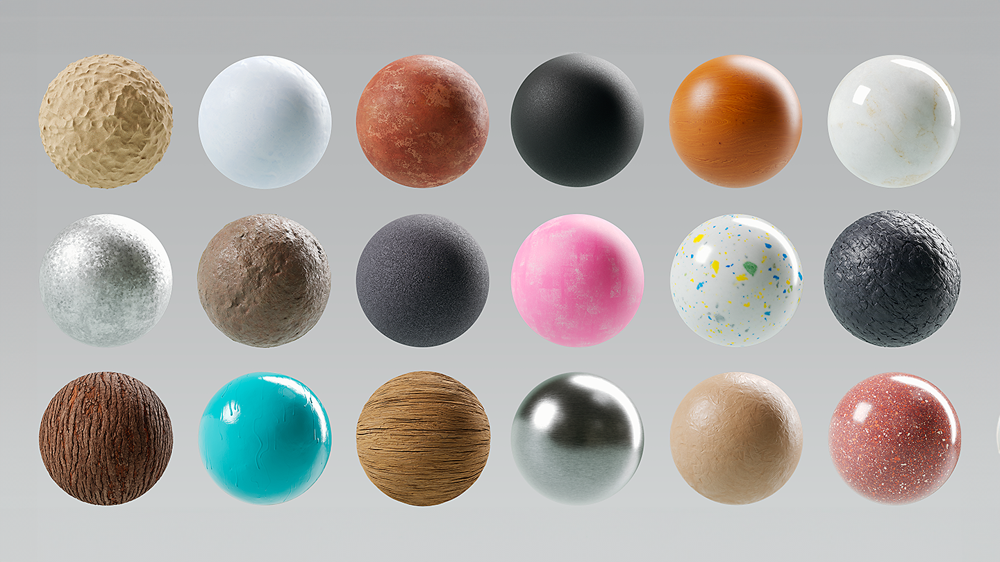
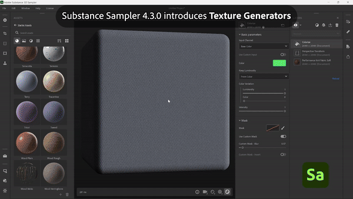
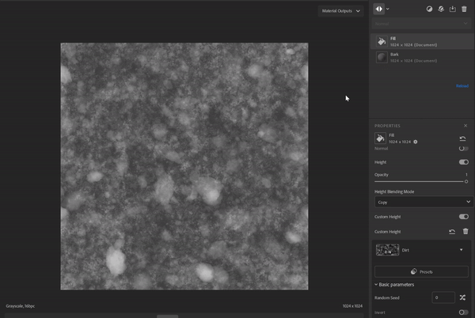

# Versione 4.3

<b>Substance 3D Sampler 4.3</b> introduce nuovi contenuti per iniziare, tra cui <b>Generatori di Texture</b>, una nuova versione del filtro <b>Ricamo</b> e uno strumento <b>Ritaglio prospettico</b>.

*Data di pubblicazione: 25 gennaio 2024*

## Nuovo contenuto di Risorse per iniziare

I materiali inclusi in Sampler sono stati aggiornati per soddisfare meglio le esigenze dei flussi di lavoro <b>progettazione industriale</b>, <b>moda </b>e gli artisti tecnici che lavorano nei media e nell&#39;intrattenimento avranno ora un maggiore controllo sugli aspetti tecnici della creazione delle texture.

## Generatore texture

I nuovi generatori di texture offrono un migliore controllo sulla creazione del materiale utilizzando <b>rumori parametrici, pattern </b>e<b> opzioni per grungi</b>.  Le immagini generate possono essere utilizzate nelle maschere o nelle mappe dei canali, in modo da semplificare la collaborazione tra team tecnici e creativi nella progettazione dei materiali.

Utilizzate la nuova icona di filtro per analizzare solo i generatori di texture.

## Ricamo

Il filtro Ricamo aggiornato offre maggiore precisione di giuntura e supporta fino a 8 colori. Gli input del materiale sono di nuovo nella pila di livelli che consente l&#39;inserimento di altri metalli nella patch.

## Ritaglio prospettiva

Il nuovo strumento Prospettiva ritaglio consente di ritagliare materiali e scansioni distorti con quattro punti di controllo per rimuovere gli artefatti delle Prospettive e ottenere una risorsa affiancabile.

## Stilizzazione

Il filtro Stilizzazione consente di modellare qualsiasi materiale per ottenere un aspetto dipinto a mano.

## Modalità Fusione nel filtro Riempimento

L’aggiornamento del filtro Riempimento introduce i metodi di fusione, che consentono di moltiplicare il valore, le mappe di input o i generatori di texture del Riempimento con i risultati del canale dei livelli sottostanti.

## Miglioramenti del livello di importazione delle immagini

Potete aggiungere più immagini su un livello immagine di importazione e generare una mappa di opacità dal canale di Alpha di un’immagine.

## Nota di rilascio

*(Rilasciato il 25 gennaio 2024)*

<b>Aggiunto</b>:

* [Assets] Nuovo tipo di risorsa: Generatori di texture
* [Assets] Nuovi materiali inclusi in Starter Assets
* [Risorse] Nuovo selettore di risorse per i parametri dell&#39;immagine nel pannello Proprietà
* [Risorse] Trascina i generatori di Texture dal pannello Risorse ai selettori di immagini nel pannello Proprietà
* [Assets] Trascina i generatori di Texture dall’interfaccia Esplora file del sistema operativo
* [Assets] I filtri possono suggerire l&#39;adattamento dei generatori tramite un tag utente sull&#39;input dell&#39;immagine
* [Risorse] I generatori di Texture possono definire il filtro da utilizzare come suggerimento tramite un tag utente
* [Contenuto] Nuovo filtro Prospettiva ritaglio
* [Content] Nuovo filtro Stilizzazione
* [Content] Metodo fusione su filtro riempimento
* [Content] Filtro ricamo aggiornato
* [Content] Filtro Contorna con Pittura aggiornato
* [Content] Tutti i filtri sono stati aggiornati per supportare i generatori di Texture
* [Livelli] Possibilità di scegliere un canale di output del generatore di Texture quando lo si aggiunge alla Pila livelli
* [Livelli] Possibilità di elencare e applicare facilmente i predefiniti ai generatori di Texture
* [Livelli] Visualizza un’anteprima del Generatore di Texture nei selettori di immagini
* [Livelli] I parametri del generatore di Texture possono essere esposti ed esportati
* [Livelli] Assegna l’utilizzo del Colore di base quando si importa una singola immagine con il modello di creazione Texture importazione
* [Livelli] Feedback quando si tenta di trascinare e rilasciare file incompatibili nei selettori di immagini nel pannello Proprietà
* [Livelli] Genera un canale di opacità dal canale alfa di un’immagine importata
* [Layers] Image to Material (AI) calcola più velocemente quando si cambia categoria
* [Livelli] Seleziona il livello più pertinente dopo aver utilizzato un modello di creazione
* [Livelli] I widget di posizione ora possono essere modificati con un cursore nel gruppo Parametri avanzati
* [Esporta] Visualizza una percentuale nella coda anziché i numeri non elaborati
* [Interoperabilità] Il canale di opacità viene ora riconosciuto come canale alfa quando si invia a Painter
* [Applicazione] Nuova finestra di dialogo per visualizzare e salvare le informazioni sull&#39;hardware
* [Applicazione] Nuova preferenza per modificare la scala di height predefinita per ogni progetto
* [Applicazione] Migliorare la visualizzazione delle risorse obsolete
* [Script] Nuove funzioni asset.documentResolution() e asset.setDocumentResolution()
* [Scripting] Nuova funzione select\_asset()
* [Scripting] API Python per i generatori di Texture
* [Scripting] get\_project\_assets() ora restituisce oggetti 3D
* [UI] Le dimensioni della miniatura della risorsa possono essere modificate nel pannello Risorse
* [UI] Icone di visualizzazione della finestra della vista aggiornate

<b>Corretto:</b>

* [vista 2D] Lo zoom con la rotellina del mouse è bloccato al 244%
* [Applicazione] Arresto anomalo all’avvio durante l’inizializzazione dell’API grafica
* [Applicazione] Arresto anomalo in cui il nome del progetto contiene il carattere #
* [Applicazione] Possibile arresto anomalo all’apertura di un vecchio progetto
* [Applicazione] La riapertura del progetto corrente può provocare un arresto anomalo
* [Applicazione] Alcune modifiche al progetto non sono registrate e, se non salvate, vengono perse senza preavviso quando si chiude il progetto
* [Export] Problemi di esportazione .sbs/.sbsar quando si utilizzano più file con lo stesso nome
* [Esportazione] Spazio cromatico errato per il file .sbs/.sbsar delle immagini in scala di grigio esportate
* [Filtri] Problemi di comportamento della fusione Opacità
* [Livelli] I file .svg a volte non vengono visualizzati alla risoluzione corretta
* [Prestazioni] Alcuni salvataggi di progetto su disco non sono necessari
* [Progetto] L’importazione di un vecchio progetto non carica i predefiniti associati
* [Scripting] Impossibile ottenere i parametri del primo livello inserito
* [UI] Il popup di anteprima quando si passa il cursore su una risorsa può apparire nella posizione o nella schermata errata
* [UI] I pannelli non ancorati sono visibili e utilizzabili nella parte superiore della schermata di benvenuto
