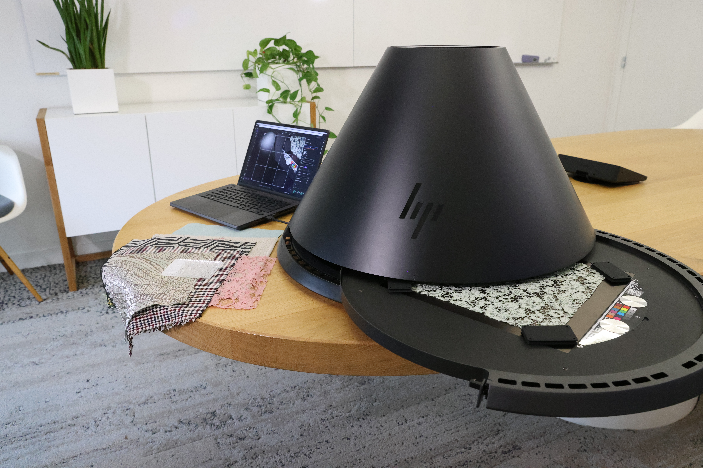

# Versione 6.0

Jalapeño

Questo aggiornamento introduce il supporto per gli standard di settore, i predefiniti di materiale per una creazione più veloce di materiali avanzati e un pannello Proprietà riprogettato per un&#39;esperienza di creazione più flessibile.

Le principali novità includono:

## OpenPBR al centro dell&#39;ecosistema Substance

Sampler 6.0 adotta [OpenPBR](../features-and-workflows/openpbr.md), il modello di materiale unificato del settore. Costruisci materiali che siano compresi in modo nativo nell&#39;ecosistema 3D più ampio: uno standard, compatibilità infinita.Progetta una volta, elimina le congetture e accelera il tuo flusso di lavoro con un modello creato per una perfetta interoperabilità tra gli strumenti.

## Materiali complessi con un clic

Crea istantaneamente materiali più ricchi e complessi. Nuovi modelli come fuzz, translucency e clear coat consentono di aggiungere effetti fisici avanzati senza la complessità. Scegli un modello e vai!

Ulteriori informazioni *[qui](../interface/tools-and-widgets/material-creation-presets.md)*

## Pensato per la creazione di materiali

Sampler 6.0 perfeziona l’intera esperienza su ciò che conta di più: la creazione di materiali digitali gemelli di alta qualità. Ogni aggiornamento e ogni nuova funzione sono progettati per rimuovere attrito, risparmiare tempo e concentrarti sulle parti del flusso di lavoro che aggiungono veramente valore.

## Una nuova pila di livelli per migliorare il controllo

Prendetevi cura dei vostri materiali. Con il pannello delle proprietà riprogettato, puoi impostare come destinazione i filtri per canale, apportando modifiche precise senza dover effettuare passaggi aggiuntivi.

Ulteriori informazioni *[qui](../interface/panels/properties-panel.md)*

## Acquisite i materiali più velocemente che mai

Sampler ora consente di avviare un&#39;acquisizione HP Z Captis con un solo clic, con l&#39;area di interesse rilevata automaticamente, ruotabile su richiesta e automazione intelligente per la messa a fuoco e l&#39;intensità della luce, in modo da ottenere mappe nitide e coerenti con meno configurazione.

Ulteriori informazioni *[qui](../pipeline-and-integrations/hp-z-captis-support/your-first-capture-step-by-step.md)*

## Note sulla versione v6.0

### **6.0.3**

*(Rilasciato: 24 agosto 2026)*

**Corretto:**

[Rendering] Ripristinare una soluzione temporanea per i driver NVIDIA difettosi

### **6.0.2**

*(Rilasciato: 25 giugno 2026)*

**Aggiunto:**

* &amp;lbrack;Assets&amp;rbrack; Controllare la versione secondaria e avvisare gli utenti se il motore è troppo vecchio per leggerlo
* &amp;lbrack;Captis&amp;rbrack; Aggiungi di nuovo opzione per salvare la fotometria dei sottotitoli nelle preferenze

**Corretto:**

* &amp;lbrack;2D View&amp;rbrack; Do not &#39;display with physical ratio&#39; (Visualizza con rapporto fisico) se dimensioni fisiche è disabilitato
* &amp;lbrack;Analytics&amp;rbrack; eventi di analisi mancanti
* &amp;lbrack;Analytics&amp;rbrack; Impedisce che il blocco anomalo segnali un arresto anomalo in vk devicelost
* &amp;lbrack;Application&amp;rbrack; Non distruggere i vkdevice all&#39;uscita per evitare un arresto anomalo nel driver nvidia
* &amp;lbrack;Application&amp;rbrack; Correggi uscita controllo raccolta collegata + gestione canali
* &amp;blocco;Application&amp;brack; Impedisci arresto anomalo all&#39;uscita
* &amp;lbrack;Content&amp;rbrack; Il filtro &quot;finitura metallo&quot; non influisce sulla metallizzazione
* &amp;lbrack;Content&amp;rbrack; Aggiungi dimensioni fisiche ai filtri dinamici dove manca
* &amp;blocco;Filtri&amp;rbrack; Rimuovi riempimento in base al contenuto dall&#39;elenco delle risorse nascoste
* &amp;blocca;Livelli&amp;rbrack; se si fa clic su &quot;Reimposta tutte le impostazioni&quot; non viene reimpostato il menu a discesa &quot;Applica a&quot;
* &amp;lbrack;Livelli&amp;rbrack; Correggere le modifiche minime e massime per il widget posizione
* &amp;lbrack;Layers&amp;rbrack; aggiorna correttamente il filtro
* &amp;lbrack;Dimensioni fisiche&amp;rbrack; verifica che la scala fisica funzioni ovunque + verifica che la dimensione fisica sia corretta con i filtri dinamici
* &amp;lbrack;Project&amp;rbrack; Verifica che la risoluzione delle risorse sia quella predefinita (2k x 2k) durante la creazione di una nuova risorsa
* &amp;lbrack;Project&amp;rbrack; riapertura del progetto corrente utilizzato per aprire la versione precedente
* &amp;lbrack;Project&amp;rbrack; Sampler non offre più di ripristinare un backup dei progetti danneggiati
* &amp;lbrack;Rendering&amp;rbrack; Esegui il rendering della miniatura del materiale a una risoluzione massima di 2k
* &amp;lbrack;UI&amp;rbrack; codice difensivo per evitare l&#39;arresto anomalo se l&#39;utente è più veloce dell&#39;interfaccia utente

### **6.0.1**

*(Rilasciato: 16 aprile 2026)*

**Aggiunto:**

* [Vista 3D] Fornire trame predefinite in formato USD
* [Applicazione] Rileva gli usi in un materiale non disponibile nel modello di materiale corrente
* [Applicazione]: lettura tag modello di materiale dai file SBSAR
* [Captis] Consente la rotazione dell&#39;area di interesse e la nuova risoluzione 4K
* [Captis] Controllare la versione del sistema operativo Captis e avvisare l&#39;utente di aggiornarla se necessario
* [Captis] Mantieni parametri di scansione tra scansioni successive
* [Captis] Nuovo sistema di messa a fuoco automatica
* [Captis] Scansione Con Un Clic
* [Captis] Visualizza una notifica al termine dell&#39;acquisizione
* [Captis] Vari miglioramenti UI/UX
* [Impostazioni canale] Pannello impostazioni canale riprogettato per l’OpenPBR
* [Impostazioni canale] Supporto per il passaggio tra OpenPBR e modelli di materiale ASM
* [Esporta] Abilita l&#39;esportazione dei materiali come USD, USDA o USDZ
* [Esporta] supporta i canali di OpenPBR nella selezione del canale di esportazione
* [Esporta] Utilizza il percorso del progetto come percorso di esportazione predefinito
* [Filtri] Consenti l&#39;aggiornamento da filtri composti statici a dinamici
* [Filtri] Consenti l&#39;aggiornamento da filtri statici a filtri dinamici
* [Filtri] Versioni dinamiche di Porzione automatica, Riempimento in base al contenuto, Fusione Height, Fusione normale
* [Filtri] Nascondi versione statica di un filtro quando è presente una versione dinamica
* [Filtri] Nuova esperienza di riempimento
* [Filtri] Nuovo Materiale di base compatibile con ASM e OpenPBR
* [Importazione di immagini] L&#39;importazione di immagini propone ora di aggiungere utilizzi al flusso di lavoro
* [Importazione immagini] Selettore di utilizzo migliorato
* [Livelli] Le dimensioni predefinite della risorsa sono ora 2K
* [Livelli] Abilita una selezione di utilizzo output per livello
* [Preferenze] Aggiungete una preferenza di modello di materiale predefinita
* Il predefinito [Predefinito] predefinito ora utilizza l&#39;modello di materiale
* [Rendering] Abilita il rendering 8K
* [Rendering] - shader handle nella scena USD
* [Rendering] Eseguire il rendering delle immagini alle dimensioni del documento quando non si esegue l’esportazione
* [Scripting] modello di materiale di handle per la creazione di risorse nell&#39;API Python
* [Scripting] Nuova proprietà MaterialModel sulla risorsa
* [IU] Aggiungere una categoria alle azioni rapide e nascondere i filtri ambiente/trama
* [UI] Visualizza finestra modello quando lo stack contiene solo un materiale di base
* [UI] Implementare la ricerca fuzzy nella funzione di accesso rapido
* [UI] ha integrato la selezione del modello nella finestra di dialogo per la creazione del materiale
* Creazione di materiali [UI] da un avvio rapido
* Flusso di lavoro per la creazione di materiali [UI] con modelli
* [UI] Nuovo stile per le barre azioni mobili
* [IU] Notifica all&#39;utente quando un materiale richiede utilizzi aggiuntivi
* [UI] Proponi un nuovo nome di materiale con un numero incrementale
* [UI] Rinomina &quot;Crea progetto vuoto&quot; in &quot;Avvio rapido&quot;
* [IU]: pannello &quot;Ottieni contenuto&quot; rinnovato
* Implementazione della ricerca [UI] nell&#39;edizione elenco canali
* [UI] Visualizza una notifica durante il salvataggio di uno snapshot in un file

**Corretto:**

* [Visualizzazione 2D] Ordinare la visualizzazione 2D in base all&#39;indice di utilizzo dei risultati nella specifica
* [Applicazione] Correggere un arresto anomalo all&#39;avvio
* [Applicazione] Correggere la logica errata per il filtraggio dell&#39;utilizzo del flusso di lavoro con OpenPBR
* [Applicazione] L&#39;elenco delle versioni note è ora letto durante la ricerca di un aggiornamento
* [Applicazione] Impedisce un arresto anomalo dell&#39;accesso simultaneo
* [Applicazione] Impedisce il doppio calcolo durante l&#39;importazione di immagini con materiale di base
* [Applicazione] Impedisce un potenziale arresto anomalo all&#39;uscita
* [Applicazione] Impedisce l&#39;arresto anomalo quando si cancella una maschera due volte
* [Applicazione] Impedisce la conversione dell&#39;utilizzo che perde il caso originale
* [Applicazione] Impedisce il calcolo inutile degli output invisibili
* [Applicazione] Sostituisci gli spazi con caratteri di sottolineatura durante la creazione dell&#39;ID di utilizzo dal nome
* [Applicazione] diverse correzioni di aggiornamento
* [Captis] Dispositivo non rilevato dopo l&#39;aggiornamento dei criteri di sicurezza
* [Captis] Correggere gli errori del protocollo FTP
* [Captis] Correggi ritaglio
* [Captis] Concentrarsi su un&#39;area tecnica prima di eseguire la calibrazione del colore
* [Capti] Mantenere le proporzioni di ritaglio quando la risoluzione è bloccata
* [Captis] Impedisce il blocco quando si preme più volte &#39;invia risultati al campionatore&#39;
* [Captis] Aumenta la finestra Captis quando si fa clic sul menu Captis ed è ridotta a icona
* [Captis] Scambia due sezioni nell&#39;interfaccia utente di anteprima
* [Captis] I metadati della risorsa finale non sono impostati
* [Captis] Varie correzioni di bug
* [Capti] Dimensioni di ritaglio errate
* [Impostazioni canale] Mascherare i canali nel pannello se sono invisibili
* [Esportazione] L&#39;apertura di una cartella con caratteri speciali funziona correttamente
* [Esporta] Impedisce l&#39;arresto anomalo durante l&#39;esportazione quando la struttura è stata scaricata
* [Esporta] gli output selezionati non sono persistenti nella finestra di dialogo di esportazione
* [Filtri] L&#39;esportazione di un albero con immagini interrompe la risoluzione dinamica dell&#39;immagine
* [Filtri] Correggere la disponibilità del filtro C++
* [Filtri] Correggere il rilevamento dinamico del filtro Timbro clone
* [Filtri] Correggere l&#39;inizializzazione del contatore UID durante il riempimento degli usi dinamici
* [Filtri] Correggere lo spazio colore nella suddivisione automatica in porzioni
* [Filtri] Correggere le dimensioni di output del ritaglio
* [Filtri] Eseguire l&#39;aggiornamento del filtro con il parametro bloccato
* [Filtri] per evitare l&#39;arresto anomalo di macOS durante la suddivisione automatica
* [Filtri] Impedisce l&#39;arresto anomalo di ingrandimento quando manca un input
* [Filtri] per evitare l&#39;arresto anomalo durante il caricamento di un filtro composto senza nome di file
* [Filtri]: modifica della maschera di destinazione duplicata in PatchMatch
* [Importazione immagini] Correggere la misura manuale automatica per dimensioni fisiche
* [Importazione immagini] dimensioni di rasterizzazione SVG corrette quando utilizzate come regolazione
* [Livelli] L’assegnazione di un utilizzo a un’immagine digitandola non funziona
* [Livelli] Evitare arresti anomali durante l&#39;aggiunta di livelli alla pila
* [I livelli] parametri esposti che non dovevano essere aggiornati sono stati rimossi
* [Livelli] Correggere l&#39;aggiunta del generatore di texture come mappa
* [Livelli]: correggi unico livello
* [Livelli] appiattisce il sottofondo nelle dimensioni di input, non nelle dimensioni del documento
* [Livelli] per evitare l&#39;arresto anomalo durante la conversione di una pila contenente livelli convertiti
* [Livelli] Impedisce la visualizzazione del messaggio di ottimizzazione del rendering con Materiale di base
* [Livelli] L’aggiornamento di un filtro a un filtro di output univoco non aggiornava correttamente l’interfaccia utente
* [Preferenze] Correggere la modifica delle preferenze
* [Progetto] Correggere l&#39;importazione di progetti .alch
* Il salvataggio del [progetto] non ha più esito negativo in modalità invisibile
* [Rendering] Evitate l&#39;arresto anomalo in macOS mantenendo la modalità di pianificazione automatica
* [Il rendering] della modifica del componente V dell’affiancatura della texture non ha avuto alcun effetto
* [Rendering] Correggere il rendering e le miniature mancanti
* [Il rendering] impedisce l&#39;accesso simultaneo ai valori di output
* [Rendering]: gestisce correttamente i valori di output di una struttura nel modulo di rendering
* [Rendering] Interrompi la creazione della struttura ad albero in ogni rendering
* [Scripting] Correggere un arresto anomalo in get_project_assets
* [Scripting] per evitare l’arresto anomalo in un unico livello dall’API Python
* [IU] Tutti i divisori nel pannello delle proprietà ora hanno la larghezza del pannello
* [IU] Evitare di visualizzare gli usi interni di suddivisione automatica come usi personalizzati
* [UI] Correggere il menu contestuale interrotto
* [UI] Correggere il menu di scelta rapida per le modifiche del generatore
* [UI] Correggere il caricamento dei font
* [UI] Pulsante per la correzione dei predefiniti di materiale con nomi lunghi
* [IU] Correggere le associazioni di rifinitura con più cursori
* [IU] Correggere i pulsanti di piccole dimensioni rari nella finestra di dialogo
* [UI] Correggere la modifica del valore di modifica durante la creazione del componente
* [UI] Correggere la visualizzazione dell&#39;input della variabile e rimuovere il comando fantasma errato
* [IU] Correggere l&#39;aggiornamento del pannello delle impostazioni di visualizzazione quando il contesto della risorsa cambia
* [UI] Correggere la modalità di ritorno a capo automatico del selettore unificato
* [IU] Non consentire l&#39;aggiunta di caratteri speciali nel campo del nome dei metadati
* La visualizzazione dello strumento misura Dimensioni fisiche [UI] è interrotta
* [IU] Impedisce l&#39;arresto anomalo durante l&#39;apertura del pannello delle impostazioni dei canali
* [UI] Impedisce l&#39;arresto anomalo quando si utilizza &#39;Ripristina il layout predefinito&#39;
* [IU] Impedisce la scomparsa della notifica di aggiornamento nel pannello della struttura
* [UI] Assegna priorità al filtro dinamico durante la ricerca per nome
* [IU] Scorrete nel pannello delle proprietà per utilizzare le modifiche
* [IU]: aggiornare le impostazioni del canale durante l’utilizzo di un’immagine
* [Interfaccia utente] Aggiornamento del testo nel popup di conversione Modello di materiale

## Rimosso

* [UI] Rimuovi voce di menu Capture 3D
* [IU] Rimuovi pannello IA generativa
* [UI] Rimuovi impostazioni shader
